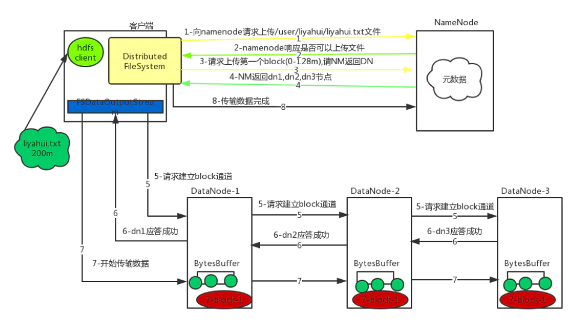
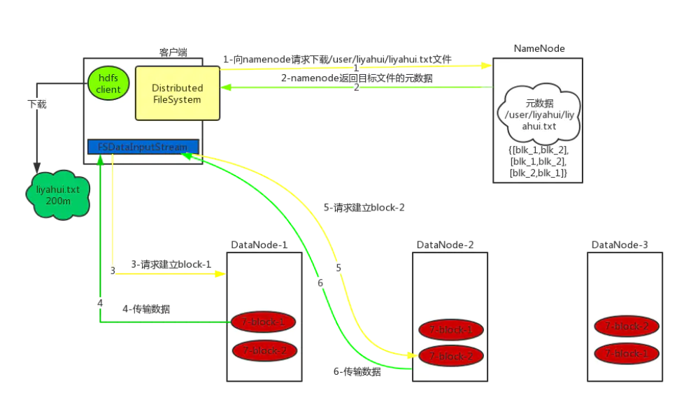

## HDFS的块的处理过程


## HDFS的机架策略

## HDFS的副本放置策略


## hadoop机架感知原理

默认情况下，hadoop的机架感知是没有被启用的。所以，在通常情况下，hadoop集群的HDFS在选机器的时候，是随机选择的，也就是说，很有可能在写数据时，hadoop将第一块数据block1写到了rack1上，然后随机的选择下将block2写入到了rack2下，此时两个rack之间产生了数据传输的流量，再接下来，在随机的情况下，又将block3重新又写回了rack1，此时，两个rack之间又产生了一次数据流量。在job处理的数据量非常的大，或者往hadoop推送的数据量非常大的时候，这种情况会造成rack之间的网络流量成倍的上升，成为性能的瓶颈，进而影响作业的性能以至于整个集群的服务。
要将hadoop机架感知的功能启用，配置非常简单，在namenode所在机器的hadoop-site.xml配置文件中配置一个选项：

```xml
<property>
  <name>topology.script.file.name</name>
  <value>/path/to/RackAware.py</value>
</property
```

这个配置选项的value指定为一个可执行程序，通常为一个脚本，该脚本接受一个参数，输出一个值。接受的参数通常为某台datanode机器的ip地址，而输出的值通常为该ip地址对应的datanode所在的rack，例如”/rack1”。Namenode启动时，会判断该配置选项是否为空，如果非空，则表示已经用机架感知的配置，此时namenode会根据配置寻找该脚本，并在接收到每一个datanode的heartbeat时，将该datanode的ip地址作为参数传给该脚本运行，并将得到的输出作为该datanode所属的机架，保存到内存的一个map中。

至于脚本的编写，就需要将真实的网络拓朴和机架信息了解清楚后，通过该脚本能够将机器的ip地址正确的映射到相应的机架上去。一个简单的实现如下：

```python
#!/usr/bin/python  
#-*-coding:UTF-8 -*-  
import sys  

rack = {"hadoopnode-176.tj":"rack1",  
        "hadoopnode-178.tj":"rack1",  
        "hadoopnode-179.tj":"rack1",  
        "hadoopnode-180.tj":"rack1",  
        "hadoopnode-186.tj":"rack2",  
        "hadoopnode-187.tj":"rack2",  
        "hadoopnode-188.tj":"rack2",  
        "hadoopnode-190.tj":"rack2",  
        "192.168.1.15":"rack1",  
        "192.168.1.17":"rack1",  
        "192.168.1.18":"rack1",  
        "192.168.1.19":"rack1",  
        "192.168.1.25":"rack2",  
        "192.168.1.26":"rack2",  
        "192.168.1.27":"rack2",  
        "192.168.1.29":"rack2",  
        }  


if __name__=="__main__":  
    print "/" + rack.get(sys.argv[1],"rack0")  
```


## DataNode的坏盘的容忍程度

设置坏盘的容忍程度

```
dfs.datanode.failed.volumnes.tolerated
```


## HDFS的BlockPool

HDFS的BlockPool可以拥有多个，

```
BP-1120155954-10.0.0.1-1459909528739
```

<https://blog.csdn.net/bigdatahappy/article/details/41524427>


## Distcp

服务器跨集群间的拷贝，不同版本间的拷贝需要指定


HDFS数据写入实现原理(P)


JVM

<https://www.cnblogs.com/ceshi2016/p/8447989.html>


## HDFS的读数据和写数据的流程

### 写数据



1）客户端通过Distributed FileSystem模块向namenode请求上传文件，namenode检查目标文件是否已存在，父目录是否存在。
 2）namenode返回是否可以上传。
 3）客户端请求第一个 block上传到哪几个datanode服务器上。
 4）namenode返回3个datanode节点，分别为dn1、dn2、dn3。
 5）客户端通过FSDataOutputStream模块请求dn1上传数据，dn1收到请求会继续调用dn2，然后dn2调用dn3，将这个通信管道建立完成。
 6）dn1、dn2、dn3逐级应答客户端。
 7）客户端开始往dn1上传第一个block（先从磁盘读取数据放到一个本地内存缓存），以packet为单位（大小为64k），dn1收到一个packet就会传给dn2，dn2传给dn3；dn1每传一个packet会放入一个应答队列等待应答。
 8）当一个block传输完成之后，客户端再次请求namenode上传第二个block的服务器。（重复执行3-7步）。

### 读数据



1）客户端通过Distributed FileSystem向namenode请求下载文件，namenode通过查询元数据，找到文件块所在的datanode地址。
 2）挑选一台datanode（就近原则，然后随机）服务器，请求读取数据。
 3）datanode开始传输数据给客户端（从磁盘里面读取数据输入流，以packet为单位来做校验,大小为64k）。
 4）客户端以packet为单位接收，先在本地缓存，然后写入目标文件。

## HDFS的监控指标


#### **通用监控指标**

#### **对于每个RPC服务应该监控**

**RpcProcessingTimeAvgTime(PRC处理的平均时间)**

通常hdfs在异常任务突发大量访问时，这个参数会突然变得很大，导致其他用户访问hdfs时，会感觉到卡顿，从而影响任务的执行时间

**CallQueueLength(RPC Call队列的长度)**

如果callqueue队列数值一直处于较高的水平，例如对于NN来说CallQueue的长度等于handler*100，也就是说NN可能收到了大量的请求或者server在处理rpc请求时耗时很长，导致call堆积等

#### **进程JVM监控**

**MemHeapUsedM(堆内存使用监控)**

通过监控改参数可以查看进程的gc时间和gc发生之后释放多少内存和进程的内存使用情况

**ThreadsBlocked(线程阻塞数量)**

分析当问题发生时进程的线程的阻塞状况

**ThreadsWaiting(线程等待数量)**

分析当问题发生时进程的线程的等待状况

#### **NameNode监控指标**

**TotalFiles(总的文件数量)**

监控和预警文件数的总量，可以通过其看出是否有任务突然大量写文件和删除大量文件

**TotalBlocks(总的block数量)**

表示集群的block数量，作用同上

**PercentUsed(集群hdfs使用百分比)**

监控集群的hdfs的使用情况，使用率不宜太高，因为需要预留磁盘空间给任务计算使用

**BlockPoolUsedSpace(集群该namespace的hdfs使用容量大小)**

可以监控不同namespace的hdfs的使用情况

**Total(集群hdfs总容量大小)**

显示集群整体容量情况

**Used(集群hdfs已使用的容量大小)**

集群hdfs使用情况，可以预警是否需要增加机器和删除无用数据

**NumLiveDataNodes(存活的DN数量)**

**NumDeadDataNodes(丢失的DN数量)**

丢失节点，如果过多可能会引起丢块

**VolumeFailuresTotal(坏盘的数量)**

应该设定阀值，达到一定数量时处理

**MissingBlocks(丢失的block数量)**

丢失重要的块会引起任务报错

#### **DataNode监控指标**

**ReadBlockOpAvgTime(读取block的平均时间)**

可选的监控选项，如果该机器在某个时段平均时间突然升高，可能网络有打满或磁盘读取速度存在问题

**WriteBlockOpAvgTime(写数据块的平均时间)**

可选的监控选项

#### **ResouceManager监控指标**

**NumActiveNMs(NM存活节点数量监控)**

**NumLostNMs(NM丢失节点数量监控)**

有时节点会因为磁盘空间不足等原因导致进程退出，虽然集群具有容错机制，但当丢失节点达到一定数量之后，集群计算资源相当于减少了，所以应当设置合理的阀值报警处理

**NumUnhealthyNMs(NM不健康节点数量监控)**

通常会因为磁盘问题导致节点不健康

#### **集群应用数量监控**

**AppsSubmitted(app提交数量)**

之前集群有出现过app的id号，生成很慢的情况，可以通过改数值和其他参数去判断提交减少的问题

**AppsRunning(app的运行数量)**

可以通过改值去对比历史同一时刻的app的运行数量是否差异很大，去判断集群到底是否可能出现问题

**AppsPending(app等待数量)**

如果该数值很高，或则在某个queue的该数值很高，有可能是因为app所在的队列资源满了，导致app无法获取资源，启动master，如果资源没满，可能的一个原因是app的所在队列无法在rm中有先获取资源，或资源被预留所导致等

**AppsCompleted(app完成数量)**

应用完成的数量监控

**AppsKilled(app被kill的数量)**

应用被kill的数量监控

**AppsFailed(app失败数量)**

如果AppsFailed数量升高，说明集群的存在导致app批量失败的操作

#### **集群资源使用量情况监控**

**AllocatedMB(已分配的内存大小)**

如果集群用户反应任务运行缓慢，应该及时检查队列资源的使用情况和hdfs的响应速度

**AllocatedVCores(已分配的核数量)**

有时任务分配不上去，有可能是核数已经用完

**AllocatedContainers(已分配的Container数量)**

已分配的Container数量

**AvailableMB(可用的内存大小)**

有遇到过在集群反复重启NM后，导致集群计算可用资源错误的bug

**AvailableVCores(可能的核数量)**

**PendingMB(等待分配的内存大小)**

**PendingVCores(等待分配的核数量)**

**PendingContainers(等待分配的Container数量)**

如果等待分配的Container比日常出现多出很多，应该检查集群是否有问题

**ReservedMB(预留的内存大小)**

之前遇到因为spark任务申请很大的资源，导致把整个集群的资源都预留的情况，这时应该适当的调整最大的分配Container的内存大小

**ReservedVCores(预留的核数量)**

同上

**ReservedContainers(预留的Container数量)**

Container因为资源不足，优先预留节点

#### **集群分配数据监控**

**AssignContainerCallNumOps(分配Container的次数)**

我们可以通过该监控可以知道RM每秒能够分配多少的Container，在高峰期是否可能存在瓶颈，经过社区的patch优化之后，RM的分配Container最大值可以达到4k+

**AssignContainerCallAvgTime(分配Container的平均时间)**

如果时间突然变大，说明可能遇到分配瓶颈等其他问题

**ContinuousScheduleCallNumOps(连续调度次数)**

如果该数值没有增加，说明连续调度线程出现问题

**ContinuousScheduleCallAvgTime(连续调度平均时间)**

连续调度的平均时间

**NodeUpdateCallNumOps(NM心跳汇报次数)**

**NodeUpdateCallAvgTime(心跳汇报处理时间)**

rm资源分配是通过每一次NM的心跳进行分配和领取Container的，如果该时间变长，则分配速度可能会存在下降

#### **Linux机器监控**

**网络带宽情况**

通过监控DN的网络情况可以查找，该节点是否在当时是热节点，一般情况下如果在该机器的网络情况已经满了，会影响任务的正常运行速度

**机器负载情况**

**网络丢包情况**

**机器内存使用情况**


## hadoop的namenode和datanode的关系


## namenode的内存配置


Hadoop的log配置

<https://cwiki.apache.org/confluence/display/HADOOP2/HowToConfigure>


hadoop和CDH的区别

