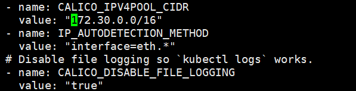

# 01. 初始化系统和全局变量

## 集群规划

- 192.168.93.45 k8s-01
- 192.168.93.46 k8s-02
- 192.168.93.47 k8s-03

三台机器混合部署本文档的 etcd、master 集群和 woker 集群。

如果没有特殊说明，需要在**所有节点**上执行本文档的初始化操作。

## 设置主机名

```shell
hostnamectl set-hostname k8s-01 # 将k8s-01 替换为当前主机名
```

如果 DNS 不支持主机名称解析，还需要在每台机器的 `/etc/hosts` 文件中添加主机名和 IP 的对应关系：

```shell
cat >>/etc/resolv.conf <<EOF
nameserver 8.8.8.8
nameserver 1.2.4.8
EOF
service network restart
cat >> /etc/hosts <<EOF
192.168.93.45 k8s-01
192.168.93.46 k8s-02
192.168.93.47 k8s-03
EOF
cat /etc/hosts;
```

退出，重新登录 root 账号，可以看到主机名生效。

## 更新 PATH 变量

```
echo 'PATH=/opt/k8s/bin:$PATH' >>/root/.bashrc
source /root/.bashrc
```

- `/opt/k8s/bin` 目录保存本文档下载安装的程序；

## 添加节点信任关系

本操作只需要在 k8s-01 节点上进行，设置 root 账户可以无密码登录**所有节点**：

```shell
ssh-keygen -t rsa
ssh-copy-id root@k8s-01
ssh-copy-id root@k8s-02
ssh-copy-id root@k8s-03
```

## 安装依赖包

```shell
yum -y install wget;
cd  /etc/yum.repos.d/
wget  http://mirrors.aliyun.com/repo/Centos-7.repo;
mv CentOs-Base.repo CentOs-Base.repo.bak;
mv Centos-7.repo CentOs-Base.repo;
yum clean all;
yum makecache;
yum update;
yum install -y epel-release;
yum install -y chrony conntrack ipvsadm ipset jq iptables curl sysstat libseccomp wget socat git;
```

- 本文档的 kube-proxy 使用 ipvs 模式，ipvsadm 为 ipvs 的管理工具；
- etcd 集群各机器需要时间同步，chrony 用于系统时间同步；

## 关闭防火墙

```shell
systemctl stop firewalld;
systemctl disable firewalld;
iptables -F && iptables -X && iptables -F -t nat && iptables -X -t nat;
iptables -P FORWARD ACCEPT;
```

## 关闭 swap 分区

```shell
swapoff -a;
sed -i '/ swap / s/^\(.*\)$/#\1/g' /etc/fstab;
```

## 关闭 SELinux

```shell
setenforce 0
sed -i 's/^SELINUX=.*/SELINUX=disabled/' /etc/selinux/config
```

## 优化内核参数

```shell
cat > kubernetes.conf <<EOF
net.bridge.bridge-nf-call-iptables=1
net.bridge.bridge-nf-call-ip6tables=1
net.ipv4.ip_forward=1
net.ipv4.tcp_tw_recycle=0
net.ipv4.neigh.default.gc_thresh1=1024
net.ipv4.neigh.default.gc_thresh1=2048
net.ipv4.neigh.default.gc_thresh1=4096
vm.swappiness=0
vm.overcommit_memory=1
vm.panic_on_oom=0
fs.inotify.max_user_instances=8192
fs.inotify.max_user_watches=1048576
fs.file-max=52706963
fs.nr_open=52706963
net.ipv6.conf.all.disable_ipv6=1
net.netfilter.nf_conntrack_max=2310720
EOF
cp kubernetes.conf  /etc/sysctl.d/kubernetes.conf;
sysctl -p /etc/sysctl.d/kubernetes.conf;
```

关闭 tcp_tw_recycle，否则与 NAT 冲突，可能导致服务不通；

## 设置系统时区

```shell
timedatectl set-timezone Asia/Shanghai
```

## 设置系统时钟同步

```shell
systemctl enable chronyd;
systemctl start chronyd;
#查看状态
timedatectl status
# 将当前的 UTC 时间写入硬件时钟
timedatectl set-local-rtc 0

# 重启依赖于系统时间的服务
systemctl restart rsyslog;
systemctl restart crond;
```

查看同步状态：

```shell
timedatectl status
```

输出：

```shell
System clock synchronized: yes
              NTP service: active
          RTC in local TZ: no
```

- `System clock synchronized: yes`，表示时钟已同步；
- `NTP service: active`，表示开启了时钟同步服务；

## 关闭无关的服务

```shell
systemctl stop postfix && systemctl disable postfix
```

## 创建相关目录

```shell
mkdir -p /opt/k8s/{bin,work} /etc/{kubernetes,etcd}/cert
```

## 分发集群配置参数脚本

后续使用的环境变量都定义在文件 [environment.sh](https://github.com/opsnull/follow-me-install-kubernetes-cluster/blob/master/manifests/environment.sh) 中，请根据**自己的机器、网络情况**修改。然后拷贝到**所有**节点：

```shell
#!/usr/bin/bash
# 生成 EncryptionConfig 所需的加密 key
export ENCRYPTION_KEY=$(head -c 32 /dev/urandom | base64)
# 集群各机器 IP 数组
export NODE_IPS=(172.27.138.251 172.27.137.229 172.27.138.239)
# 集群各 IP 对应的主机名数组
export NODE_NAMES=(zhangjun-k8s-01 zhangjun-k8s-02 zhangjun-k8s-03)
# etcd 集群服务地址列表
export ETCD_ENDPOINTS="https://172.27.138.251:2379,https://172.27.137.229:2379,https://172.27.138.239:2379"
# etcd 集群间通信的 IP 和端口
export ETCD_NODES="zhangjun-k8s-01=https://172.27.138.251:2380,zhangjun-k8s-02=https://172.27.137.229:2380,zhangjun-k8s-03=https://172.27.138.239:2380"
# kube-apiserver 的反向代理(kube-nginx)地址端口
export KUBE_APISERVER="https://127.0.0.1:8443"
# 节点间互联网络接口名称
export IFACE="eth0"
# etcd 数据目录
export ETCD_DATA_DIR="/data/k8s/etcd/data"
# etcd WAL 目录，建议是 SSD 磁盘分区，或者和 ETCD_DATA_DIR 不同的磁盘分区
export ETCD_WAL_DIR="/data/k8s/etcd/wal"
# k8s 各组件数据目录
export K8S_DIR="/data/k8s/k8s"
## DOCKER_DIR 和 CONTAINERD_DIR 二选一
# docker 数据目录
export DOCKER_DIR="/data/k8s/docker"
# containerd 数据目录
export CONTAINERD_DIR="/data/k8s/containerd"
## 以下参数一般不需要修改
# TLS Bootstrapping 使用的 Token，可以使用命令 head -c 16 /dev/urandom | od -An -t x | tr -d ' ' 生成
BOOTSTRAP_TOKEN="41f7e4ba8b7be874fcff18bf5cf41a7c"
# 最好使用 当前未用的网段 来定义服务网段和 Pod 网段
# 服务网段，部署前路由不可达，部署后集群内路由可达(kube-proxy 保证)
SERVICE_CIDR="10.254.0.0/16"
# Pod 网段，建议 /16 段地址，部署前路由不可达，部署后集群内路由可达(flanneld 保证)
CLUSTER_CIDR="172.30.0.0/16"
# 服务端口范围 (NodePort Range)
export NODE_PORT_RANGE="30000-32767"
# kubernetes 服务 IP (一般是 SERVICE_CIDR 中第一个IP)
export CLUSTER_KUBERNETES_SVC_IP="10.254.0.1"
# 集群 DNS 服务 IP (从 SERVICE_CIDR 中预分配)
export CLUSTER_DNS_SVC_IP="10.254.0.2"
# 集群 DNS 域名（末尾不带点号）
export CLUSTER_DNS_DOMAIN="cluster.local"
# 将二进制目录 /opt/k8s/bin 加到 PATH 中
export PATH=/opt/k8s/bin:$PATH
```

```shell
source environment.sh # 先修改
for node_ip in ${NODE_IPS[@]}
  do
    echo ">>> ${node_ip}"
    scp environment.sh root@${node_ip}:/opt/k8s/bin/
    ssh root@${node_ip} "chmod +x /opt/k8s/bin/*"
  done
```


## 升级内核

CentOS 7.x 系统自带的 3.10.x 内核存在一些 Bugs，导致运行的 Docker、Kubernetes 不稳定，例如：

1. 高版本的 docker(1.13 以后) 启用了 3.10 kernel 实验支持的 kernel memory account 功能(无法关闭)，当节点压力大如频繁启动和停止容器时会导致 cgroup memory leak；
2. 网络设备引用计数泄漏，会导致类似于报错："kernel:unregister_netdevice: waiting for eth0 to become free. Usage count = 1";

解决方案如下：

1. 升级内核到 4.4.X 以上；

2. 或者，手动编译内核，disable CONFIG_MEMCG_KMEM 特性；

3. 或者，安装修复了该问题的 Docker 18.09.1 及以上的版本。但由于 kubelet 也会设置 kmem（它 vendor 了 runc），所以需要重新编译 kubelet 并指定 GOFLAGS="-tags=nokmem"；

   ```shell
   git clone --branch v1.14.1 --single-branch --depth 1 https://github.com/kubernetes/kubernetes
   cd kubernetes
   KUBE_GIT_VERSION=v1.14.1 ./build/run.sh make kubelet GOFLAGS="-tags=nokmem"
   ```

这里采用升级内核的解决办法：

```shell
rpm -Uvh http://www.elrepo.org/elrepo-release-7.0-3.el7.elrepo.noarch.rpm
# 安装完成后检查 /boot/grub2/grub.cfg 中对应内核 menuentry 中是否包含 initrd16 配置，如果没有，再安装一次！
yum --enablerepo=elrepo-kernel install -y kernel-lt
# 设置开机从新内核启动
grub2-set-default 0
```

重启机器：

```shell
sync
reboot
```

## 参考

1. 系统内核相关参数参考：<https://docs.openshift.com/enterprise/3.2/admin_guide/overcommit.html>
2. 3.10.x 内核 kmem bugs 相关的讨论和解决办法：
   1. <https://github.com/kubernetes/kubernetes/issues/61937>
   2. <https://support.mesosphere.com/s/article/Critical-Issue-KMEM-MSPH-2018-0006>
   3. <https://pingcap.com/blog/try-to-fix-two-linux-kernel-bugs-while-testing-tidb-operator-in-k8s/>

# 02. 创建 CA 根证书和秘钥

为确保安全，`kubernetes` 系统各组件需要使用 `x509` 证书对通信进行加密和认证。

CA (Certificate Authority) 是自签名的根证书，用来签名后续创建的其它证书。

CA 证书是集群所有节点共享的，**只需要创建一次**，后续用它签名其它所有证书。

本文档使用 `CloudFlare` 的 PKI 工具集 [cfssl](https://github.com/cloudflare/cfssl) 创建所有证书。

注意：如果没有特殊指明，本文档的所有操作**均在 k8s-01 节点上执行**。

## 安装 cfssl 工具集

```shell
sudo mkdir -p /opt/k8s/cert && cd /opt/k8s/work;
wget https://github.com/cloudflare/cfssl/releases/download/v1.4.1/cfssl_1.4.1_linux_amd64;
mv cfssl_1.4.1_linux_amd64 /opt/k8s/bin/cfssl;
wget https://github.com/cloudflare/cfssl/releases/download/v1.4.1/cfssljson_1.4.1_linux_amd64;
mv cfssljson_1.4.1_linux_amd64 /opt/k8s/bin/cfssljson;
wget https://github.com/cloudflare/cfssl/releases/download/v1.4.1/cfssl-certinfo_1.4.1_linux_amd64;
mv cfssl-certinfo_1.4.1_linux_amd64 /opt/k8s/bin/cfssl-certinfo;
chmod +x /opt/k8s/bin/*;
export PATH=/opt/k8s/bin:$PATH;
```

```shell
#error
Segmentation fault
```


## 创建配置文件

CA 配置文件用于配置根证书的使用场景 (profile) 和具体参数 (usage，过期时间、服务端认证、客户端认证、加密等)：

```shell
cd /opt/k8s/work
cat > ca-config.json <<EOF
{
  "signing": {
    "default": {
      "expiry": "87600h"
    },
    "profiles": {
      "kubernetes": {
        "usages": [
            "signing",
            "key encipherment",
            "server auth",
            "client auth"
        ],
        "expiry": "876000h"
      }
    }
  }
}
EOF
```

- `signing`：表示该证书可用于签名其它证书（生成的 `ca.pem` 证书中 `CA=TRUE`）；
- `server auth`：表示 client 可以用该该证书对 server 提供的证书进行验证；
- `client auth`：表示 server 可以用该该证书对 client 提供的证书进行验证；
- `"expiry": "876000h"`：证书有效期设置为 100 年；

## 创建证书签名请求文件

```shell
cd /opt/k8s/work
cat > ca-csr.json <<EOF
{
  "CN": "kubernetes-ca",
  "key": {
    "algo": "rsa",
    "size": 2048
  },
  "names": [
    {
      "C": "CN",
      "ST": "BeiJing",
      "L": "BeiJing",
      "O": "k8s",
      "OU": "opsnull"
    }
  ],
  "ca": {
    "expiry": "876000h"
 }
}
EOF
```

- `CN：Common Name`：kube-apiserver 从证书中提取该字段作为请求的**用户名 (User Name)**，浏览器使用该字段验证网站是否合法；
- `O：Organization`：kube-apiserver 从证书中提取该字段作为请求用户所属的**组 (Group)**；
- kube-apiserver 将提取的 `User、Group` 作为 `RBAC` 授权的用户标识；

注意：

1. 不同证书 csr 文件的 CN、C、ST、L、O、OU 组合必须不同，否则可能出现 `PEER'S CERTIFICATE HAS AN INVALID SIGNATURE` 错误；
2. 后续创建证书的 csr 文件时，CN 都不相同（C、ST、L、O、OU 相同），以达到区分的目的；

## 生成 CA 证书和私钥

```shell
cd /opt/k8s/work
cfssl gencert -initca ca-csr.json | cfssljson -bare ca
ls ca*
```

## 分发证书文件

```shell
cd /opt/k8s/work
source /opt/k8s/bin/environment.sh
for node_ip in ${NODE_IPS[@]}
  do
    echo ">>> ${node_ip}"
    ssh root@${node_ip} "mkdir -p /etc/kubernetes/cert"
    scp ca*.pem ca-config.json root@${node_ip}:/etc/kubernetes/cert
  done
```

## 参考

[各种 CA 证书类型](https://github.com/kubernetes-incubator/apiserver-builder/blob/master/docs/concepts/auth.md)

# 03. 安装和配置 kubectl

本文档介绍安装和配置 kubernetes 命令行管理工具 kubectl 的步骤。

注意：

1. 如果没有特殊指明，本文档的所有操作**均在 k8s-01 节点上执行**；
2. 本文档只需要**部署一次**，生成的 kubeconfig 文件是**通用的**，可以拷贝到需要执行 kubectl 命令的机器的 `~/.kube/config` 位置；

## 下载和分发 kubectl 二进制文件

```shell
cd /opt/k8s/work
wget https://dl.k8s.io/v1.16.6/kubernetes-client-linux-amd64.tar.gz # 自行解决翻墙下载问题
tar -xzvf kubernetes-client-linux-amd64.tar.gz
```

分发到所有使用 kubectl 工具的节点

```shell
cd /opt/k8s/work
source /opt/k8s/bin/environment.sh
for node_ip in ${NODE_IPS[@]}
  do
    echo ">>> ${node_ip}"
    scp kubernetes/client/bin/kubectl root@${node_ip}:/opt/k8s/bin/
    ssh root@${node_ip} "chmod +x /opt/k8s/bin/*"
  done
```

## 创建 admin 证书和私钥

kubectl 使用 https 协议与 kube-apiserver 进行安全通信，kube-apiserver 对 kubectl 请求包含的证书进行认证和授权。

kubectl 后续用于集群管理，所以这里创建具有**最高权限**的 admin 证书。

创建证书签名请求

```shell
cd /opt/k8s/work
cat > admin-csr.json <<EOF
{
  "CN": "admin",
  "hosts": [],
  "key": {
    "algo": "rsa",
    "size": 2048
  },
  "names": [
    {
      "C": "CN",
      "ST": "BeiJing",
      "L": "BeiJing",
      "O": "system:masters",
      "OU": "opsnull"
    }
  ]
}
EOF
```

- `O: system:masters`：kube-apiserver 收到使用该证书的客户端请求后，为请求添加组（Group）认证标识 `system:masters`；
- 预定义的 ClusterRoleBinding `cluster-admin` 将 Group `system:masters` 与 Role `cluster-admin` 绑定，该 Role 授予操作集群所需的**最高**权限；
- 该证书只会被 kubectl 当做 client 证书使用，所以 `hosts` 字段为空；

生成证书和私钥：

```shell
cd /opt/k8s/work
cfssl gencert -ca=/opt/k8s/work/ca.pem \
  -ca-key=/opt/k8s/work/ca-key.pem \
  -config=/opt/k8s/work/ca-config.json \
  -profile=kubernetes admin-csr.json | cfssljson -bare admin
ls admin*
```

忽略警告消息 `[WARNING] This certificate lacks a "hosts" field.`；

## 创建 kubeconfig 文件

kubectl 使用 kubeconfig 文件访问 apiserver，该文件包含 kube-apiserver 的地址和认证信息（CA 证书和客户端证书）：

```shell
cd /opt/k8s/work
source /opt/k8s/bin/environment.sh

# 设置集群参数
kubectl config set-cluster kubernetes \
  --certificate-authority=/opt/k8s/work/ca.pem \
  --embed-certs=true \
  --server=https://${NODE_IPS[0]}:6443 \
  --kubeconfig=kubectl.kubeconfig

# 设置客户端认证参数
kubectl config set-credentials admin \
  --client-certificate=/opt/k8s/work/admin.pem \
  --client-key=/opt/k8s/work/admin-key.pem \
  --embed-certs=true \
  --kubeconfig=kubectl.kubeconfig

# 设置上下文参数
kubectl config set-context kubernetes \
  --cluster=kubernetes \
  --user=admin \
  --kubeconfig=kubectl.kubeconfig

# 设置默认上下文
kubectl config use-context kubernetes --kubeconfig=kubectl.kubeconfig
```

- `--certificate-authority`：验证 kube-apiserver 证书的根证书；
- `--client-certificate`、`--client-key`：刚生成的 `admin` 证书和私钥，与 kube-apiserver https 通信时使用；
- `--embed-certs=true`：将 ca.pem 和 admin.pem 证书内容嵌入到生成的 kubectl.kubeconfig 文件中(否则，写入的是证书文件路径，后续拷贝 kubeconfig 到其它机器时，还需要单独拷贝证书文件，不方便。)；
- `--server`：指定 kube-apiserver 的地址，这里指向第一个节点上的服务；

## 分发 kubeconfig 文件

分发到所有使用 `kubectl` 命令的节点:

```shell
cd /opt/k8s/work
source /opt/k8s/bin/environment.sh
for node_ip in ${NODE_IPS[@]}
  do
    echo ">>> ${node_ip}"
    ssh root@${node_ip} "mkdir -p ~/.kube"
    scp kubectl.kubeconfig root@${node_ip}:~/.kube/config
  done
```

# 04. 部署 etcd 集群

etcd 是基于 Raft 的分布式 KV 存储系统，由 CoreOS 开发，常用于服务发现、共享配置以及并发控制（如 leader 选举、分布式锁等）。

kubernetes 使用 etcd 集群持久化存储所有 API 对象、运行数据。

本文档介绍部署一个三节点高可用 etcd 集群的步骤：

- 下载和分发 etcd 二进制文件；
- 创建 etcd 集群各节点的 x509 证书，用于加密客户端(如 etcdctl) 与 etcd 集群、etcd 集群之间的通信；
- 创建 etcd 的 systemd unit 文件，配置服务参数；
- 检查集群工作状态；

etcd 集群节点名称和 IP 如下：

- k8s-01：192.168.93.45
- k8s-02：192.168.93.46
- k8s-03：192.168.93.47

注意：

1. 如果没有特殊指明，本文档的所有操作**均在k8s-01 节点上执行**；
2. flanneld 与本文档安装的 etcd v3.4.x 不兼容，如果要安装 flanneld（本文档使用 calio），则需要将 etcd **降级到 v3.3.x 版本**；

## 下载和分发 etcd 二进制文件

到 etcd 的 [release 页面](https://github.com/coreos/etcd/releases) 下载最新版本的发布包：

```shell
cd /opt/k8s/work
wget https://github.com/coreos/etcd/releases/download/v3.4.3/etcd-v3.4.3-linux-amd64.tar.gz
tar -xvf etcd-v3.4.3-linux-amd64.tar.gz
wget https://github.com/coreos/etcd/releases/download/v3.3.22/etcd-v3.3.22-linux-amd64.tar.gz
tar -xvf etcd-v3.3.22-linux-amd64.tar.gz
```

分发二进制文件到集群所有节点：

```shell
cd /opt/k8s/work
source /opt/k8s/bin/environment.sh
for node_ip in ${NODE_IPS[@]}
  do
    echo ">>> ${node_ip}"
    scp etcd-v3.4.3-linux-amd64/etcd* root@${node_ip}:/opt/k8s/bin
    ssh root@${node_ip} "chmod +x /opt/k8s/bin/*"
  done
  
cd /opt/k8s/work;
source /opt/k8s/bin/environment.sh
for node_ip in ${NODE_IPS[@]}
  do
    echo ">>> ${node_ip}"
    scp etcd-v3.3.22-linux-amd64/etcd* root@${node_ip}:/opt/k8s/bin
    ssh root@${node_ip} "chmod +x /opt/k8s/bin/*"
  done
```

## 创建 etcd 证书和私钥

创建证书签名请求：

```shell
cd /opt/k8s/work
cat > etcd-csr.json <<EOF
{
  "CN": "etcd",
  "hosts": [
    "127.0.0.1",
    "192.168.93.45",
    "192.168.93.46",
    "192.168.93.47"
  ],
  "key": {
    "algo": "rsa",
    "size": 2048
  },
  "names": [
    {
      "C": "CN",
      "ST": "BeiJing",
      "L": "BeiJing",
      "O": "k8s",
      "OU": "opsnull"
    }
  ]
}
EOF
```

`hosts`：指定授权使用该证书的 etcd 节点 IP 列表，**需要将 etcd 集群所有节点 IP 都列在其中**；

生成证书和私钥：

```shell
cd /opt/k8s/work
cfssl gencert -ca=/opt/k8s/work/ca.pem \
    -ca-key=/opt/k8s/work/ca-key.pem \
    -config=/opt/k8s/work/ca-config.json \
    -profile=kubernetes etcd-csr.json | cfssljson -bare etcd
ls etcd*pem
```

分发生成的证书和私钥到各 etcd 节点：

```shell
cd /opt/k8s/work
source /opt/k8s/bin/environment.sh
for node_ip in ${NODE_IPS[@]}
  do
    echo ">>> ${node_ip}"
    ssh root@${node_ip} "mkdir -p /etc/etcd/cert"
    scp etcd*.pem root@${node_ip}:/etc/etcd/cert/
  done
```

## 创建 etcd 的 systemd unit 模板文件

```shell
cd /opt/k8s/work
source /opt/k8s/bin/environment.sh
cat > etcd.service.template <<EOF
[Unit]
Description=Etcd Server
After=network.target
After=network-online.target
Wants=network-online.target
Documentation=https://github.com/coreos

[Service]
Type=notify
WorkingDirectory=${ETCD_DATA_DIR}
ExecStart=/opt/k8s/bin/etcd \\
  --data-dir=${ETCD_DATA_DIR} \\
  --wal-dir=${ETCD_WAL_DIR} \\
  --name=##NODE_NAME## \\
  --cert-file=/etc/etcd/cert/etcd.pem \\
  --key-file=/etc/etcd/cert/etcd-key.pem \\
  --trusted-ca-file=/etc/kubernetes/cert/ca.pem \\
  --peer-cert-file=/etc/etcd/cert/etcd.pem \\
  --peer-key-file=/etc/etcd/cert/etcd-key.pem \\
  --peer-trusted-ca-file=/etc/kubernetes/cert/ca.pem \\
  --peer-client-cert-auth \\
  --client-cert-auth \\
  --listen-peer-urls=https://##NODE_IP##:2380 \\
  --initial-advertise-peer-urls=https://##NODE_IP##:2380 \\
  --listen-client-urls=https://##NODE_IP##:2379,http://127.0.0.1:2379 \\
  --advertise-client-urls=https://##NODE_IP##:2379 \\
  --initial-cluster-token=etcd-cluster-0 \\
  --initial-cluster=${ETCD_NODES} \\
  --initial-cluster-state=new \\
  --auto-compaction-mode=periodic \\
  --auto-compaction-retention=1 \\
  --max-request-bytes=33554432 \\
  --quota-backend-bytes=6442450944 \\
  --heartbeat-interval=250 \\
  --election-timeout=2000
Restart=on-failure
RestartSec=5
LimitNOFILE=65536

[Install]
WantedBy=multi-user.target
EOF
```

- `WorkingDirectory`、`--data-dir`：指定工作目录和数据目录为 `${ETCD_DATA_DIR}`，需在启动服务前创建这个目录；
- `--wal-dir`：指定 wal 目录，为了提高性能，一般使用 SSD 或者和 `--data-dir` 不同的磁盘；
- `--name`：指定节点名称，当 `--initial-cluster-state` 值为 `new` 时，`--name` 的参数值必须位于 `--initial-cluster` 列表中；
- `--cert-file`、`--key-file`：etcd server 与 client 通信时使用的证书和私钥；
- `--trusted-ca-file`：签名 client 证书的 CA 证书，用于验证 client 证书；
- `--peer-cert-file`、`--peer-key-file`：etcd 与 peer 通信使用的证书和私钥；
- `--peer-trusted-ca-file`：签名 peer 证书的 CA 证书，用于验证 peer 证书；

## 为各节点创建和分发 etcd systemd unit 文件

替换模板文件中的变量，为各节点创建 systemd unit 文件：

```shell
cd /opt/k8s/work
source /opt/k8s/bin/environment.sh
for (( i=0; i < 3; i++ ))
  do
    sed -e "s/##NODE_NAME##/${NODE_NAMES[i]}/" -e "s/##NODE_IP##/${NODE_IPS[i]}/" etcd.service.template > etcd-${NODE_IPS[i]}.service 
  done
ls *.service
```

- NODE_NAMES 和 NODE_IPS 为相同长度的 bash 数组，分别为节点名称和对应的 IP；

分发生成的 systemd unit 文件：

```shell
cd /opt/k8s/work
source /opt/k8s/bin/environment.sh
for node_ip in ${NODE_IPS[@]}
  do
    echo ">>> ${node_ip}"
    scp etcd-${node_ip}.service root@${node_ip}:/etc/systemd/system/etcd.service
  done
```

## 启动 etcd 服务

```shell
cd /opt/k8s/work
source /opt/k8s/bin/environment.sh
for node_ip in ${NODE_IPS[@]}
  do
    echo ">>> ${node_ip}"
    ssh root@${node_ip} "rm -rf ${ETCD_DATA_DIR} ${ETCD_WAL_DIR}"
    ssh root@${node_ip} "mkdir -p ${ETCD_DATA_DIR} ${ETCD_WAL_DIR}"
    ssh root@${node_ip} "systemctl daemon-reload && systemctl enable etcd && systemctl restart etcd " &
  done
```

- 必须先创建 etcd 数据目录和工作目录;
- etcd 进程首次启动时会等待其它节点的 etcd 加入集群，命令 `systemctl start etcd` 会卡住一段时间，为正常现象；

## 检查启动结果

```shell
cd /opt/k8s/work
source /opt/k8s/bin/environment.sh
for node_ip in ${NODE_IPS[@]}
  do
    echo ">>> ${node_ip}"
    ssh root@${node_ip} "systemctl status etcd|grep Active"
  done
```

确保状态为 `active (running)`，否则查看日志，确认原因：

```shell
journalctl -u etcd
```

```shell
May 21 13:52:33 k8s-01 etcd[1939]: failed to read ecbd259d522d6af9 on stream MsgApp v2 (read tcp 192.168.93.45:57450->192.168.93.47:2380: i/o timeout)
```


## 验证服务状态

部署完 etcd 集群后，在任一 etcd 节点上执行如下命令：

```shell
cd /opt/k8s/work
source /opt/k8s/bin/environment.sh
for node_ip in ${NODE_IPS[@]}
  do
    echo ">>> ${node_ip}"
    /opt/k8s/bin/etcdctl \
    --endpoints=https://${node_ip}:2379 \
    --cacert=/etc/kubernetes/cert/ca.pem \
    --cert=/etc/etcd/cert/etcd.pem \
    --key=/etc/etcd/cert/etcd-key.pem endpoint health
  done
```

- 3.4.3 版本的 etcd/etcdctl 默认启用了 V3 API，所以执行 etcdctl 命令时不需要再指定环境变量 `ETCDCTL_API=3`；
- 从 K8S 1.13 开始，不再支持 v2 版本的 etcd；

预期输出：

```
>>> 192.168.93.45
https://192.168.93.45:2379 is healthy: successfully committed proposal: took = 15.504085ms
>>> 192.168.93.46
https://192.168.93.46:2379 is healthy: successfully committed proposal: took = 11.768148ms
>>> 192.168.93.47
https://192.168.93.47:2379 is healthy: successfully committed proposal: took = 19.43271ms
```

输出均为 `healthy` 时表示集群服务正常。

## 查看当前的 leader

```shell
source /opt/k8s/bin/environment.sh
/opt/k8s/bin/etcdctl \
  -w table --cacert=/etc/kubernetes/cert/ca.pem \
  --cert=/etc/etcd/cert/etcd.pem \
  --key=/etc/etcd/cert/etcd-key.pem \
  --endpoints=${ETCD_ENDPOINTS} endpoint status 
```

输出：

```
+----------------------------+------------------+---------+---------+-----------+------------+-----------+------------+--------------------+--------+
|          ENDPOINT          |        ID        | VERSION | DB SIZE | IS LEADER | IS LEARNER | RAFT TERM | RAFT INDEX | RAFT APPLIED INDEX | ERRORS |
+----------------------------+------------------+---------+---------+-----------+------------+-----------+------------+--------------------+--------+
| https://192.168.93.45:2379 | 7f79ca801b70462f |   3.4.3 |   20 kB |      true |      false |         2 |          8 |                  8 |        |
| https://192.168.93.46:2379 | 339fb13a1d072d95 |   3.4.3 |   20 kB |     false |      false |         2 |          8 |                  8 |        |
| https://192.168.93.47:2379 | ecbd259d522d6af9 |   3.4.3 |   20 kB |     false |      false |         2 |          8 |                  8 |        |
+----------------------------+------------------+---------+---------+-----------+------------+-----------+------------+--------------------+--------+

```

可见，当前的 leader 为 192.168.93.45。

# 05-1. 部署 master 节点

kubernetes master 节点运行如下组件：

- kube-apiserver
- kube-scheduler
- kube-controller-manager

kube-apiserver、kube-scheduler 和 kube-controller-manager 均以多实例模式运行：

1. kube-scheduler 和 kube-controller-manager 会自动选举产生一个 leader 实例，其它实例处于阻塞模式，当 leader 挂了后，重新选举产生新的 leader，从而保证服务可用性；
2. kube-apiserver 是无状态的，可以通过 kube-nginx 进行代理访问（见[06-2.apiserver高可用](https://github.com/opsnull/follow-me-install-kubernetes-cluster/blob/master/06-2.apiserver%E9%AB%98%E5%8F%AF%E7%94%A8.md)），从而保证服务可用性；

注意：如果没有特殊指明，本文档的所有操作**均在 k8s01 节点上执行**。


## 下载最新版本二进制文件

```
cd /opt/k8s/work
wget https://dl.k8s.io/v1.16.6/kubernetes-server-linux-amd64.tar.gz  # 自行解决翻墙问题
tar -xzvf kubernetes-server-linux-amd64.tar.gz
cd kubernetes
tar -xzvf  kubernetes-src.tar.gz
```

将二进制文件拷贝到所有节点：

```shell
cd /opt/k8s/work
source /opt/k8s/bin/environment.sh
for node_ip in ${NODE_IPS[@]}
  do
    echo ">>> ${node_ip}"
    scp kubernetes/server/bin/{apiextensions-apiserver,kube-apiserver,kube-controller-manager,kube-proxy,kube-scheduler,kubeadm,kubectl,kubelet,mounter} root@${node_ip}:/opt/k8s/bin/
    ssh root@${node_ip} "chmod +x /opt/k8s/bin/*"
  done
```

# 05-2. 部署 kube-apiserver 集群

本文档讲解部署一个三实例 kube-apiserver 集群的步骤.

注意：如果没有特殊指明，本文档的所有操作**均在 k8s-01 节点上执行**。

## 创建 kubernetes-master 证书和私钥

创建证书签名请求：

```shell
cd /opt/k8s/work
source /opt/k8s/bin/environment.sh
cat > kubernetes-csr.json <<EOF
{
  "CN": "kubernetes-master",
  "hosts": [
    "127.0.0.1",
    "192.168.93.45",
    "192.168.93.46",
    "192.168.93.47",
    "${CLUSTER_KUBERNETES_SVC_IP}",
    "kubernetes",
    "kubernetes.default",
    "kubernetes.default.svc",
    "kubernetes.default.svc.cluster",
    "kubernetes.default.svc.cluster.local.",
    "kubernetes.default.svc.${CLUSTER_DNS_DOMAIN}."
  ],
  "key": {
    "algo": "rsa",
    "size": 2048
  },
  "names": [
    {
      "C": "CN",
      "ST": "BeiJing",
      "L": "BeiJing",
      "O": "k8s",
      "OU": "opsnull"
    }
  ]
}
EOF
```

hosts 字段指定授权使用该证书的 **IP 和域名列表**，这里列出了 master 节点 IP、kubernetes 服务的 IP 和域名；

生成证书和私钥：

```shell
cfssl gencert -ca=/opt/k8s/work/ca.pem \
  -ca-key=/opt/k8s/work/ca-key.pem \
  -config=/opt/k8s/work/ca-config.json \
  -profile=kubernetes kubernetes-csr.json | cfssljson -bare kubernetes
ls kubernetes*pem
```

将生成的证书和私钥文件拷贝到所有 master 节点：

```shell
cd /opt/k8s/work
source /opt/k8s/bin/environment.sh
for node_ip in ${NODE_IPS[@]}
  do
    echo ">>> ${node_ip}"
    ssh root@${node_ip} "mkdir -p /etc/kubernetes/cert"
    scp kubernetes*.pem root@${node_ip}:/etc/kubernetes/cert/
  done
```

## 创建加密配置文件

```shell
cd /opt/k8s/work
source /opt/k8s/bin/environment.sh
cat > encryption-config.yaml <<EOF
kind: EncryptionConfig
apiVersion: v1
resources:
  - resources:
      - secrets
    providers:
      - aescbc:
          keys:
            - name: key1
              secret: ${ENCRYPTION_KEY}
      - identity: {}
EOF
```

将加密配置文件拷贝到 master 节点的 `/etc/kubernetes` 目录下：

```shell
cd /opt/k8s/work
source /opt/k8s/bin/environment.sh
for node_ip in ${NODE_IPS[@]}
  do
    echo ">>> ${node_ip}"
    scp encryption-config.yaml root@${node_ip}:/etc/kubernetes/
  done
```

## 创建审计策略文件

```shell
cd /opt/k8s/work
source /opt/k8s/bin/environment.sh
cat > audit-policy.yaml <<EOF
apiVersion: audit.k8s.io/v1beta1
kind: Policy
rules:
  # The following requests were manually identified as high-volume and low-risk, so drop them.
  - level: None
    resources:
      - group: ""
        resources:
          - endpoints
          - services
          - services/status
    users:
      - 'system:kube-proxy'
    verbs:
      - watch

  - level: None
    resources:
      - group: ""
        resources:
          - nodes
          - nodes/status
    userGroups:
      - 'system:nodes'
    verbs:
      - get

  - level: None
    namespaces:
      - kube-system
    resources:
      - group: ""
        resources:
          - endpoints
    users:
      - 'system:kube-controller-manager'
      - 'system:kube-scheduler'
      - 'system:serviceaccount:kube-system:endpoint-controller'
    verbs:
      - get
      - update

  - level: None
    resources:
      - group: ""
        resources:
          - namespaces
          - namespaces/status
          - namespaces/finalize
    users:
      - 'system:apiserver'
    verbs:
      - get

  # Don't log HPA fetching metrics.
  - level: None
    resources:
      - group: metrics.k8s.io
    users:
      - 'system:kube-controller-manager'
    verbs:
      - get
      - list

  # Don't log these read-only URLs.
  - level: None
    nonResourceURLs:
      - '/healthz*'
      - /version
      - '/swagger*'

  # Don't log events requests.
  - level: None
    resources:
      - group: ""
        resources:
          - events

  # node and pod status calls from nodes are high-volume and can be large, don't log responses
  # for expected updates from nodes
  - level: Request
    omitStages:
      - RequestReceived
    resources:
      - group: ""
        resources:
          - nodes/status
          - pods/status
    users:
      - kubelet
      - 'system:node-problem-detector'
      - 'system:serviceaccount:kube-system:node-problem-detector'
    verbs:
      - update
      - patch

  - level: Request
    omitStages:
      - RequestReceived
    resources:
      - group: ""
        resources:
          - nodes/status
          - pods/status
    userGroups:
      - 'system:nodes'
    verbs:
      - update
      - patch

  # deletecollection calls can be large, don't log responses for expected namespace deletions
  - level: Request
    omitStages:
      - RequestReceived
    users:
      - 'system:serviceaccount:kube-system:namespace-controller'
    verbs:
      - deletecollection

  # Secrets, ConfigMaps, and TokenReviews can contain sensitive & binary data,
  # so only log at the Metadata level.
  - level: Metadata
    omitStages:
      - RequestReceived
    resources:
      - group: ""
        resources:
          - secrets
          - configmaps
      - group: authentication.k8s.io
        resources:
          - tokenreviews
  # Get repsonses can be large; skip them.
  - level: Request
    omitStages:
      - RequestReceived
    resources:
      - group: ""
      - group: admissionregistration.k8s.io
      - group: apiextensions.k8s.io
      - group: apiregistration.k8s.io
      - group: apps
      - group: authentication.k8s.io
      - group: authorization.k8s.io
      - group: autoscaling
      - group: batch
      - group: certificates.k8s.io
      - group: extensions
      - group: metrics.k8s.io
      - group: networking.k8s.io
      - group: policy
      - group: rbac.authorization.k8s.io
      - group: scheduling.k8s.io
      - group: settings.k8s.io
      - group: storage.k8s.io
    verbs:
      - get
      - list
      - watch

  # Default level for known APIs
  - level: RequestResponse
    omitStages:
      - RequestReceived
    resources:
      - group: ""
      - group: admissionregistration.k8s.io
      - group: apiextensions.k8s.io
      - group: apiregistration.k8s.io
      - group: apps
      - group: authentication.k8s.io
      - group: authorization.k8s.io
      - group: autoscaling
      - group: batch
      - group: certificates.k8s.io
      - group: extensions
      - group: metrics.k8s.io
      - group: networking.k8s.io
      - group: policy
      - group: rbac.authorization.k8s.io
      - group: scheduling.k8s.io
      - group: settings.k8s.io
      - group: storage.k8s.io
      
  # Default level for all other requests.
  - level: Metadata
    omitStages:
      - RequestReceived
EOF
```

分发审计策略文件：

```shell
cd /opt/k8s/work
source /opt/k8s/bin/environment.sh
for node_ip in ${NODE_IPS[@]}
  do
    echo ">>> ${node_ip}"
    scp audit-policy.yaml root@${node_ip}:/etc/kubernetes/audit-policy.yaml
  done
```

## 创建后续访问 metrics-server 或 kube-prometheus 使用的证书

创建证书签名请求:

```shell
cd /opt/k8s/work
cat > proxy-client-csr.json <<EOF
{
  "CN": "aggregator",
  "hosts": [],
  "key": {
    "algo": "rsa",
    "size": 2048
  },
  "names": [
    {
      "C": "CN",
      "ST": "BeiJing",
      "L": "BeiJing",
      "O": "k8s",
      "OU": "opsnull"
    }
  ]
}
EOF
```

CN 名称需要位于 kube-apiserver 的 `--requestheader-allowed-names` 参数中，否则后续访问 metrics 时会提示权限不足。

生成证书和私钥：

```shell
cfssl gencert -ca=/etc/kubernetes/cert/ca.pem \
  -ca-key=/etc/kubernetes/cert/ca-key.pem  \
  -config=/etc/kubernetes/cert/ca-config.json  \
  -profile=kubernetes proxy-client-csr.json | cfssljson -bare proxy-client
ls proxy-client*.pem
```

将生成的证书和私钥文件拷贝到所有 master 节点：

```shell
source /opt/k8s/bin/environment.sh
for node_ip in ${NODE_IPS[@]}
  do
    echo ">>> ${node_ip}"
    scp proxy-client*.pem root@${node_ip}:/etc/kubernetes/cert/
  done
```

## 创建 kube-apiserver systemd unit 模板文件

```shell
cd /opt/k8s/work
source /opt/k8s/bin/environment.sh
cat > kube-apiserver.service.template <<EOF
[Unit]
Description=Kubernetes API Server
Documentation=https://github.com/GoogleCloudPlatform/kubernetes
After=network.target

[Service]
WorkingDirectory=${K8S_DIR}/kube-apiserver
ExecStart=/opt/k8s/bin/kube-apiserver \\
  --advertise-address=##NODE_IP## \\
  --default-not-ready-toleration-seconds=360 \\
  --default-unreachable-toleration-seconds=360 \\
  --feature-gates=DynamicAuditing=true \\
  --max-mutating-requests-inflight=2000 \\
  --max-requests-inflight=4000 \\
  --default-watch-cache-size=200 \\
  --delete-collection-workers=2 \\
  --encryption-provider-config=/etc/kubernetes/encryption-config.yaml \\
  --etcd-cafile=/etc/kubernetes/cert/ca.pem \\
  --etcd-certfile=/etc/kubernetes/cert/kubernetes.pem \\
  --etcd-keyfile=/etc/kubernetes/cert/kubernetes-key.pem \\
  --etcd-servers=${ETCD_ENDPOINTS} \\
  --bind-address=##NODE_IP## \\
  --secure-port=6443 \\
  --tls-cert-file=/etc/kubernetes/cert/kubernetes.pem \\
  --tls-private-key-file=/etc/kubernetes/cert/kubernetes-key.pem \\
  --insecure-port=0 \\
  --audit-dynamic-configuration \\
  --audit-log-maxage=15 \\
  --audit-log-maxbackup=3 \\
  --audit-log-maxsize=100 \\
  --audit-log-truncate-enabled \\
  --audit-log-path=${K8S_DIR}/kube-apiserver/audit.log \\
  --audit-policy-file=/etc/kubernetes/audit-policy.yaml \\
  --profiling \\
  --anonymous-auth=false \\
  --client-ca-file=/etc/kubernetes/cert/ca.pem \\
  --enable-bootstrap-token-auth \\
  --requestheader-allowed-names="aggregator" \\
  --requestheader-client-ca-file=/etc/kubernetes/cert/ca.pem \\
  --requestheader-extra-headers-prefix="X-Remote-Extra-" \\
  --requestheader-group-headers=X-Remote-Group \\
  --requestheader-username-headers=X-Remote-User \\
  --service-account-key-file=/etc/kubernetes/cert/ca.pem \\
  --authorization-mode=Node,RBAC \\
  --runtime-config=api/all=true \\
  --enable-admission-plugins=NodeRestriction \\
  --allow-privileged=true \\
  --apiserver-count=3 \\
  --event-ttl=168h \\
  --kubelet-certificate-authority=/etc/kubernetes/cert/ca.pem \\
  --kubelet-client-certificate=/etc/kubernetes/cert/kubernetes.pem \\
  --kubelet-client-key=/etc/kubernetes/cert/kubernetes-key.pem \\
  --kubelet-https=true \\
  --kubelet-timeout=10s \\
  --proxy-client-cert-file=/etc/kubernetes/cert/proxy-client.pem \\
  --proxy-client-key-file=/etc/kubernetes/cert/proxy-client-key.pem \\
  --service-cluster-ip-range=${SERVICE_CIDR} \\
  --service-node-port-range=${NODE_PORT_RANGE} \\
  --logtostderr=true \\
  --v=2
Restart=on-failure
RestartSec=10
Type=notify
LimitNOFILE=65536

[Install]
WantedBy=multi-user.target
EOF
```

- `--advertise-address`：apiserver 对外通告的 IP（kubernetes 服务后端节点 IP）；
- `--default-*-toleration-seconds`：设置节点异常相关的阈值；
- `--max-*-requests-inflight`：请求相关的最大阈值；
- `--etcd-*`：访问 etcd 的证书和 etcd 服务器地址；
- `--bind-address`： https 监听的 IP，不能为 `127.0.0.1`，否则外界不能访问它的安全端口 6443；
- `--secret-port`：https 监听端口；
- `--insecure-port=0`：关闭监听 http 非安全端口(8080)；
- `--tls-*-file`：指定 apiserver 使用的证书、私钥和 CA 文件；
- `--audit-*`：配置审计策略和审计日志文件相关的参数；
- `--client-ca-file`：验证 client (kue-controller-manager、kube-scheduler、kubelet、kube-proxy 等)请求所带的证书；
- `--enable-bootstrap-token-auth`：启用 kubelet bootstrap 的 token 认证；
- `--requestheader-*`：kube-apiserver 的 aggregator layer 相关的配置参数，proxy-client & HPA 需要使用；
- `--requestheader-client-ca-file`：用于签名 `--proxy-client-cert-file` 和 `--proxy-client-key-file` 指定的证书；在启用了 metric aggregator 时使用；
- `--requestheader-allowed-names`：不能为空，值为逗号分割的 `--proxy-client-cert-file` 证书的 CN 名称，这里设置为 "aggregator"；
- `--service-account-key-file`：签名 ServiceAccount Token 的公钥文件，kube-controller-manager 的 `--service-account-private-key-file` 指定私钥文件，两者配对使用；
- `--runtime-config=api/all=true`： 启用所有版本的 APIs，如 autoscaling/v2alpha1；
- `--authorization-mode=Node,RBAC`、`--anonymous-auth=false`： 开启 Node 和 RBAC 授权模式，拒绝未授权的请求；
- `--enable-admission-plugins`：启用一些默认关闭的 plugins；
- `--allow-privileged`：运行执行 privileged 权限的容器；
- `--apiserver-count=3`：指定 apiserver 实例的数量；
- `--event-ttl`：指定 events 的保存时间；
- `--kubelet-*`：如果指定，则使用 https 访问 kubelet APIs；需要为证书对应的用户(上面 kubernetes*.pem 证书的用户为 kubernetes) 用户定义 RBAC 规则，否则访问 kubelet API 时提示未授权；
- `--proxy-client-*`：apiserver 访问 metrics-server 使用的证书；
- `--service-cluster-ip-range`： 指定 Service Cluster IP 地址段；
- `--service-node-port-range`： 指定 NodePort 的端口范围；

如果 kube-apiserver 机器**没有**运行 kube-proxy，则还需要添加 `--enable-aggregator-routing=true` 参数；

关于 `--requestheader-XXX` 相关参数，参考：

- <https://github.com/kubernetes-incubator/apiserver-builder/blob/master/docs/concepts/auth.md>
- <https://docs.bitnami.com/kubernetes/how-to/configure-autoscaling-custom-metrics/>

注意：

1. `--requestheader-client-ca-file` 指定的 CA 证书，必须具有 `client auth and server auth`；
2. 如果 `--requestheader-allowed-names` 不为空,且 `--proxy-client-cert-file` 证书的 CN 名称不在 allowed-names 中，则后续查看 node 或 pods 的 metrics 失败，提示：

```shell
$ kubectl top nodes
Error from server (Forbidden): nodes.metrics.k8s.io is forbidden: User "aggregator" cannot list resource "nodes" in API 
```

## 为各节点创建和分发 kube-apiserver systemd unit 文件

替换模板文件中的变量，为各节点生成 systemd unit 文件：

```shell
cd /opt/k8s/work
source /opt/k8s/bin/environment.sh
for (( i=0; i < 3; i++ ))
  do
    sed -e "s/##NODE_NAME##/${NODE_NAMES[i]}/" -e "s/##NODE_IP##/${NODE_IPS[i]}/" kube-apiserver.service.template > kube-apiserver-${NODE_IPS[i]}.service 
  done
ls kube-apiserver*.service
```

- NODE_NAMES 和 NODE_IPS 为相同长度的 bash 数组，分别为节点名称和对应的 IP；

分发生成的 systemd unit 文件：

```shell
cd /opt/k8s/work
source /opt/k8s/bin/environment.sh
for node_ip in ${NODE_IPS[@]}
  do
    echo ">>> ${node_ip}"
    scp kube-apiserver-${node_ip}.service root@${node_ip}:/etc/systemd/system/kube-apiserver.service
  done
```

## 启动 kube-apiserver 服务

```shell
source /opt/k8s/bin/environment.sh
for node_ip in ${NODE_IPS[@]}
  do
    echo ">>> ${node_ip}"
    ssh root@${node_ip} "mkdir -p ${K8S_DIR}/kube-apiserver"
    ssh root@${node_ip} "systemctl daemon-reload && systemctl enable kube-apiserver && systemctl restart kube-apiserver"
  done
```

## 检查 kube-apiserver 运行状态

```shell
source /opt/k8s/bin/environment.sh
for node_ip in ${NODE_IPS[@]}
  do
    echo ">>> ${node_ip}"
    ssh root@${node_ip} "systemctl status kube-apiserver |grep 'Active:'"
  done
```

确保状态为 `active (running)`，否则查看日志，确认原因：

```
journalctl -u kube-apiserver
```

## 检查集群状态

```shell
$ kubectl cluster-info
Kubernetes master is running at https://192.168.93.45:6443

To further debug and diagnose cluster problems, use 'kubectl cluster-info dump'.

$ kubectl get all --all-namespaces
NAMESPACE   NAME                 TYPE        CLUSTER-IP   EXTERNAL-IP   PORT(S)   AGE
default     service/kubernetes   ClusterIP   10.254.0.1   <none>        443/TCP   3m53s

$ kubectl get componentstatuses
NAME                 AGE
controller-manager   <unknown>
scheduler            <unknown>
etcd-0               <unknown>
etcd-2               <unknown>
etcd-1               <unknown>
```

Kubernetes 1.16.6 存在 Bugs 导致返回结果一直为 `<unknown>`，但 `kubectl get cs -o yaml` 可以返回正确结果；

## 检查 kube-apiserver 监听的端口

```shell
netstat -lnpt|grep kube
tcp        0      0 192.168.93.45:6443      0.0.0.0:*               LISTEN      2522/kube-apiserver
```

- 6443: 接收 https 请求的安全端口，对所有请求做认证和授权；
- 由于关闭了非安全端口，故没有监听 8080；

# 05-3. 部署高可用 kube-controller-manager 集群

本文档介绍部署高可用 kube-controller-manager 集群的步骤。

该集群包含 3 个节点，启动后将通过竞争选举机制产生一个 leader 节点，其它节点为阻塞状态。当 leader 节点不可用时，阻塞的节点将再次进行选举产生新的 leader 节点，从而保证服务的可用性。

为保证通信安全，本文档先生成 x509 证书和私钥，kube-controller-manager 在如下两种情况下使用该证书：

1. 与 kube-apiserver 的安全端口通信;
2. 在**安全端口**(https，10252) 输出 prometheus 格式的 metrics；

注意：如果没有特殊指明，本文档的所有操作**均在 k8s-01 节点上执行**。

## 创建 kube-controller-manager 证书和私钥

创建证书签名请求：

```shell
cd /opt/k8s/work
cat > kube-controller-manager-csr.json <<EOF
{
    "CN": "system:kube-controller-manager",
    "key": {
        "algo": "rsa",
        "size": 2048
    },
    "hosts": [
      "127.0.0.1",
      "192.168.93.45",
      "192.168.93.46",
      "192.168.93.47"
    ],
    "names": [
      {
        "C": "CN",
        "ST": "BeiJing",
        "L": "BeiJing",
        "O": "system:kube-controller-manager",
        "OU": "opsnull"
      }
    ]
}
EOF
```

- hosts 列表包含**所有** kube-controller-manager 节点 IP；
- CN 和 O 均为 `system:kube-controller-manager`，kubernetes 内置的 ClusterRoleBindings `system:kube-controller-manager` 赋予 kube-controller-manager 工作所需的权限。

生成证书和私钥：

```shell
cd /opt/k8s/work
cfssl gencert -ca=/opt/k8s/work/ca.pem \
  -ca-key=/opt/k8s/work/ca-key.pem \
  -config=/opt/k8s/work/ca-config.json \
  -profile=kubernetes kube-controller-manager-csr.json | cfssljson -bare kube-controller-manager
ls kube-controller-manager*pem
```

将生成的证书和私钥分发到所有 master 节点：

```shell
cd /opt/k8s/work
source /opt/k8s/bin/environment.sh
for node_ip in ${NODE_IPS[@]}
  do
    echo ">>> ${node_ip}"
    scp kube-controller-manager*.pem root@${node_ip}:/etc/kubernetes/cert/
  done
```

## 创建和分发 kubeconfig 文件

kube-controller-manager 使用 kubeconfig 文件访问 apiserver，该文件提供了 apiserver 地址、嵌入的 CA 证书和 kube-controller-manager 证书等信息：

```shell
cd /opt/k8s/work
source /opt/k8s/bin/environment.sh
kubectl config set-cluster kubernetes \
  --certificate-authority=/opt/k8s/work/ca.pem \
  --embed-certs=true \
  --server="https://##NODE_IP##:6443" \
  --kubeconfig=kube-controller-manager.kubeconfig

kubectl config set-credentials system:kube-controller-manager \
  --client-certificate=kube-controller-manager.pem \
  --client-key=kube-controller-manager-key.pem \
  --embed-certs=true \
  --kubeconfig=kube-controller-manager.kubeconfig

kubectl config set-context system:kube-controller-manager \
  --cluster=kubernetes \
  --user=system:kube-controller-manager \
  --kubeconfig=kube-controller-manager.kubeconfig

kubectl config use-context system:kube-controller-manager --kubeconfig=kube-controller-manager.kubeconfig
```

- kube-controller-manager 与 kube-apiserver 混布，故直接通过**节点 IP** 访问 kube-apiserver；

分发 kubeconfig 到所有 master 节点：

```shell
cd /opt/k8s/work
source /opt/k8s/bin/environment.sh
for node_ip in ${NODE_IPS[@]}
  do
    echo ">>> ${node_ip}"
    sed -e "s/##NODE_IP##/${node_ip}/" kube-controller-manager.kubeconfig > kube-controller-manager-${node_ip}.kubeconfig
    scp kube-controller-manager-${node_ip}.kubeconfig root@${node_ip}:/etc/kubernetes/kube-controller-manager.kubeconfig
  done
```

## 创建 kube-controller-manager systemd unit 模板文件

```shell
cd /opt/k8s/work
source /opt/k8s/bin/environment.sh
cat > kube-controller-manager.service.template <<EOF
[Unit]
Description=Kubernetes Controller Manager
Documentation=https://github.com/GoogleCloudPlatform/kubernetes

[Service]
WorkingDirectory=${K8S_DIR}/kube-controller-manager
ExecStart=/opt/k8s/bin/kube-controller-manager \\
  --profiling \\
  --cluster-name=kubernetes \\
  --controllers=*,bootstrapsigner,tokencleaner \\
  --kube-api-qps=1000 \\
  --kube-api-burst=2000 \\
  --leader-elect \\
  --use-service-account-credentials\\
  --concurrent-service-syncs=2 \\
  --bind-address=##NODE_IP## \\
  --secure-port=10252 \\
  --tls-cert-file=/etc/kubernetes/cert/kube-controller-manager.pem \\
  --tls-private-key-file=/etc/kubernetes/cert/kube-controller-manager-key.pem \\
  --port=0 \\
  --authentication-kubeconfig=/etc/kubernetes/kube-controller-manager.kubeconfig \\
  --client-ca-file=/etc/kubernetes/cert/ca.pem \\
  --requestheader-allowed-names="aggregator" \\
  --requestheader-client-ca-file=/etc/kubernetes/cert/ca.pem \\
  --requestheader-extra-headers-prefix="X-Remote-Extra-" \\
  --requestheader-group-headers=X-Remote-Group \\
  --requestheader-username-headers=X-Remote-User \\
  --authorization-kubeconfig=/etc/kubernetes/kube-controller-manager.kubeconfig \\
  --cluster-signing-cert-file=/etc/kubernetes/cert/ca.pem \\
  --cluster-signing-key-file=/etc/kubernetes/cert/ca-key.pem \\
  --experimental-cluster-signing-duration=876000h \\
  --horizontal-pod-autoscaler-sync-period=10s \\
  --concurrent-deployment-syncs=10 \\
  --concurrent-gc-syncs=30 \\
  --node-cidr-mask-size=24 \\
  --service-cluster-ip-range=${SERVICE_CIDR} \\
  --pod-eviction-timeout=6m \\
  --terminated-pod-gc-threshold=10000 \\
  --root-ca-file=/etc/kubernetes/cert/ca.pem \\
  --service-account-private-key-file=/etc/kubernetes/cert/ca-key.pem \\
  --kubeconfig=/etc/kubernetes/kube-controller-manager.kubeconfig \\
  --logtostderr=true \\
  --v=2
Restart=on-failure
RestartSec=5

[Install]
WantedBy=multi-user.target
EOF
```

- `--port=0`：关闭监听非安全端口（http），同时 `--address` 参数无效，`--bind-address` 参数有效；
- `--secure-port=10252`、`--bind-address=0.0.0.0`: 在所有网络接口监听 10252 端口的 https /metrics 请求；
- `--kubeconfig`：指定 kubeconfig 文件路径，kube-controller-manager 使用它连接和验证 kube-apiserver；
- `--authentication-kubeconfig` 和 `--authorization-kubeconfig`：kube-controller-manager 使用它连接 apiserver，对 client 的请求进行认证和授权。`kube-controller-manager` 不再使用 `--tls-ca-file` 对请求 https metrics 的 Client 证书进行校验。如果没有配置这两个 kubeconfig 参数，则 client 连接 kube-controller-manager https 端口的请求会被拒绝(提示权限不足)。
- `--cluster-signing-*-file`：签名 TLS Bootstrap 创建的证书；
- `--experimental-cluster-signing-duration`：指定 TLS Bootstrap 证书的有效期；
- `--root-ca-file`：放置到容器 ServiceAccount 中的 CA 证书，用来对 kube-apiserver 的证书进行校验；
- `--service-account-private-key-file`：签名 ServiceAccount 中 Token 的私钥文件，必须和 kube-apiserver 的 `--service-account-key-file` 指定的公钥文件配对使用；
- `--service-cluster-ip-range` ：指定 Service Cluster IP 网段，必须和 kube-apiserver 中的同名参数一致；
- `--leader-elect=true`：集群运行模式，启用选举功能；被选为 leader 的节点负责处理工作，其它节点为阻塞状态；
- `--controllers=*,bootstrapsigner,tokencleaner`：启用的控制器列表，tokencleaner 用于自动清理过期的 Bootstrap token；
- `--horizontal-pod-autoscaler-*`：custom metrics 相关参数，支持 autoscaling/v2alpha1；
- `--tls-cert-file`、`--tls-private-key-file`：使用 https 输出 metrics 时使用的 Server 证书和秘钥；
- `--use-service-account-credentials=true`: kube-controller-manager 中各 controller 使用 serviceaccount 访问 kube-apiserver；

## 为各节点创建和分发 kube-controller-mananger systemd unit 文件

替换模板文件中的变量，为各节点创建 systemd unit 文件：

```shell
cd /opt/k8s/work
source /opt/k8s/bin/environment.sh
for (( i=0; i < 3; i++ ))
  do
    sed -e "s/##NODE_NAME##/${NODE_NAMES[i]}/" -e "s/##NODE_IP##/${NODE_IPS[i]}/" kube-controller-manager.service.template > kube-controller-manager-${NODE_IPS[i]}.service 
  done
ls kube-controller-manager*.service
```

分发到所有 master 节点：

```shell
cd /opt/k8s/work
source /opt/k8s/bin/environment.sh
for node_ip in ${NODE_IPS[@]}
  do
    echo ">>> ${node_ip}"
    scp kube-controller-manager-${node_ip}.service root@${node_ip}:/etc/systemd/system/kube-controller-manager.service
  done
```

## 启动 kube-controller-manager 服务

```shell
source /opt/k8s/bin/environment.sh
for node_ip in ${NODE_IPS[@]}
  do
    echo ">>> ${node_ip}"
    ssh root@${node_ip} "mkdir -p ${K8S_DIR}/kube-controller-manager"
    ssh root@${node_ip} "systemctl daemon-reload && systemctl enable kube-controller-manager && systemctl restart kube-controller-manager"
  done
```

## 检查服务运行状态

```shell
source /opt/k8s/bin/environment.sh
for node_ip in ${NODE_IPS[@]}
  do
    echo ">>> ${node_ip}"
    ssh root@${node_ip} "systemctl status kube-controller-manager|grep Active"
  done
```

确保状态为 `active (running)`，否则查看日志，确认原因：

```shell
journalctl -u kube-controller-manager
```

kube-controller-manager 监听 10252 端口，接收 https 请求：

```shell
$ sudo netstat -lnpt | grep kube-cont
tcp        0      0 192.168.93.45:10252     0.0.0.0:*               LISTEN      28827/kube-controll
```

## 查看输出的 metrics

注意：以下命令在 kube-controller-manager 节点上执行。

```shell
$ curl -s --cacert /opt/k8s/work/ca.pem --cert /opt/k8s/work/admin.pem --key /opt/k8s/work/admin-key.pem https://192.168.93.45:10252/metrics |head
# HELP apiserver_audit_event_total [ALPHA] Counter of audit events generated and sent to the audit backend.
# TYPE apiserver_audit_event_total counter
apiserver_audit_event_total 0
# HELP apiserver_audit_requests_rejected_total [ALPHA] Counter of apiserver requests rejected due to an error in audit logging backend.
# TYPE apiserver_audit_requests_rejected_total counter
apiserver_audit_requests_rejected_total 0
# HELP apiserver_client_certificate_expiration_seconds [ALPHA] Distribution of the remaining lifetime on the certificate used to authenticate a request.
# TYPE apiserver_client_certificate_expiration_seconds histogram
apiserver_client_certificate_expiration_seconds_bucket{le="0"} 0
apiserver_client_certificate_expiration_seconds_bucket{le="1800"} 0
```

## 查看当前的 leader

```shell
$ kubectl get endpoints kube-controller-manager --namespace=kube-system  -o yaml
apiVersion: v1
kind: Endpoints
metadata:
  annotations:
    control-plane.alpha.kubernetes.io/leader: '{"holderIdentity":"zhangjun-k8s-03_e334e88d-6b52-40e0-b2a1-a6f7e47593e1","leaseDurationSeconds":15,"acquireTime":"2020-02-07T07:01:32Z","renewTime":"2020-02-07T07:01:44Z","leaderTransitions":1}'
  creationTimestamp: "2020-02-07T06:59:38Z"
  name: kube-controller-manager
  namespace: kube-system
  resourceVersion: "561"
  selfLink: /api/v1/namespaces/kube-system/endpoints/kube-controller-manager
  uid: e5d52a8c-fe69-4910-a125-d7ec97cead16
```

可见，当前的 leader 为 zhangjun-k8s-03 节点。

## 测试 kube-controller-manager 集群的高可用

停掉一个或两个节点的 kube-controller-manager 服务，观察其它节点的日志，看是否获取了 leader 权限。

## 参考

1. 关于 controller 权限和 use-service-account-credentials 参数：<https://github.com/kubernetes/kubernetes/issues/48208>
2. kubelet 认证和授权：<https://kubernetes.io/docs/admin/kubelet-authentication-authorization/#kubelet-authorization>

# 05-4. 部署高可用 kube-scheduler 集群

本文档介绍部署高可用 kube-scheduler 集群的步骤。

该集群包含 3 个节点，启动后将通过竞争选举机制产生一个 leader 节点，其它节点为阻塞状态。当 leader 节点不可用后，剩余节点将再次进行选举产生新的 leader 节点，从而保证服务的可用性。

为保证通信安全，本文档先生成 x509 证书和私钥，kube-scheduler 在如下两种情况下使用该证书：

1. 与 kube-apiserver 的安全端口通信;
2. 在**安全端口**(https，10251) 输出 prometheus 格式的 metrics；

注意：如果没有特殊指明，本文档的所有操作**均在 zhangjun-k8s-01 节点上执行**。

## 创建 kube-scheduler 证书和私钥

创建证书签名请求：

```shell
cd /opt/k8s/work
cat > kube-scheduler-csr.json <<EOF
{
    "CN": "system:kube-scheduler",
    "hosts": [
      "127.0.0.1",
      "192.168.93.45",
      "192.168.93.46",
      "192.168.93.47"
    ],
    "key": {
        "algo": "rsa",
        "size": 2048
    },
    "names": [
      {
        "C": "CN",
        "ST": "BeiJing",
        "L": "BeiJing",
        "O": "system:kube-scheduler",
        "OU": "opsnull"
      }
    ]
}
EOF
```

- hosts 列表包含**所有** kube-scheduler 节点 IP；
- CN 和 O 均为 `system:kube-scheduler`，kubernetes 内置的 ClusterRoleBindings `system:kube-scheduler` 将赋予 kube-scheduler 工作所需的权限；

生成证书和私钥：

```shell
cd /opt/k8s/work
cfssl gencert -ca=/opt/k8s/work/ca.pem \
  -ca-key=/opt/k8s/work/ca-key.pem \
  -config=/opt/k8s/work/ca-config.json \
  -profile=kubernetes kube-scheduler-csr.json | cfssljson -bare kube-scheduler
ls kube-scheduler*pem
```

将生成的证书和私钥分发到所有 master 节点：

```shell
cd /opt/k8s/work
source /opt/k8s/bin/environment.sh
for node_ip in ${NODE_IPS[@]}
  do
    echo ">>> ${node_ip}"
    scp kube-scheduler*.pem root@${node_ip}:/etc/kubernetes/cert/
  done
```

## 创建和分发 kubeconfig 文件

kube-scheduler 使用 kubeconfig 文件访问 apiserver，该文件提供了 apiserver 地址、嵌入的 CA 证书和 kube-scheduler 证书：

```shell
cd /opt/k8s/work
source /opt/k8s/bin/environment.sh
kubectl config set-cluster kubernetes \
  --certificate-authority=/opt/k8s/work/ca.pem \
  --embed-certs=true \
  --server="https://##NODE_IP##:6443" \
  --kubeconfig=kube-scheduler.kubeconfig

kubectl config set-credentials system:kube-scheduler \
  --client-certificate=kube-scheduler.pem \
  --client-key=kube-scheduler-key.pem \
  --embed-certs=true \
  --kubeconfig=kube-scheduler.kubeconfig

kubectl config set-context system:kube-scheduler \
  --cluster=kubernetes \
  --user=system:kube-scheduler \
  --kubeconfig=kube-scheduler.kubeconfig

kubectl config use-context system:kube-scheduler --kubeconfig=kube-scheduler.kubeconfig
```

分发 kubeconfig 到所有 master 节点：

```shell
cd /opt/k8s/work
source /opt/k8s/bin/environment.sh
for node_ip in ${NODE_IPS[@]}
  do
    echo ">>> ${node_ip}"
    sed -e "s/##NODE_IP##/${node_ip}/" kube-scheduler.kubeconfig > kube-scheduler-${node_ip}.kubeconfig
    scp kube-scheduler-${node_ip}.kubeconfig root@${node_ip}:/etc/kubernetes/kube-scheduler.kubeconfig
  done
```

## 创建 kube-scheduler 配置文件

```shell
cd /opt/k8s/work
cat >kube-scheduler.yaml.template <<EOF
apiVersion: kubescheduler.config.k8s.io/v1alpha1
kind: KubeSchedulerConfiguration
bindTimeoutSeconds: 600
clientConnection:
  burst: 200
  kubeconfig: "/etc/kubernetes/kube-scheduler.kubeconfig"
  qps: 100
enableContentionProfiling: false
enableProfiling: true
hardPodAffinitySymmetricWeight: 1
healthzBindAddress: ##NODE_IP##:10251
leaderElection:
  leaderElect: true
metricsBindAddress: ##NODE_IP##:10251
EOF
```

- `--kubeconfig`：指定 kubeconfig 文件路径，kube-scheduler 使用它连接和验证 kube-apiserver；
- `--leader-elect=true`：集群运行模式，启用选举功能；被选为 leader 的节点负责处理工作，其它节点为阻塞状态；

替换模板文件中的变量：

```shell
cd /opt/k8s/work
source /opt/k8s/bin/environment.sh
for (( i=0; i < 3; i++ ))
  do
    sed -e "s/##NODE_NAME##/${NODE_NAMES[i]}/" -e "s/##NODE_IP##/${NODE_IPS[i]}/" kube-scheduler.yaml.template > kube-scheduler-${NODE_IPS[i]}.yaml
  done
ls kube-scheduler*.yaml
```

- NODE_NAMES 和 NODE_IPS 为相同长度的 bash 数组，分别为节点名称和对应的 IP；

分发 kube-scheduler 配置文件到所有 master 节点：

```shell
cd /opt/k8s/work
source /opt/k8s/bin/environment.sh
for node_ip in ${NODE_IPS[@]}
  do
    echo ">>> ${node_ip}"
    scp kube-scheduler-${node_ip}.yaml root@${node_ip}:/etc/kubernetes/kube-scheduler.yaml
  done
```

- 重命名为 kube-scheduler.yaml;

## 创建 kube-scheduler systemd unit 模板文件

```shell
cd /opt/k8s/work
source /opt/k8s/bin/environment.sh
cat > kube-scheduler.service.template <<EOF
[Unit]
Description=Kubernetes Scheduler
Documentation=https://github.com/GoogleCloudPlatform/kubernetes

[Service]
WorkingDirectory=${K8S_DIR}/kube-scheduler
ExecStart=/opt/k8s/bin/kube-scheduler \\
  --config=/etc/kubernetes/kube-scheduler.yaml \\
  --bind-address=##NODE_IP## \\
  --secure-port=10259 \\
  --port=0 \\
  --tls-cert-file=/etc/kubernetes/cert/kube-scheduler.pem \\
  --tls-private-key-file=/etc/kubernetes/cert/kube-scheduler-key.pem \\
  --authentication-kubeconfig=/etc/kubernetes/kube-scheduler.kubeconfig \\
  --client-ca-file=/etc/kubernetes/cert/ca.pem \\
  --requestheader-allowed-names="" \\
  --requestheader-client-ca-file=/etc/kubernetes/cert/ca.pem \\
  --requestheader-extra-headers-prefix="X-Remote-Extra-" \\
  --requestheader-group-headers=X-Remote-Group \\
  --requestheader-username-headers=X-Remote-User \\
  --authorization-kubeconfig=/etc/kubernetes/kube-scheduler.kubeconfig \\
  --logtostderr=true \\
  --v=2
Restart=always
RestartSec=5
StartLimitInterval=0

[Install]
WantedBy=multi-user.target
EOF
```

## 为各节点创建和分发 kube-scheduler systemd unit 文件

替换模板文件中的变量，为各节点创建 systemd unit 文件：

```shell
cd /opt/k8s/work
source /opt/k8s/bin/environment.sh
for (( i=0; i < 3; i++ ))
  do
    sed -e "s/##NODE_NAME##/${NODE_NAMES[i]}/" -e "s/##NODE_IP##/${NODE_IPS[i]}/" kube-scheduler.service.template > kube-scheduler-${NODE_IPS[i]}.service 
  done
ls kube-scheduler*.service
```

分发 systemd unit 文件到所有 master 节点：

```shell
cd /opt/k8s/work
source /opt/k8s/bin/environment.sh
for node_ip in ${NODE_IPS[@]}
  do
    echo ">>> ${node_ip}"
    scp kube-scheduler-${node_ip}.service root@${node_ip}:/etc/systemd/system/kube-scheduler.service
  done
```

## 启动 kube-scheduler 服务

```shell
source /opt/k8s/bin/environment.sh
for node_ip in ${NODE_IPS[@]}
  do
    echo ">>> ${node_ip}"
    ssh root@${node_ip} "mkdir -p ${K8S_DIR}/kube-scheduler"
    ssh root@${node_ip} "systemctl daemon-reload && systemctl enable kube-scheduler && systemctl restart kube-scheduler"
  done
```

## 检查服务运行状态

```shell
source /opt/k8s/bin/environment.sh
for node_ip in ${NODE_IPS[@]}
  do
    echo ">>> ${node_ip}"
    ssh root@${node_ip} "systemctl status kube-scheduler|grep Active"
  done
```

确保状态为 `active (running)`，否则查看日志，确认原因：

```shell
journalctl -u kube-scheduler
```

## 查看输出的 metrics

注意：以下命令在 kube-scheduler 节点上执行。

kube-scheduler 监听 10251 和 10259 端口：

- 10251：接收 http 请求，非安全端口，不需要认证授权；
- 10259：接收 https 请求，安全端口，需要认证授权；

两个接口都对外提供 `/metrics` 和 `/healthz` 的访问。

```shell
$ sudo netstat -lnpt |grep kube-sch
tcp        0      0 192.168.93.45:10251     0.0.0.0:*               LISTEN      3948/kube-scheduler 
tcp        0      0 192.168.93.45:10259     0.0.0.0:*               LISTEN      3948/kube-scheduler
$ curl -s http://192.168.93.45:10251/metrics |head
# HELP apiserver_audit_event_total Counter of audit events generated and sent to the audit backend.
# TYPE apiserver_audit_event_total counter
apiserver_audit_event_total 0
# HELP apiserver_audit_requests_rejected_total Counter of apiserver requests rejected due to an error in audit logging backend.
# TYPE apiserver_audit_requests_rejected_total counter
apiserver_audit_requests_rejected_total 0
# HELP apiserver_client_certificate_expiration_seconds Distribution of the remaining lifetime on the certificate used to authenticate a request.
# TYPE apiserver_client_certificate_expiration_seconds histogram
apiserver_client_certificate_expiration_seconds_bucket{le="0"} 0
apiserver_client_certificate_expiration_seconds_bucket{le="1800"} 0

```

```shell
$ curl -s --cacert /opt/k8s/work/ca.pem --cert /opt/k8s/work/admin.pem --key /opt/k8s/work/admin-key.pem https://192.168.93.45:10259/metrics |head
# HELP apiserver_audit_event_total Counter of audit events generated and sent to the audit backend.
# TYPE apiserver_audit_event_total counter
apiserver_audit_event_total 0
# HELP apiserver_audit_requests_rejected_total Counter of apiserver requests rejected due to an error in audit logging backend.
# TYPE apiserver_audit_requests_rejected_total counter
apiserver_audit_requests_rejected_total 0
# HELP apiserver_client_certificate_expiration_seconds Distribution of the remaining lifetime on the certificate used to authenticate a request.
# TYPE apiserver_client_certificate_expiration_seconds histogram
apiserver_client_certificate_expiration_seconds_bucket{le="0"} 0
apiserver_client_certificate_expiration_seconds_bucket{le="1800"} 0
```


## 查看当前的 leader

```shell
$ kubectl get endpoints kube-scheduler --namespace=kube-system  -o yaml
apiVersion: v1
kind: Endpoints
metadata:
  annotations:
    control-plane.alpha.kubernetes.io/leader: '{"holderIdentity":"k8s-02_73bc76e2-54c5-48a1-aa56-d23f41b72dae","leaseDurationSeconds":15,"acquireTime":"2020-05-22T11:51:35
Z","renewTime":"2020-05-22T11:54:23Z","leaderTransitions":8}'  creationTimestamp: "2020-05-21T13:01:17Z"
  name: kube-scheduler
  namespace: kube-system
  resourceVersion: "32332"
  selfLink: /api/v1/namespaces/kube-system/endpoints/kube-scheduler
  uid: 354670d9-0c81-4f20-bf71-3b5b005be566

```

可见，当前的 leader 为 k8s-01 节点。

## 测试 kube-scheduler 集群的高可用

随便找一个或两个 master 节点，停掉 kube-scheduler 服务，看其它节点是否获取了 leader 权限。

# 06-1. 部署 worker 节点

kubernetes worker 节点运行如下组件：

- containerd
- kubelet
- kube-proxy
- calico
- kube-nginx

注意：如果没有特殊指明，本文档的所有操作**均在 k8s-01 节点上执行**。

## 安装依赖包

```shell
source /opt/k8s/bin/environment.sh
for node_ip in ${NODE_IPS[@]}
  do
    echo ">>> ${node_ip}"
    ssh root@${node_ip} "yum install -y epel-release" &
    ssh root@${node_ip} "yum install -y chrony conntrack ipvsadm ipset jq iptables curl sysstat libseccomp wget socat git" &
  done
```

# 06-2. apiserver 高可用

本文档讲解使用 nginx 4 层透明代理功能实现 Kubernetes worker 节点组件高可用访问 kube-apiserver 集群的步骤。

注意：如果没有特殊指明，本文档的所有操作**均在 k8s-01 节点上执行**。

## 基于 nginx 代理的 kube-apiserver 高可用方案

- 控制节点的 kube-controller-manager、kube-scheduler 是多实例部署且连接本机的 kube-apiserver，所以只要有一个实例正常，就可以保证高可用；
- 集群内的 Pod 使用 K8S 服务域名 kubernetes 访问 kube-apiserver， kube-dns 会自动解析出多个 kube-apiserver 节点的 IP，所以也是高可用的；
- 在每个节点起一个 nginx 进程，后端对接多个 apiserver 实例，nginx 对它们做健康检查和负载均衡；
- kubelet、kube-proxy 通过本地的 nginx（监听 127.0.0.1）访问 kube-apiserver，从而实现 kube-apiserver 的高可用；

## 下载和编译 nginx【开始】

下载源码：

```shell
cd /opt/k8s/work
wget http://nginx.org/download/nginx-1.15.3.tar.gz
tar -xzvf nginx-1.15.3.tar.gz
```

配置编译参数：

```shell
cd /opt/k8s/work/nginx-1.15.3
mkdir nginx-prefix
yum install -y gcc make
./configure --with-stream --without-http --prefix=$(pwd)/nginx-prefix --without-http_uwsgi_module --without-http_scgi_module --without-http_fastcgi_module
```

- `--with-stream`：开启 4 层透明转发(TCP Proxy)功能；
- `--without-xxx`：关闭所有其他功能，这样生成的动态链接二进制程序依赖最小；

输出：

```shell
Configuration summary
  + PCRE library is not used
  + OpenSSL library is not used
  + zlib library is not used

  nginx path prefix: "/opt/k8s/work/nginx-1.15.3/nginx-prefix"
  nginx binary file: "/opt/k8s/work/nginx-1.15.3/nginx-prefix/sbin/nginx"
  nginx modules path: "/opt/k8s/work/nginx-1.15.3/nginx-prefix/modules"
  nginx configuration prefix: "/opt/k8s/work/nginx-1.15.3/nginx-prefix/conf"
  nginx configuration file: "/opt/k8s/work/nginx-1.15.3/nginx-prefix/conf/nginx.conf"
  nginx pid file: "/opt/k8s/work/nginx-1.15.3/nginx-prefix/logs/nginx.pid"
  nginx error log file: "/opt/k8s/work/nginx-1.15.3/nginx-prefix/logs/error.log"
  nginx http access log file: "/opt/k8s/work/nginx-1.15.3/nginx-prefix/logs/access.log"
  nginx http client request body temporary files: "client_body_temp"
  nginx http proxy temporary files: "proxy_temp"
```

编译和安装：

```shell
cd /opt/k8s/work/nginx-1.15.3
make && make install
```

## 验证编译的 nginx

```shell
cd /opt/k8s/work/nginx-1.15.3
./nginx-prefix/sbin/nginx -v
```

输出：

```shell
nginx version: nginx/1.15.3
```

## 安装和部署 nginx

创建目录结构：

```shell
cd /opt/k8s/work
source /opt/k8s/bin/environment.sh
for node_ip in ${NODE_IPS[@]}
  do
    echo ">>> ${node_ip}"
    ssh root@${node_ip} "mkdir -p /opt/k8s/kube-nginx/{conf,logs,sbin}"
  done
```

拷贝二进制程序：

```shell
cd /opt/k8s/work
source /opt/k8s/bin/environment.sh
for node_ip in ${NODE_IPS[@]}
  do
    echo ">>> ${node_ip}"
    ssh root@${node_ip} "mkdir -p /opt/k8s/kube-nginx/{conf,logs,sbin}"
    scp /opt/k8s/work/nginx-1.15.3/nginx-prefix/sbin/nginx  root@${node_ip}:/opt/k8s/kube-nginx/sbin/kube-nginx
    ssh root@${node_ip} "chmod a+x /opt/k8s/kube-nginx/sbin/*"
  done
```

- 重命名二进制文件为 kube-nginx；

配置 nginx，开启 4 层透明转发功能：

```shell
cd /opt/k8s/work
cat > kube-nginx.conf << \EOF
worker_processes 1;

events {
    worker_connections  1024;
}

stream {
    upstream backend {
        hash $remote_addr consistent;
        server 192.168.93.45:6443        max_fails=3 fail_timeout=30s;
        server 192.168.93.46:6443        max_fails=3 fail_timeout=30s;
        server 192.168.93.47:6443        max_fails=3 fail_timeout=30s;
    }

    server {
        listen 127.0.0.1:8443;
        proxy_connect_timeout 1s;
        proxy_pass backend;
    }
}
EOF
```

- `upstream backend` 中的 server 列表为集群中各 kube-apiserver 的节点 IP，**需要根据实际情况修改**；

分发配置文件：

```shell
cd /opt/k8s/work
source /opt/k8s/bin/environment.sh
for node_ip in ${NODE_IPS[@]}
  do
    echo ">>> ${node_ip}"
    scp kube-nginx.conf  root@${node_ip}:/opt/k8s/kube-nginx/conf/kube-nginx.conf
  done
```

## 配置 systemd unit 文件，启动服务

配置 kube-nginx systemd unit 文件：

```shell
cd /opt/k8s/work
cat > kube-nginx.service <<EOF
[Unit]
Description=kube-apiserver nginx proxy
After=network.target
After=network-online.target
Wants=network-online.target

[Service]
Type=forking
ExecStartPre=/opt/k8s/kube-nginx/sbin/kube-nginx -c /opt/k8s/kube-nginx/conf/kube-nginx.conf -p /opt/k8s/kube-nginx -t
ExecStart=/opt/k8s/kube-nginx/sbin/kube-nginx -c /opt/k8s/kube-nginx/conf/kube-nginx.conf -p /opt/k8s/kube-nginx
ExecReload=/opt/k8s/kube-nginx/sbin/kube-nginx -c /opt/k8s/kube-nginx/conf/kube-nginx.conf -p /opt/k8s/kube-nginx -s reload
PrivateTmp=true
Restart=always
RestartSec=5
StartLimitInterval=0
LimitNOFILE=65536

[Install]
WantedBy=multi-user.target
EOF
```

分发 systemd unit 文件：

```shell
cd /opt/k8s/work
source /opt/k8s/bin/environment.sh
for node_ip in ${NODE_IPS[@]}
  do
    echo ">>> ${node_ip}"
    scp kube-nginx.service  root@${node_ip}:/etc/systemd/system/
  done
```

启动 kube-nginx 服务：

```shell
cd /opt/k8s/work
source /opt/k8s/bin/environment.sh
for node_ip in ${NODE_IPS[@]}
  do
    echo ">>> ${node_ip}"
    ssh root@${node_ip} "systemctl daemon-reload && systemctl enable kube-nginx && systemctl restart kube-nginx"
  done
```

## 检查 kube-nginx 服务运行状态

```shell
cd /opt/k8s/work
source /opt/k8s/bin/environment.sh
for node_ip in ${NODE_IPS[@]}
  do
    echo ">>> ${node_ip}"
    ssh root@${node_ip} "systemctl status kube-nginx |grep 'Active:'"
  done
```

确保状态为 `active (running)`，否则查看日志，确认原因：

```shell
journalctl -u kube-nginx
```

# 06-3. 部署 containerd 组件

containerd 实现了 kubernetes 的 Container Runtime Interface (CRI) 接口，提供容器运行时核心功能，如镜像管理、容器管理等，相比 dockerd 更加简单、健壮和可移植。

注意：

1. 如果没有特殊指明，本文档的所有操作均在 k8s01 节点上执行。
2. 如果想使用 docker，请参考附件 [F.部署docker.md](https://github.com/opsnull/follow-me-install-kubernetes-cluster/blob/master/F.%E9%83%A8%E7%BD%B2docker.md)；
3. docker 需要与 flannel 配合使用，且先安装 flannel；

## 下载和分发二进制文件

下载二进制文件：

```shell
cd /opt/k8s/work
wget https://github.com/kubernetes-sigs/cri-tools/releases/download/v1.17.0/crictl-v1.17.0-linux-amd64.tar.gz;
wget https://github.com/opencontainers/runc/releases/download/v1.0.0-rc10/runc.amd64;
wget https://github.com/containernetworking/plugins/releases/download/v0.8.5/cni-plugins-linux-amd64-v0.8.5.tgz;
wget https://github.com/containerd/containerd/releases/download/v1.3.3/containerd-1.3.3.linux-amd64.tar.gz;
```

解压：

```shell
cd /opt/k8s/work
mkdir containerd
tar -xvf containerd-1.3.3.linux-amd64.tar.gz -C containerd
tar -xvf crictl-v1.17.0-linux-amd64.tar.gz

mkdir cni-plugins
sudo tar -xvf cni-plugins-linux-amd64-v0.8.5.tgz -C cni-plugins

sudo mv runc.amd64 runc
```

分发二进制文件到所有 worker 节点：

```shell
cd /opt/k8s/work
source /opt/k8s/bin/environment.sh
for node_ip in ${NODE_IPS[@]}
  do
    echo ">>> ${node_ip}"
    scp containerd/bin/*  crictl  cni-plugins/*  runc  root@${node_ip}:/opt/k8s/bin
    ssh root@${node_ip} "chmod a+x /opt/k8s/bin/* && mkdir -p /etc/cni/net.d"
  done
```

## 创建和分发 containerd 配置文件

```shell
cd /opt/k8s/work
source /opt/k8s/bin/environment.sh
cat << EOF | sudo tee containerd-config.toml
version = 2
root = "${CONTAINERD_DIR}/root"
state = "${CONTAINERD_DIR}/state"

[plugins]
  [plugins."io.containerd.grpc.v1.cri"]
    sandbox_image = "registry.cn-beijing.aliyuncs.com/images_k8s/pause-amd64:3.1"
    [plugins."io.containerd.grpc.v1.cri".cni]
      bin_dir = "/opt/k8s/bin"
      conf_dir = "/etc/cni/net.d"
  [plugins."io.containerd.runtime.v1.linux"]
    shim = "containerd-shim"
    runtime = "runc"
    runtime_root = ""
    no_shim = false
    shim_debug = false
EOF
cd /opt/k8s/work
source /opt/k8s/bin/environment.sh
for node_ip in ${NODE_IPS[@]}
  do
    echo ">>> ${node_ip}"
    ssh root@${node_ip} "mkdir -p /etc/containerd/ ${CONTAINERD_DIR}/{root,state}"
    scp containerd-config.toml root@${node_ip}:/etc/containerd/config.toml
  done
```

## 创建 containerd systemd unit 文件

```shell
cd /opt/k8s/work
cat <<EOF | sudo tee containerd.service
[Unit]
Description=containerd container runtime
Documentation=https://containerd.io
After=network.target

[Service]
Environment="PATH=/opt/k8s/bin:/bin:/sbin:/usr/bin:/usr/sbin"
ExecStartPre=/sbin/modprobe overlay
ExecStart=/opt/k8s/bin/containerd
Restart=always
RestartSec=5
Delegate=yes
KillMode=process
OOMScoreAdjust=-999
LimitNOFILE=1048576
LimitNPROC=infinity
LimitCORE=infinity

[Install]
WantedBy=multi-user.target
EOF
```

## 分发 systemd unit 文件，启动 containerd 服务

```shell
cd /opt/k8s/work
source /opt/k8s/bin/environment.sh
for node_ip in ${NODE_IPS[@]}
  do
    echo ">>> ${node_ip}"
    scp containerd.service root@${node_ip}:/etc/systemd/system
    ssh root@${node_ip} "systemctl enable containerd && systemctl restart containerd"
  done
```

## 创建和分发 crictl 配置文件

crictl 是兼容 CRI 容器运行时的命令行工具，提供类似于 docker 命令的功能。具体参考[官方文档](https://github.com/kubernetes-sigs/cri-tools/blob/master/docs/crictl.md)。

```shell
cd /opt/k8s/work
cat << EOF | sudo tee crictl.yaml
runtime-endpoint: unix:///run/containerd/containerd.sock
image-endpoint: unix:///run/containerd/containerd.sock
timeout: 10
debug: false
EOF
```

分发到所有 worker 节点：

```shell
cd /opt/k8s/work
source /opt/k8s/bin/environment.sh
for node_ip in ${NODE_IPS[@]}
  do
    echo ">>> ${node_ip}"
    scp crictl.yaml root@${node_ip}:/etc/crictl.yaml
  done
```

# 06-4. 部署 kubelet 组件

kubelet 运行在每个 worker 节点上，接收 kube-apiserver 发送的请求，管理 Pod 容器，执行交互式命令，如 exec、run、logs 等。

kubelet 启动时自动向 kube-apiserver 注册节点信息，内置的 cadvisor 统计和监控节点的资源使用情况。

为确保安全，部署时关闭了 kubelet 的非安全 http 端口，对请求进行认证和授权，拒绝未授权的访问(如 apiserver、heapster 的请求)。

注意：如果没有特殊指明，本文档的所有操作**均在 k8s-01 节点上执行**。

## 下载和分发 kubelet 二进制文件

参考 [05-1.部署master节点.md](https://github.com/opsnull/follow-me-install-kubernetes-cluster/blob/master/05-1.%E9%83%A8%E7%BD%B2master%E8%8A%82%E7%82%B9.md)。

## 创建 kubelet bootstrap kubeconfig 文件

```shell
cd /opt/k8s/work
source /opt/k8s/bin/environment.sh
for node_name in ${NODE_NAMES[@]}
  do
    echo ">>> ${node_name}"

    # 创建 token
    export BOOTSTRAP_TOKEN=$(kubeadm token create \
      --description kubelet-bootstrap-token \
      --groups system:bootstrappers:${node_name} \
      --kubeconfig ~/.kube/config)

    # 设置集群参数
    kubectl config set-cluster kubernetes \
      --certificate-authority=/etc/kubernetes/cert/ca.pem \
      --embed-certs=true \
      --server=${KUBE_APISERVER} \
      --kubeconfig=kubelet-bootstrap-${node_name}.kubeconfig

    # 设置客户端认证参数
    kubectl config set-credentials kubelet-bootstrap \
      --token=${BOOTSTRAP_TOKEN} \
      --kubeconfig=kubelet-bootstrap-${node_name}.kubeconfig

    # 设置上下文参数
    kubectl config set-context default \
      --cluster=kubernetes \
      --user=kubelet-bootstrap \
      --kubeconfig=kubelet-bootstrap-${node_name}.kubeconfig

    # 设置默认上下文
    kubectl config use-context default --kubeconfig=kubelet-bootstrap-${node_name}.kubeconfig
  done
```

- 向 kubeconfig 写入的是 token，bootstrap 结束后 kube-controller-manager 为 kubelet 创建 client 和 server 证书；

查看 kubeadm 为各节点创建的 token：

```shell
$ kubeadm token list --kubeconfig ~/.kube/config
TOKEN                     TTL       EXPIRES                     USAGES                   DESCRIPTION               EXTRA GROUPS
amcos7.prfmaiggpp7qyzpa   23h       2020-05-23T11:51:49+08:00   authentication,signing   kubelet-bootstrap-token   system:bootstrappers:k8s-01
ghztbz.830r0eey73jz4g6t   23h       2020-05-23T11:51:50+08:00   authentication,signing   kubelet-bootstrap-token   system:bootstrappers:k8s-02
hfgwx2.ag8n0tkhtx97miby   23h       2020-05-23T11:51:50+08:00   authentication,signing   kubelet-bootstrap-token   system:bootstrappers:k8s-03
```

- token 有效期为 1 天，**超期后将不能**再被用来 boostrap kubelet，且会被 kube-controller-manager 的 tokencleaner 清理；
- kube-apiserver 接收 kubelet 的 bootstrap token 后，将请求的 user 设置为 `system:bootstrap:<Token ID>`，group 设置为 `system:bootstrappers`，后续将为这个 group 设置 ClusterRoleBinding；

## 分发 bootstrap kubeconfig 文件到所有 worker 节点

```shell
cd /opt/k8s/work
source /opt/k8s/bin/environment.sh
for node_name in ${NODE_NAMES[@]}
  do
    echo ">>> ${node_name}"
    scp kubelet-bootstrap-${node_name}.kubeconfig root@${node_name}:/etc/kubernetes/kubelet-bootstrap.kubeconfig
  done
```

## 创建和分发 kubelet 参数配置文件

从 v1.10 开始，部分 kubelet 参数需在**配置文件**中配置，`kubelet --help` 会提示：

```shell
DEPRECATED: This parameter should be set via the config file specified by the Kubelet's --config flag
```

创建 kubelet 参数配置文件模板（可配置项参考[代码中注释](https://github.com/kubernetes/kubernetes/blob/master/pkg/kubelet/apis/config/types.go)）：

```shell
cd /opt/k8s/work
source /opt/k8s/bin/environment.sh
cat > kubelet-config.yaml.template <<EOF
kind: KubeletConfiguration
apiVersion: kubelet.config.k8s.io/v1beta1
address: "##NODE_IP##"
staticPodPath: ""
syncFrequency: 1m
fileCheckFrequency: 20s
httpCheckFrequency: 20s
staticPodURL: ""
port: 10250
readOnlyPort: 0
rotateCertificates: true
serverTLSBootstrap: true
authentication:
  anonymous:
    enabled: false
  webhook:
    enabled: true
  x509:
    clientCAFile: "/etc/kubernetes/cert/ca.pem"
authorization:
  mode: Webhook
registryPullQPS: 0
registryBurst: 20
eventRecordQPS: 0
eventBurst: 20
enableDebuggingHandlers: true
enableContentionProfiling: true
healthzPort: 10248
healthzBindAddress: "##NODE_IP##"
clusterDomain: "${CLUSTER_DNS_DOMAIN}"
clusterDNS:
  - "${CLUSTER_DNS_SVC_IP}"
nodeStatusUpdateFrequency: 10s
nodeStatusReportFrequency: 1m
imageMinimumGCAge: 2m
imageGCHighThresholdPercent: 85
imageGCLowThresholdPercent: 80
volumeStatsAggPeriod: 1m
kubeletCgroups: ""
systemCgroups: ""
cgroupRoot: ""
cgroupsPerQOS: true
cgroupDriver: cgroupfs
runtimeRequestTimeout: 10m
hairpinMode: promiscuous-bridge
maxPods: 220
podCIDR: "${CLUSTER_CIDR}"
podPidsLimit: -1
resolvConf: /etc/resolv.conf
maxOpenFiles: 1000000
kubeAPIQPS: 1000
kubeAPIBurst: 2000
serializeImagePulls: false
evictionHard:
  memory.available:  "100Mi"
  nodefs.available:  "10%"
  nodefs.inodesFree: "5%"
  imagefs.available: "15%"
evictionSoft: {}
enableControllerAttachDetach: true
failSwapOn: true
containerLogMaxSize: 20Mi
containerLogMaxFiles: 10
systemReserved: {}
kubeReserved: {}
systemReservedCgroup: ""
kubeReservedCgroup: ""
enforceNodeAllocatable: ["pods"]
EOF
```

- address：kubelet 安全端口（https，10250）监听的地址，不能为 127.0.0.1，否则 kube-apiserver、heapster 等不能调用 kubelet 的 API；
- readOnlyPort=0：关闭只读端口(默认 10255)，等效为未指定；
- authentication.anonymous.enabled：设置为 false，不允许匿名�访问 10250 端口；
- authentication.x509.clientCAFile：指定签名客户端证书的 CA 证书，开启 HTTP 证书认证；
- authentication.webhook.enabled=true：开启 HTTPs bearer token 认证；
- 对于未通过 x509 证书和 webhook 认证的请求(kube-apiserver 或其他客户端)，将被拒绝，提示 Unauthorized；
- authroization.mode=Webhook：kubelet 使用 SubjectAccessReview API 查询 kube-apiserver 某 user、group 是否具有操作资源的权限(RBAC)；
- featureGates.RotateKubeletClientCertificate、featureGates.RotateKubeletServerCertificate：自动 rotate 证书，证书的有效期取决于 kube-controller-manager 的 --experimental-cluster-signing-duration 参数；
- 需要 root 账户运行；

为各节点创建和分发 kubelet 配置文件：

```shell
cd /opt/k8s/work
source /opt/k8s/bin/environment.sh
for node_ip in ${NODE_IPS[@]}
  do 
    echo ">>> ${node_ip}"
    sed -e "s/##NODE_IP##/${node_ip}/" kubelet-config.yaml.template > kubelet-config-${node_ip}.yaml.template
    scp kubelet-config-${node_ip}.yaml.template root@${node_ip}:/etc/kubernetes/kubelet-config.yaml
  done
```

## 创建和分发 kubelet systemd unit 文件

创建 kubelet systemd unit 文件模板：

```shell
cd /opt/k8s/work
source /opt/k8s/bin/environment.sh
cat > kubelet.service.template <<EOF
[Unit]
Description=Kubernetes Kubelet
Documentation=https://github.com/GoogleCloudPlatform/kubernetes
After=containerd.service
Requires=containerd.service

[Service]
WorkingDirectory=${K8S_DIR}/kubelet
ExecStart=/opt/k8s/bin/kubelet \\
  --bootstrap-kubeconfig=/etc/kubernetes/kubelet-bootstrap.kubeconfig \\
  --cert-dir=/etc/kubernetes/cert \\
  --network-plugin=cni \\
  --cni-conf-dir=/etc/cni/net.d \\
  --container-runtime=remote \\
  --container-runtime-endpoint=unix:///var/run/containerd/containerd.sock \\
  --root-dir=${K8S_DIR}/kubelet \\
  --kubeconfig=/etc/kubernetes/kubelet.kubeconfig \\
  --config=/etc/kubernetes/kubelet-config.yaml \\
  --hostname-override=##NODE_NAME## \\
  --image-pull-progress-deadline=15m \\
  --volume-plugin-dir=${K8S_DIR}/kubelet/kubelet-plugins/volume/exec/ \\
  --logtostderr=true \\
  --v=2
Restart=always
RestartSec=5
StartLimitInterval=0

[Install]
WantedBy=multi-user.target
EOF
```

- 如果设置了 `--hostname-override` 选项，则 `kube-proxy` 也需要设置该选项，否则会出现找不到 Node 的情况；
- `--bootstrap-kubeconfig`：指向 bootstrap kubeconfig 文件，kubelet 使用该文件中的用户名和 token 向 kube-apiserver 发送 TLS Bootstrapping 请求；
- K8S approve kubelet 的 csr 请求后，在 `--cert-dir` 目录创建证书和私钥文件，然后写入 `--kubeconfig` 文件；
- `--pod-infra-container-image` 不使用 redhat 的 `pod-infrastructure:latest` 镜像，它不能回收容器的僵尸；

为各节点创建和分发 kubelet systemd unit 文件：

```shell
cd /opt/k8s/work
source /opt/k8s/bin/environment.sh
for node_name in ${NODE_NAMES[@]}
  do 
    echo ">>> ${node_name}"
    sed -e "s/##NODE_NAME##/${node_name}/" kubelet.service.template > kubelet-${node_name}.service
    scp kubelet-${node_name}.service root@${node_name}:/etc/systemd/system/kubelet.service
  done
```

## 授予 kube-apiserver 访问 kubelet API 的权限

在执行 kubectl exec、run、logs 等命令时，apiserver 会将请求转发到 kubelet 的 https 端口。这里定义 RBAC 规则，授权 apiserver 使用的证书（kubernetes.pem）用户名（CN：kuberntes-master）访问 kubelet API 的权限：

```shell
kubectl create clusterrolebinding kube-apiserver:kubelet-apis --clusterrole=system:kubelet-api-admin --user kubernetes-master
```

## Bootstrap Token Auth 和授予权限

kubelet 启动时查找 `--kubeletconfig` 参数对应的文件是否存在，如果不存在则使用 `--bootstrap-kubeconfig` 指定的 kubeconfig 文件向 kube-apiserver 发送证书签名请求 (CSR)。

kube-apiserver 收到 CSR 请求后，对其中的 Token 进行认证，认证通过后将请求的 user 设置为 `system:bootstrap:<Token ID>`，group 设置为 `system:bootstrappers`，这一过程称为 `Bootstrap Token Auth`。

默认情况下，这个 user 和 group 没有创建 CSR 的权限，kubelet 启动失败，错误日志如下：

```shell
$ sudo journalctl -u kubelet -a |grep -A 2 'certificatesigningrequests'
May 26 12:13:41 zhangjun-k8s-01 kubelet[128468]: I0526 12:13:41.798230  128468 certificate_manager.go:366] Rotating certificates
May 26 12:13:41 zhangjun-k8s-01 kubelet[128468]: E0526 12:13:41.801997  128468 certificate_manager.go:385] Failed while requesting a signed certificate from the master: cannot create certificate signing request: certificatesigningrequests.certificates.k8s.io is forbidden: User "system:bootstrap:82jfrm" cannot create resource "certificatesigningrequests" in API group "certificates.k8s.io" at the cluster scope
```

解决办法是：创建一个 clusterrolebinding，将 group system:bootstrappers 和 clusterrole system:node-bootstrapper 绑定：

```shell
kubectl create clusterrolebinding kubelet-bootstrap --clusterrole=system:node-bootstrapper --group=system:bootstrappers
```

## 自动 approve CSR 请求，生成 kubelet client 证书

kubelet 创建 CSR 请求后，下一步需要创建被 approve，有两种方式：

1. kube-controller-manager 自动 aprrove；
2. 手动使用命令 `kubectl certificate approve`；

CSR 被 approve 后，kubelet 向 kube-controller-manager 请求创建 client 证书，kube-controller-manager 中的 `csrapproving` controller 使用 `SubjectAccessReview` API 来检查 kubelet 请求（对应的 group 是 system:bootstrappers）是否具有相应的权限。

创建三个 ClusterRoleBinding，分别授予 group system:bootstrappers 和 group system:nodes 进行 approve client、renew client、renew server 证书的权限（server csr 是手动 approve 的，见后文）：

```shell
cd /opt/k8s/work
cat > csr-crb.yaml <<EOF
 # Approve all CSRs for the group "system:bootstrappers"
 kind: ClusterRoleBinding
 apiVersion: rbac.authorization.k8s.io/v1
 metadata:
   name: auto-approve-csrs-for-group
 subjects:
 - kind: Group
   name: system:bootstrappers
   apiGroup: rbac.authorization.k8s.io
 roleRef:
   kind: ClusterRole
   name: system:certificates.k8s.io:certificatesigningrequests:nodeclient
   apiGroup: rbac.authorization.k8s.io
---
 # To let a node of the group "system:nodes" renew its own credentials
 kind: ClusterRoleBinding
 apiVersion: rbac.authorization.k8s.io/v1
 metadata:
   name: node-client-cert-renewal
 subjects:
 - kind: Group
   name: system:nodes
   apiGroup: rbac.authorization.k8s.io
 roleRef:
   kind: ClusterRole
   name: system:certificates.k8s.io:certificatesigningrequests:selfnodeclient
   apiGroup: rbac.authorization.k8s.io
---
# A ClusterRole which instructs the CSR approver to approve a node requesting a
# serving cert matching its client cert.
kind: ClusterRole
apiVersion: rbac.authorization.k8s.io/v1
metadata:
  name: approve-node-server-renewal-csr
rules:
- apiGroups: ["certificates.k8s.io"]
  resources: ["certificatesigningrequests/selfnodeserver"]
  verbs: ["create"]
---
 # To let a node of the group "system:nodes" renew its own server credentials
 kind: ClusterRoleBinding
 apiVersion: rbac.authorization.k8s.io/v1
 metadata:
   name: node-server-cert-renewal
 subjects:
 - kind: Group
   name: system:nodes
   apiGroup: rbac.authorization.k8s.io
 roleRef:
   kind: ClusterRole
   name: approve-node-server-renewal-csr
   apiGroup: rbac.authorization.k8s.io
EOF
kubectl apply -f csr-crb.yaml
```

- auto-approve-csrs-for-group：自动 approve node 的第一次 CSR； 注意第一次 CSR 时，请求的 Group 为 system:bootstrappers；
- node-client-cert-renewal：自动 approve node 后续过期的 client 证书，自动生成的证书 Group 为 system:nodes;
- node-server-cert-renewal：自动 approve node 后续过期的 server 证书，自动生成的证书 Group 为 system:nodes;

## 启动 kubelet 服务

```shell
source /opt/k8s/bin/environment.sh
for node_ip in ${NODE_IPS[@]}
  do
    echo ">>> ${node_ip}"
    ssh root@${node_ip} "mkdir -p ${K8S_DIR}/kubelet/kubelet-plugins/volume/exec/"
    ssh root@${node_ip} "/usr/sbin/swapoff -a"
    ssh root@${node_ip} "systemctl daemon-reload && systemctl enable kubelet && systemctl restart kubelet"
  done
```

- 启动服务前必须先创建工作目录；
- 关闭 swap 分区，否则 kubelet 会启动失败；

kubelet 启动后使用 --bootstrap-kubeconfig 向 kube-apiserver 发送 CSR 请求，当这个 CSR 被 approve 后，kube-controller-manager 为 kubelet 创建 TLS 客户端证书、私钥和 --kubeletconfig 文件。

注意：kube-controller-manager 需要配置 `--cluster-signing-cert-file` 和 `--cluster-signing-key-file` 参数，才会为 TLS Bootstrap 创建证书和私钥。

## 查看 kubelet 情况

稍等一会，三个节点的 CSR 都被自动 approved：

```shell
$ kubectl get csr
NAME        AGE   REQUESTOR                 CONDITION
csr-55l7b   8s    system:node:k8s-01        Pending
csr-8w5t6   7s    system:node:k8s-03        Pending
csr-gfxgd   16s   system:bootstrap:ghztbz   Approved,Issued
csr-ptbpr   16s   system:bootstrap:amcos7   Approved,Issued
csr-qzcxk   15s   system:bootstrap:hfgwx2   Approved,Issued
csr-rngc6   5s    system:node:k8s-02        Pending
```

- Pending 的 CSR 用于创建 kubelet server 证书，需要手动 approve，参考后文。

所有节点均注册（NotReady 状态是预期的，后续安装了网络插件后就好）：

```shell
$ kubectl get node
NAME     STATUS     ROLES    AGE     VERSION
k8s-01   NotReady   <none>   5m26s   v1.16.6
k8s-02   NotReady   <none>   5m23s   v1.16.6
k8s-03   NotReady   <none>   5m25s   v1.16.6
```

kube-controller-manager 为各 node 生成了 kubeconfig 文件和公私钥：

```shell
ls -l /etc/kubernetes/kubelet.kubeconfig
-rw------- 1 root root 2246 May 22 12:05 /etc/kubernetes/kubelet.kubeconfig
ls -l /etc/kubernetes/cert/kubelet-client-*
-rw------- 1 root root 1273 May 22 12:07 /etc/kubernetes/cert/kubelet-client-2020-05-22-12-07-19.pem
lrwxrwxrwx 1 root root   59 May 22 12:07 /etc/kubernetes/cert/kubelet-client-current.pem -> /etc/kubernetes/cert/kubelet-client-2020-05-22-12-07-19.pem

```

- 没有自动生成 kubelet server 证书；

## 手动 approve server cert csr

基于[安全性考虑](https://kubernetes.io/docs/reference/command-line-tools-reference/kubelet-tls-bootstrapping/#kubelet-configuration)，CSR approving controllers 不会自动 approve kubelet server 证书签名请求，需要手动 approve：

```shell
$ kubectl get csr
NAME        AGE     REQUESTOR                 CONDITION
csr-55l7b   7m12s   system:node:k8s-01        Pending
csr-8w5t6   7m11s   system:node:k8s-03        Pending
csr-gfxgd   7m20s   system:bootstrap:ghztbz   Approved,Issued
csr-ptbpr   7m20s   system:bootstrap:amcos7   Approved,Issued
csr-qzcxk   7m19s   system:bootstrap:hfgwx2   Approved,Issued
csr-rngc6   7m9s    system:node:k8s-02        Pending

$ # 手动 approve
$ kubectl get csr | grep Pending | awk '{print $1}' | xargs kubectl certificate approve

$ # 自动生成了 server 证书
$  ls -l /etc/kubernetes/cert/kubelet-*
-rw------- 1 root root 1273 May 22 12:07 /etc/kubernetes/cert/kubelet-client-2020-05-22-12-07-19.pem
lrwxrwxrwx 1 root root   59 May 22 12:07 /etc/kubernetes/cert/kubelet-client-current.pem -> /etc/kubernetes/cert/kubelet-client-2020-05-22-12-07-19.pem
-rw------- 1 root root 1309 May 22 12:15 /etc/kubernetes/cert/kubelet-server-2020-05-22-12-15-29.pem
lrwxrwxrwx 1 root root   59 May 22 12:15 /etc/kubernetes/cert/kubelet-server-current.pem -> /etc/kubernetes/cert/kubelet-server-2020-05-22-12-15-29.pem

```

## kubelet api 认证和授权

kubelet 配置了如下认证参数：

- authentication.anonymous.enabled：设置为 false，不允许匿名�访问 10250 端口；
- authentication.x509.clientCAFile：指定签名客户端证书的 CA 证书，开启 HTTPs 证书认证；
- authentication.webhook.enabled=true：开启 HTTPs bearer token 认证；

同时配置了如下授权参数：

- authroization.mode=Webhook：开启 RBAC 授权；

kubelet 收到请求后，使用 clientCAFile 对证书签名进行认证，或者查询 bearer token 是否有效。如果两者都没通过，则拒绝请求，提示 `Unauthorized`：

```shell
$ curl -s --cacert /etc/kubernetes/cert/ca.pem https://192.168.93.45:10250/metrics
Unauthorized

$ curl -s --cacert /etc/kubernetes/cert/ca.pem -H "Authorization: Bearer 123456" https://192.168.93.45:10250/metrics
Unauthorized
```

通过认证后，kubelet 使用 `SubjectAccessReview` API 向 kube-apiserver 发送请求，查询证书或 token 对应的 user、group 是否有操作资源的权限(RBAC)；

### 证书认证和授权

```shell
$ # 权限不足的证书；
$ curl -s --cacert /etc/kubernetes/cert/ca.pem --cert /etc/kubernetes/cert/kube-controller-manager.pem --key /etc/kubernetes/cert/kube-controller-manager-key.pem https://192.168.93.45:10250/metrics
Forbidden (user=system:kube-controller-manager, verb=get, resource=nodes, subresource=metrics)

$ # 使用部署 kubectl 命令行工具时创建的、具有最高权限的 admin 证书；
$ curl -s --cacert /etc/kubernetes/cert/ca.pem --cert /opt/k8s/work/admin.pem --key /opt/k8s/work/admin-key.pem https://192.168.93.45:10250/metrics|head
# HELP apiserver_audit_event_total Counter of audit events generated and sent to the audit backend.
# TYPE apiserver_audit_event_total counter
apiserver_audit_event_total 0
# HELP apiserver_audit_requests_rejected_total Counter of apiserver requests rejected due to an error in audit logging backend.
# TYPE apiserver_audit_requests_rejected_total counter
apiserver_audit_requests_rejected_total 0
# HELP apiserver_client_certificate_expiration_seconds Distribution of the remaining lifetime on the certificate used to authenticate a request.
# TYPE apiserver_client_certificate_expiration_seconds histogram
apiserver_client_certificate_expiration_seconds_bucket{le="0"} 0
apiserver_client_certificate_expiration_seconds_bucket{le="1800"} 0
```

- `--cacert`、`--cert`、`--key` 的参数值必须是文件路径，如上面的 `./admin.pem` 不能省略 `./`，否则返回 `401 Unauthorized`；

### bear token 认证和授权

创建一个 ServiceAccount，将它和 ClusterRole system:kubelet-api-admin 绑定，从而具有调用 kubelet API 的权限：

```shell
kubectl create sa kubelet-api-test;
kubectl create clusterrolebinding kubelet-api-test --clusterrole=system:kubelet-api-admin --serviceaccount=default:kubelet-api-test;
SECRET=$(kubectl get secrets | grep kubelet-api-test | awk '{print $1}')
TOKEN=$(kubectl describe secret ${SECRET} | grep -E '^token' | awk '{print $2}')
echo ${TOKEN}
$ curl -s --cacert /etc/kubernetes/cert/ca.pem -H "Authorization: Bearer ${TOKEN}" https://192.168.93.45:10250/metrics | head
# HELP apiserver_audit_event_total Counter of audit events generated and sent to the audit backend.
# TYPE apiserver_audit_event_total counter
apiserver_audit_event_total 0
# HELP apiserver_audit_requests_rejected_total Counter of apiserver requests rejected due to an error in audit logging backend.
# TYPE apiserver_audit_requests_rejected_total counter
apiserver_audit_requests_rejected_total 0
# HELP apiserver_client_certificate_expiration_seconds Distribution of the remaining lifetime on the certificate used to authenticate a request.
# TYPE apiserver_client_certificate_expiration_seconds histogram
apiserver_client_certificate_expiration_seconds_bucket{le="0"} 0
apiserver_client_certificate_expiration_seconds_bucket{le="1800"} 0
```

### cadvisor 和 metrics

cadvisor 是内嵌在 kubelet 二进制中的，统计所在节点各容器的资源(CPU、内存、磁盘、网卡)使用情况的服务。

浏览器访问 <https://192.168.93.45:10250/metrics> 和 <https://192.168.93.45:10250/metrics/cadvisor> 分别返回 kubelet 和 cadvisor 的 metrics。

注意：

- kubelet.config.json 设置 authentication.anonymous.enabled 为 false，不允许匿名证书访问 10250 的 https 服务；
- 参考[A.浏览器访问kube-apiserver安全端口.md](https://github.com/opsnull/follow-me-install-kubernetes-cluster/blob/master/A.%E6%B5%8F%E8%A7%88%E5%99%A8%E8%AE%BF%E9%97%AEkube-apiserver%E5%AE%89%E5%85%A8%E7%AB%AF%E5%8F%A3.md)，创建和导入相关证书，然后访问上面的 10250 端口；

## 参考

1. kubelet 认证和授权：<https://kubernetes.io/docs/reference/command-line-tools-reference/kubelet-authentication-authorization/>

# 06-5. 部署 kube-proxy 组件

kube-proxy 运行在所有 worker 节点上，它监听 apiserver 中 service 和 endpoint 的变化情况，创建路由规则以提供服务 IP 和负载均衡功能。

本文档讲解部署 ipvs 模式的 kube-proxy 过程。

注意：如果没有特殊指明，本文档的所有操作**均在 k8s-01 节点上执行**，然后远程分发文件和执行命令。

## 下载和分发 kube-proxy 二进制文件

参考 [05-1.部署master节点.md](https://github.com/opsnull/follow-me-install-kubernetes-cluster/blob/master/05-1.%E9%83%A8%E7%BD%B2master%E8%8A%82%E7%82%B9.md)。

## 创建 kube-proxy 证书

创建证书签名请求：

```shell
cd /opt/k8s/work
cat > kube-proxy-csr.json <<EOF
{
  "CN": "system:kube-proxy",
  "key": {
    "algo": "rsa",
    "size": 2048
  },
  "names": [
    {
      "C": "CN",
      "ST": "BeiJing",
      "L": "BeiJing",
      "O": "k8s",
      "OU": "opsnull"
    }
  ]
}
EOF
```

- CN：指定该证书的 User 为 `system:kube-proxy`；
- 预定义的 RoleBinding `system:node-proxier` 将User `system:kube-proxy` 与 Role `system:node-proxier` 绑定，该 Role 授予了调用 `kube-apiserver` Proxy 相关 API 的权限；
- 该证书只会被 kube-proxy 当做 client 证书使用，所以 hosts 字段为空；

生成证书和私钥：

```shell
cd /opt/k8s/work
cfssl gencert -ca=/opt/k8s/work/ca.pem \
  -ca-key=/opt/k8s/work/ca-key.pem \
  -config=/opt/k8s/work/ca-config.json \
  -profile=kubernetes  kube-proxy-csr.json | cfssljson -bare kube-proxy
ls kube-proxy*
```

## 创建和分发 kubeconfig 文件

```shell
cd /opt/k8s/work
source /opt/k8s/bin/environment.sh
kubectl config set-cluster kubernetes \
  --certificate-authority=/opt/k8s/work/ca.pem \
  --embed-certs=true \
  --server=${KUBE_APISERVER} \
  --kubeconfig=kube-proxy.kubeconfig

kubectl config set-credentials kube-proxy \
  --client-certificate=kube-proxy.pem \
  --client-key=kube-proxy-key.pem \
  --embed-certs=true \
  --kubeconfig=kube-proxy.kubeconfig

kubectl config set-context default \
  --cluster=kubernetes \
  --user=kube-proxy \
  --kubeconfig=kube-proxy.kubeconfig

kubectl config use-context default --kubeconfig=kube-proxy.kubeconfig
```

分发 kubeconfig 文件：

```shell
cd /opt/k8s/work
source /opt/k8s/bin/environment.sh
for node_name in ${NODE_NAMES[@]}
  do
    echo ">>> ${node_name}"
    scp kube-proxy.kubeconfig root@${node_name}:/etc/kubernetes/
  done
```

## 创建 kube-proxy 配置文件

从 v1.10 开始，kube-proxy **部分参数**可以配置文件中配置。可以使用 `--write-config-to` 选项生成该配置文件，或者参考 [源代码的注释](https://github.com/kubernetes/kubernetes/blob/release-1.14/pkg/proxy/apis/config/types.go)。

创建 kube-proxy config 文件模板：

```shell
cd /opt/k8s/work
source /opt/k8s/bin/environment.sh
cat > kube-proxy-config.yaml.template <<EOF
kind: KubeProxyConfiguration
apiVersion: kubeproxy.config.k8s.io/v1alpha1
clientConnection:
  burst: 200
  kubeconfig: "/etc/kubernetes/kube-proxy.kubeconfig"
  qps: 100
bindAddress: ##NODE_IP##
healthzBindAddress: ##NODE_IP##:10256
metricsBindAddress: ##NODE_IP##:10249
enableProfiling: true
clusterCIDR: ${CLUSTER_CIDR}
hostnameOverride: ##NODE_NAME##
mode: "ipvs"
portRange: ""
iptables:
  masqueradeAll: false
ipvs:
  scheduler: rr
  excludeCIDRs: []
EOF
```

- `bindAddress`: 监听地址；
- `clientConnection.kubeconfig`: 连接 apiserver 的 kubeconfig 文件；
- `clusterCIDR`: kube-proxy 根据 `--cluster-cidr` 判断集群内部和外部流量，指定 `--cluster-cidr` 或 `--masquerade-all` 选项后 kube-proxy 才会对访问 Service IP 的请求做 SNAT；
- `hostnameOverride`: 参数值必须与 kubelet 的值一致，否则 kube-proxy 启动后会找不到该 Node，从而不会创建任何 ipvs 规则；
- `mode`: 使用 ipvs 模式；

为各节点创建和分发 kube-proxy 配置文件：

```shell
cd /opt/k8s/work
source /opt/k8s/bin/environment.sh
for (( i=0; i < 3; i++ ))
  do 
    echo ">>> ${NODE_NAMES[i]}"
    sed -e "s/##NODE_NAME##/${NODE_NAMES[i]}/" -e "s/##NODE_IP##/${NODE_IPS[i]}/" kube-proxy-config.yaml.template > kube-proxy-config-${NODE_NAMES[i]}.yaml.template
    scp kube-proxy-config-${NODE_NAMES[i]}.yaml.template root@${NODE_NAMES[i]}:/etc/kubernetes/kube-proxy-config.yaml
  done
```

## 创建和分发 kube-proxy systemd unit 文件

```shell
cd /opt/k8s/work
source /opt/k8s/bin/environment.sh
cat > kube-proxy.service <<EOF
[Unit]
Description=Kubernetes Kube-Proxy Server
Documentation=https://github.com/GoogleCloudPlatform/kubernetes
After=network.target

[Service]
WorkingDirectory=${K8S_DIR}/kube-proxy
ExecStart=/opt/k8s/bin/kube-proxy \\
  --config=/etc/kubernetes/kube-proxy-config.yaml \\
  --logtostderr=true \\
  --v=2
Restart=on-failure
RestartSec=5
LimitNOFILE=65536

[Install]
WantedBy=multi-user.target
EOF
```

分发 kube-proxy systemd unit 文件：

```shell
cd /opt/k8s/work
source /opt/k8s/bin/environment.sh
for node_name in ${NODE_NAMES[@]}
  do 
    echo ">>> ${node_name}"
    scp kube-proxy.service root@${node_name}:/etc/systemd/system/
  done
```

## 启动 kube-proxy 服务

```shell
cd /opt/k8s/work
source /opt/k8s/bin/environment.sh
for node_ip in ${NODE_IPS[@]}
  do
    echo ">>> ${node_ip}"
    ssh root@${node_ip} "mkdir -p ${K8S_DIR}/kube-proxy"
    ssh root@${node_ip} "modprobe ip_vs_rr"
    ssh root@${node_ip} "systemctl daemon-reload && systemctl enable kube-proxy && systemctl restart kube-proxy"
  done
```

## 检查启动结果

```shell
source /opt/k8s/bin/environment.sh
for node_ip in ${NODE_IPS[@]}
  do
    echo ">>> ${node_ip}"
    ssh root@${node_ip} "systemctl status kube-proxy|grep Active"
  done
```

确保状态为 `active (running)`，否则查看日志，确认原因：

```shell
journalctl -u kube-proxy
```

## 查看监听端口

```shell
$ sudo netstat -lnpt|grep kube-prox
tcp        0      0 172.27.138.251:10256    0.0.0.0:*               LISTEN      30590/kube-proxy
tcp        0      0 172.27.138.251:10249    0.0.0.0:*               LISTEN      30590/kube-proxy
```

- 10249：http prometheus metrics port;
- 10256：http healthz port;

## 查看 ipvs 路由规则

```shell
source /opt/k8s/bin/environment.sh
for node_ip in ${NODE_IPS[@]}
  do
    echo ">>> ${node_ip}"
    ssh root@${node_ip} "/usr/sbin/ipvsadm -ln"
  done
```

预期输出：

```shell
>>> 192.168.93.45
IP Virtual Server version 1.2.1 (size=4096)
Prot LocalAddress:Port Scheduler Flags
  -> RemoteAddress:Port           Forward Weight ActiveConn InActConn
TCP  10.254.0.1:443 rr
  -> 192.168.93.45:6443           Masq    1      0          0         
  -> 192.168.93.46:6443           Masq    1      0          0         
  -> 192.168.93.47:6443           Masq    1      0          0         
>>> 192.168.93.46
IP Virtual Server version 1.2.1 (size=4096)
Prot LocalAddress:Port Scheduler Flags
  -> RemoteAddress:Port           Forward Weight ActiveConn InActConn
TCP  10.254.0.1:443 rr
  -> 192.168.93.45:6443           Masq    1      0          0         
  -> 192.168.93.46:6443           Masq    1      0          0         
  -> 192.168.93.47:6443           Masq    1      0          0         
>>> 192.168.93.47
IP Virtual Server version 1.2.1 (size=4096)
Prot LocalAddress:Port Scheduler Flags
  -> RemoteAddress:Port           Forward Weight ActiveConn InActConn
TCP  10.254.0.1:443 rr
  -> 192.168.93.45:6443           Masq    1      0          0         
  -> 192.168.93.46:6443           Masq    1      0          0         
  -> 192.168.93.47:6443           Masq    1      0          0    
```

可见所有通过 https 访问 K8S SVC kubernetes 的请求都转发到 kube-apiserver 节点的 6443 端口；

# 06-6. 部署 calico 网络

kubernetes 要求集群内各节点(包括 master 节点)能通过 Pod 网段互联互通。

calico 使用 IPIP 或 BGP 技术（默认为 IPIP）为各节点创建一个可以互通的 Pod 网络。

如果使用 flannel，请参考附件 [E.部署flannel网络.md](https://github.com/opsnull/follow-me-install-kubernetes-cluster/blob/master/E.%E9%83%A8%E7%BD%B2flannel%E7%BD%91%E7%BB%9C.md)（flannel 与 docker 结合使用）

注意：如果没有特殊指明，本文档的所有操作均在 zhangjun-k8s01 节点上执行。

## 安装 calico 网络插件

```shell
cd /opt/k8s/work
curl https://docs.projectcalico.org/manifests/calico.yaml -O
```

修改配置：

```shell
$ cp calico.yaml calico.yaml.orig
$ diff calico.yaml.orig calico.yaml
630c630,632
<               value: "192.168.0.0/16"
---
>               value: "172.30.0.0/16"
>             - name: IP_AUTODETECTION_METHOD
>               value: "interface=eth.*"
699c701
<             path: /opt/cni/bin
---
>             path: /opt/k8s/bin
```


- 
- 将 Pod 网段地址修改为 `172.30.0.0/16`;
- calico 自动探查互联网卡，如果有多快网卡，则可以配置用于互联的网络接口命名正则表达式，如上面的 `eth.*`(根据自己服务器的网络接口名修改)；

运行 calico 插件：

```shell
$ kubectl apply -f  calico.yaml
```

- calico 插架以 daemonset 方式运行在所有的 K8S 节点上。

## 查看 calico 运行状态

```
$ kubectl get pods -n kube-system -o wide
NAME                                      READY   STATUS    RESTARTS   AGE     IP               NODE              NOMINATED NODE   READINESS GATES
calico-kube-controllers-77c4b7448-99lfq   1/1     Running   0          2m11s   172.30.184.128   zhangjun-k8s-03   <none>           <none>
calico-node-dxnjs                         1/1     Running   0          2m11s   172.27.137.229   zhangjun-k8s-02   <none>           <none>
calico-node-rknzz                         1/1     Running   0          2m11s   172.27.138.239   zhangjun-k8s-03   <none>           <none>
calico-node-rw84c                         1/1     Running   0          2m11s   172.27.138.251   zhangjun-k8s-01   <none>           <none>
```

使用 crictl 命令查看 calico 使用的镜像：

```shell
$ crictl  images
IMAGE                                                     TAG                 IMAGE ID            SIZE
docker.io/calico/cni                                      v3.12.0             cb6799752c46c       66.5MB
docker.io/calico/node                                     v3.12.0             fc05bc4225f39       89.7MB
docker.io/calico/pod2daemon-flexvol                       v3.12.0             98793d0a88c82       37.5MB
registry.cn-beijing.aliyuncs.com/images_k8s/pause-amd64   3.1                 21a595adc69ca       326kB
```

- 如果 crictl 输出为空或执行失败，则有可能是缺少配置文件 `/etc/crictl.yaml` 导致的，该文件的配置如下：

  ```shell
  $ cat /etc/crictl.yaml
  runtime-endpoint: unix:///run/containerd/containerd.sock
  image-endpoint: unix:///run/containerd/containerd.sock
  timeout: 10
  debug: false
  ```

# 07. 验证集群功能

本文档验证 K8S 集群是否工作正常。

注意：如果没有特殊指明，本文档的所有操作**均在 zhangjun-k8s-01 节点上执行**，然后远程分发文件和执行命令。

## 检查节点状态

```shell
$ kubectl get nodes
NAME              STATUS   ROLES    AGE   VERSION
zhangjun-k8s-01   Ready    <none>   15m   v1.16.6
zhangjun-k8s-02   Ready    <none>   15m   v1.16.6
zhangjun-k8s-03   Ready    <none>   15m   v1.16.6
```

都为 Ready 且版本为 v1.16.6 时正常。

## 创建测试文件

```shell
cd /opt/k8s/work
cat > nginx-ds.yml <<EOF
apiVersion: v1
kind: Service
metadata:
  name: nginx-ds
  labels:
    app: nginx-ds
spec:
  type: NodePort
  selector:
    app: nginx-ds
  ports:
  - name: http
    port: 80
    targetPort: 80
---
apiVersion: apps/v1
kind: DaemonSet
metadata:
  name: nginx-ds
  labels:
    addonmanager.kubernetes.io/mode: Reconcile
spec:
  selector:
    matchLabels:
      app: nginx-ds
  template:
    metadata:
      labels:
        app: nginx-ds
    spec:
      containers:
      - name: my-nginx
        image: nginx:1.7.9
        ports:
        - containerPort: 80
EOF
```

## 执行测试

```shell
kubectl create -f nginx-ds.yml
```

## 检查各节点的 Pod IP 连通性

```shell
$ kubectl get pods  -o wide -l app=nginx-ds
NAME             READY   STATUS    RESTARTS   AGE   IP               NODE              NOMINATED NODE   READINESS GATES
nginx-ds-j7v5g   1/1     Running   0          61s   172.30.244.1     zhangjun-k8s-01   <none>           <none>
nginx-ds-js8g8   1/1     Running   0          61s   172.30.82.129    zhangjun-k8s-02   <none>           <none>
nginx-ds-n2p4x   1/1     Running   0          61s   172.30.184.130   zhangjun-k8s-03   <none>           <none>
```

在所有 Node 上分别 ping 上面三个 Pod IP，看是否连通：

```shell
source /opt/k8s/bin/environment.sh
for node_ip in ${NODE_IPS[@]}
  do
    echo ">>> ${node_ip}"
    ssh ${node_ip} "ping -c 1 172.30.244.1"
    ssh ${node_ip} "ping -c 1 172.30.82.129"
    ssh ${node_ip} "ping -c 1 172.30.184.130"
  done
```

## 检查服务 IP 和端口可达性

```shell
$ kubectl get svc -l app=nginx-ds                                                                                                                    
NAME       TYPE       CLUSTER-IP      EXTERNAL-IP   PORT(S)        AGE
nginx-ds   NodePort   10.254.116.22   <none>        80:30562/TCP   2m7s
```

可见：

- Service Cluster IP：10.254.116.22
- 服务端口：80
- NodePort 端口：30562

在所有 Node 上 curl Service IP：

```shell
source /opt/k8s/bin/environment.sh
for node_ip in ${NODE_IPS[@]}
  do
    echo ">>> ${node_ip}"
    ssh ${node_ip} "curl -s 10.254.116.22"
  done
```

预期输出 nginx 欢迎页面内容。

## 检查服务的 NodePort 可达性

在所有 Node 上执行：

```shell
source /opt/k8s/bin/environment.sh
for node_ip in ${NODE_IPS[@]}
  do
    echo ">>> ${node_ip}"
    ssh ${node_ip} "curl -s ${node_ip}:30562"
  done
```

预期输出 nginx 欢迎页面内容。

# 08-1. 部署集群插件

# 08-2. 部署 coredns 插件

如果没有特殊指明，本文档的所有操作**均在 zhangjun-k8s-01 节点上执行**；

## 下载和配置 coredns

```shell
cd /opt/k8s/work
git clone https://github.com/coredns/deployment.git
mv deployment coredns-deployment
```

## 创建 coredns

```shell
cd /opt/k8s/work/coredns-deployment/kubernetes
source /opt/k8s/bin/environment.sh
./deploy.sh -i ${CLUSTER_DNS_SVC_IP} -d ${CLUSTER_DNS_DOMAIN} | kubectl apply -f -
```

## 检查 coredns 功能

```shell
$ kubectl get all -n kube-system -l k8s-app=kube-dns
NAME                          READY   STATUS    RESTARTS   AGE
pod/coredns-76b74f549-cwm8d   1/1     Running   0          62s

NAME               TYPE        CLUSTER-IP   EXTERNAL-IP   PORT(S)                  AGE
service/kube-dns   ClusterIP   10.254.0.2   <none>        53/UDP,53/TCP,9153/TCP   62s

NAME                      READY   UP-TO-DATE   AVAILABLE   AGE
deployment.apps/coredns   1/1     1            1           62s

NAME                                DESIRED   CURRENT   READY   AGE
replicaset.apps/coredns-76b74f549   1         1         1       62s
```

新建一个 Deployment：

```shell
cd /opt/k8s/work
cat > my-nginx.yaml <<EOF
apiVersion: apps/v1
kind: Deployment
metadata:
  name: my-nginx
spec:
  replicas: 2
  selector:
    matchLabels:
      run: my-nginx
  template:
    metadata:
      labels:
        run: my-nginx
    spec:
      containers:
      - name: my-nginx
        image: nginx:1.7.9
        ports:
        - containerPort: 80
EOF
kubectl create -f my-nginx.yaml
```

export 该 Deployment, 生成 `my-nginx` 服务：

```shell
$ kubectl expose deploy my-nginx
service "my-nginx" exposed

$ kubectl get services my-nginx -o wide
NAME       TYPE        CLUSTER-IP      EXTERNAL-IP   PORT(S)   AGE   SELECTOR
my-nginx   ClusterIP   10.254.67.218   <none>        80/TCP    5s    run=my-nginx
```

创建另一个 Pod，查看 `/etc/resolv.conf` 是否包含 `kubelet` 配置的 `--cluster-dns` 和 `--cluster-domain`，是否能够将服务 `my-nginx` 解析到上面显示的 Cluster IP `10.254.40.167`

```shell
cd /opt/k8s/work
cat > dnsutils-ds.yml <<EOF
apiVersion: v1
kind: Service
metadata:
  name: dnsutils-ds
  labels:
    app: dnsutils-ds
spec:
  type: NodePort
  selector:
    app: dnsutils-ds
  ports:
  - name: http
    port: 80
    targetPort: 80
---
apiVersion: apps/v1
kind: DaemonSet
metadata:
  name: dnsutils-ds
  labels:
    addonmanager.kubernetes.io/mode: Reconcile
spec:
  selector:
    matchLabels:
      app: dnsutils-ds
  template:
    metadata:
      labels:
        app: dnsutils-ds
    spec:
      containers:
      - name: my-dnsutils
        image: tutum/dnsutils:latest
        command:
          - sleep
          - "3600"
        ports:
        - containerPort: 80
EOF
kubectl create -f dnsutils-ds.yml
$ kubectl get pods -lapp=dnsutils-ds -o wide 
NAME                READY   STATUS    RESTARTS   AGE   IP               NODE              NOMINATED NODE   READINESS GATES
dnsutils-ds-7h9np   1/1     Running   0          69s   172.30.244.3     zhangjun-k8s-01   <none>           <none>
dnsutils-ds-fthdl   1/1     Running   0          69s   172.30.82.131    zhangjun-k8s-02   <none>           <none>
dnsutils-ds-w69zp   1/1     Running   0          69s   172.30.184.132   zhangjun-k8s-03   <none>           <none>
$ kubectl -it exec dnsutils-ds-7h9np  cat /etc/resolv.conf
search default.svc.cluster.local svc.cluster.local cluster.local 4pd.io
nameserver 10.254.0.2
options ndots:5
$ kubectl -it exec dnsutils-ds-7h9np nslookup kubernetes
Server:         10.254.0.2
Address:        10.254.0.2#53

Name:   kubernetes.default.svc.cluster.local
Address: 10.254.0.1
$ kubectl -it exec dnsutils-ds-7h9np nslookup www.baidu.com
Server:         10.254.0.2
Address:        10.254.0.2#53

Non-authoritative answer:
*** Can't find www.baidu.com: No answer
$ kubectl -it exec dnsutils-ds-7h9np nslookup www.baidu.com.
Server:         10.254.0.2
Address:        10.254.0.2#53

Non-authoritative answer:
www.baidu.com   canonical name = www.a.shifen.com.
Name:   www.a.shifen.com
Address: 220.181.38.150
Name:   www.a.shifen.com
Address: 220.181.38.149
$ kubectl -it exec dnsutils-ds-7h9np nslookup my-nginx
Server:         10.254.0.2
Address:        10.254.0.2#53

Name:   my-nginx.default.svc.cluster.local
Address: 10.254.67.218
```

## 参考

1. <https://community.infoblox.com/t5/Community-Blog/CoreDNS-for-Kubernetes-Service-Discovery/ba-p/8187>
2. <https://coredns.io/2017/03/01/coredns-for-kubernetes-service-discovery-take-2/>
3. <https://www.cnblogs.com/boshen-hzb/p/7511432.html>
4. <https://github.com/kubernetes/kubernetes/tree/master/cluster/addons/dns>


# 08-3. 部署 dashboard 插件[未]

如果没有特殊指明，本文档的所有操作**均在 zhangjun-k8s-01 节点上执行**；

## 下载和修改配置文件

```shell
cd /opt/k8s/work
wget https://raw.githubusercontent.com/kubernetes/dashboard/v2.0.0-rc4/aio/deploy/recommended.yaml
mv  recommended.yaml dashboard-recommended.yaml
```

## 执行所有定义文件

```
cd /opt/k8s/work
kubectl apply -f  dashboard-recommended.yaml
```

## 查看运行状态

```
$ kubectl get pods -n kubernetes-dashboard 
NAME                                         READY   STATUS    RESTARTS   AGE
dashboard-metrics-scraper-7b8b58dc8b-dlk5t   1/1     Running   0          70s
kubernetes-dashboard-6cfc8c4c9-j8vcm         1/1     Running   0          70s
```

## 访问 dashboard

从 1.7 开始，dashboard 只允许通过 https 访问，如果使用 kube proxy 则必须监听 localhost 或 127.0.0.1。对于 NodePort 没有这个限制，但是仅建议在开发环境中使用。对于不满足这些条件的登录访问，在登录成功后**浏览器不跳转，始终停在登录界面**。

### 通过 port forward 访问 dashboard

启动端口转发：

```
[root@zhangjun-k8s-01 work] kubectl port-forward -n kubernetes-dashboard  svc/kubernetes-dashboard 4443:443 --address 0.0.0.0
```

浏览器访问 URL：`https://172.27.138.251:4443`

[](https://github.com/opsnull/follow-me-install-kubernetes-cluster/blob/master/images/dashboard-login.png)

## 创建登录 Dashboard 的 token 和 kubeconfig 配置文件

dashboard 默认只支持 token 认证（不支持 client 证书认证），所以如果使用 Kubeconfig 文件，需要将 token 写入到该文件。

### 创建登录 token

```
kubectl create sa dashboard-admin -n kube-system
kubectl create clusterrolebinding dashboard-admin --clusterrole=cluster-admin --serviceaccount=kube-system:dashboard-admin
ADMIN_SECRET=$(kubectl get secrets -n kube-system | grep dashboard-admin | awk '{print $1}')
DASHBOARD_LOGIN_TOKEN=$(kubectl describe secret -n kube-system ${ADMIN_SECRET} | grep -E '^token' | awk '{print $2}')
echo ${DASHBOARD_LOGIN_TOKEN}
```

使用输出的 token 登录 Dashboard。

### 创建使用 token 的 KubeConfig 文件

```
source /opt/k8s/bin/environment.sh
# 设置集群参数
kubectl config set-cluster kubernetes \
  --certificate-authority=/etc/kubernetes/cert/ca.pem \
  --embed-certs=true \
  --server=${KUBE_APISERVER} \
  --kubeconfig=dashboard.kubeconfig

# 设置客户端认证参数，使用上面创建的 Token
kubectl config set-credentials dashboard_user \
  --token=${DASHBOARD_LOGIN_TOKEN} \
  --kubeconfig=dashboard.kubeconfig

# 设置上下文参数
kubectl config set-context default \
  --cluster=kubernetes \
  --user=dashboard_user \
  --kubeconfig=dashboard.kubeconfig

# 设置默认上下文
kubectl config use-context default --kubeconfig=dashboard.kubeconfig
```

用生成的 dashboard.kubeconfig 登录 Dashboard。

[](https://github.com/opsnull/follow-me-install-kubernetes-cluster/blob/master/images/dashboard.png)

## 参考

1. <https://github.com/kubernetes/dashboard/wiki/Access-control>
2. <https://github.com/kubernetes/dashboard/issues/2558>
3. <https://kubernetes.io/docs/concepts/configuration/organize-cluster-access-kubeconfig/>
4. <https://github.com/kubernetes/dashboard/wiki/Accessing-Dashboard---1.7.X-and-above>
5. <https://github.com/kubernetes/dashboard/issues/2540>

# 08-4. 部署 kube-prometheus 插架

kube-prometheus 是一整套监控解决方案，它使用 Prometheus 采集集群指标，Grafana 做展示，包含如下组件：

- The Prometheus Operator
- Highly available Prometheus
- Highly available Alertmanager
- Prometheus node-exporter
- Prometheus Adapter for Kubernetes Metrics APIs （k8s-prometheus-adapter）
- kube-state-metrics
- Grafana

其中 k8s-prometheus-adapter 使用 Prometheus 实现了 metrics.k8s.io 和 custom.metrics.k8s.io API，所以**不需要再部署** `metrics-server`。 如果要单独部署 `metrics-server`，请参考：[C.metrics-server插件.md](https://github.com/opsnull/follow-me-install-kubernetes-cluster/blob/master/C.metrics-server%E6%8F%92%E4%BB%B6.md)

如果没有特殊指明，本文档的所有操作**均在 zhangjun-k8s-01 节点上执行**；

## 下载和安装

```shell
cd /opt/k8s/work
git clone https://github.com/coreos/kube-prometheus.git
cd kube-prometheus/
sed -i -e 's_quay.io_quay.azk8s.cn_' manifests/*.yaml manifests/setup/*.yaml # 使用微软的 Registry
kubectl apply -f manifests/setup # 安装 prometheus-operator
kubectl apply -f manifests/ # 安装 promethes metric adapter
```

## 查看运行状态

```
$ kubectl get pods -n monitoring
NAME                                   READY   STATUS    RESTARTS   AGE
alertmanager-main-0                    2/2     Running       0          63s
alertmanager-main-1                    2/2     Running       0          63s
alertmanager-main-2                    2/2     Running       0          63s
grafana-76b8d59b9b-nd6gk               1/1     Running       0          11m
kube-state-metrics-67b7c5dc78-sktzg    3/3     Running       0          73s
node-exporter-prsvf                    2/2     Running       0          34s
node-exporter-qdh6n                    2/2     Running       0          71s
node-exporter-z6h4z                    2/2     Running       0          69s
prometheus-adapter-5f46ccd66d-bbsns    1/1     Running       0          73s
prometheus-k8s-0                       3/3     Running       1          53s
prometheus-k8s-1                       3/3     Running       1          53s
prometheus-operator-6d8b95b467-htx56   1/1     Running       0          74s
$ kubectl top pods -n monitoring
NAME                                  CPU(cores)   MEMORY(bytes)   
alertmanager-main-0                    0m           18Mi            
alertmanager-main-1                    2m           20Mi            
alertmanager-main-2                    0m           19Mi            
grafana-76b8d59b9b-nd6gk               4m           49Mi            
kube-state-metrics-67b7c5dc78-sktzg    11m          29Mi            
kube-state-metrics-959876458-cjtr5     9m           37Mi            
node-exporter-prsvf                    4m           11Mi            
node-exporter-qdh6n                    1m           20Mi            
node-exporter-z6h4z                    5m           11Mi            
prometheus-adapter-5f46ccd66d-bbsns    0m           17Mi            
prometheus-k8s-0                       15m          190Mi           
prometheus-k8s-1                       6m           199Mi           
prometheus-operator-6d8b95b467-htx56   0m           20Mi   
```

## 访问 Prometheus UI

启动服务代理：

```
$ 
$ kubectl port-forward --address 0.0.0.0 pod/prometheus-k8s-0 -n monitoring 9090:9090
Forwarding from 0.0.0.0:9090 -> 9090
```

- port-forward 依赖 socat。

浏览器访问：<http://172.27.138.251:9090/new/graph?g0.expr=&g0.tab=1&g0.stacked=0&g0.range_input=1h>

[](https://github.com/opsnull/follow-me-install-kubernetes-cluster/blob/master/images/prometheus.png)

## 访问 Grafana UI

启动代理：

```
$ kubectl port-forward --address 0.0.0.0 svc/grafana -n monitoring 3000:3000 
Forwarding from 0.0.0.0:3000 -> 3000
```

浏览器访问：<http://172.27.138.251:3000/>

用 admin/admin 登录： [](https://github.com/opsnull/follow-me-install-kubernetes-cluster/blob/master/images/grafana_login.png)

然后，就可以看到各种预定义的 dashboard 了： [](https://github.com/opsnull/follow-me-install-kubernetes-cluster/blob/master/images/grafana_dashboard.png)


# 08-5. 部署 EFK 插件

注意：

1. 如果没有特殊指明，本文档的所有操作**均在 zhangjun-k8s-01 节点上执行**。
2. kuberntes 自带插件的 manifests yaml 文件使用 gcr.io 的 docker registry，国内被墙，需要**手动替换**为其它 registry 地址；
3. 可以从微软中国提供的 [gcr.io 免费代理](http://mirror.azure.cn/help/gcr-proxy-cache.html)下载被墙的镜像；

## 修改配置文件

将下载的 kubernetes-server-linux-amd64.tar.gz 解压后，再解压其中的 kubernetes-src.tar.gz 文件。

```
cd /opt/k8s/work/kubernetes/
tar -xzvf kubernetes-src.tar.gz
```

EFK 目录是 `kubernetes/cluster/addons/fluentd-elasticsearch`。

```
cd /opt/k8s/work/kubernetes/cluster/addons/fluentd-elasticsearch
sed -i -e 's_quay.io_quay.azk8s.cn_' es-statefulset.yaml # 使用微软的 Registry
sed -i -e 's_quay.io_quay.azk8s.cn_' fluentd-es-ds.yaml # 使用微软的 Registry
```

## 执行定义文件

```
cd /opt/k8s/work/kubernetes/cluster/addons/fluentd-elasticsearch
kubectl apply -f .
```

## 检查执行结果

```
$ kubectl get all -n kube-system |grep -E 'elasticsearch|fluentd|kibana'
pod/elasticsearch-logging-0                   1/1     Running   0          15m
pod/elasticsearch-logging-1                   1/1     Running   0          14m
pod/fluentd-es-v2.7.0-98slb                   1/1     Running   0          15m
pod/fluentd-es-v2.7.0-v25tz                   1/1     Running   0          15m
pod/fluentd-es-v2.7.0-zngpm                   1/1     Running   0          15m
pod/kibana-logging-75888755d6-nw6bc           1/1     Running   0          5m40s
service/elasticsearch-logging   ClusterIP   10.254.11.19     <none>        9200/TCP                 15m
service/kibana-logging          ClusterIP   10.254.207.146   <none>        5601/TCP                 15m
daemonset.apps/fluentd-es-v2.7.0   3         3         3       3            3           <none>                   15m
deployment.apps/kibana-logging            1/1     1            1           15m
replicaset.apps/kibana-logging-75888755d6           1         1         1       15m
statefulset.apps/elasticsearch-logging   2/2     15m
```

kibana Pod 第一次启动时会用**较长时间(0-20分钟)**来优化和 Cache 状态页面，可以 tailf 该 Pod 的日志观察进度：

```
$ kubectl logs kibana-logging-75888755d6-nw6bc -n kube-system -f
```

注意：只有当 Kibana pod 启动完成后，浏览器才能查看 kibana dashboard，否则会被拒绝。

## 通过 kubectl proxy 访问 kibana

创建代理：

```
$ kubectl proxy --address='172.27.138.251' --port=8086 --accept-hosts='^*$'
Starting to serve on 172.27.138.251:8086
```

浏览器访问 URL：`http://172.27.138.251:8086/api/v1/namespaces/kube-system/services/kibana-logging/proxy`

在 Management -> Indices 页面创建一个 index（相当于 mysql 中的一个 database），选中 `Index contains time-based events`，使用默认的 `logstash-*` pattern，点击 `Create` ;

[](https://github.com/opsnull/follow-me-install-kubernetes-cluster/blob/master/images/es-setting.png)

创建 Index 后，稍等几分钟就可以在 `Discover` 菜单下看到 ElasticSearch logging 中汇聚的日志；

# 09. 部署 docker registry

本文档介绍使用 docker 官方的 registry v2 镜像部署私有仓库的步骤，你也可以参考附件文档部署 Harbor 私有仓库（[D.部署 Harbor 私有仓库](https://github.com/opsnull/follow-me-install-kubernetes-cluster/blob/master/D.%E9%83%A8%E7%BD%B2Harbor-Registry.md)）。

本文档讲解部署一个 TLS 加密、HTTP Basic 认证、用 ceph rgw 做后端存储的私有 docker registry 步骤，如果使用其它类型的后端存储，则可以从 “创建 docker registry” 节开始；

示例两台机器 IP 如下：

- ceph rgw: 172.27.132.66
- docker registry: 172.27.132.67

## 部署 ceph RGW 节点

```
$ ceph-deploy rgw create 172.27.132.66 # rgw 默认监听7480端口
$
```

## 创建测试账号 demo

```
$ radosgw-admin user create --uid=demo --display-name="ceph rgw demo user"
$
```

## 创建 demo 账号的子账号 swift

当前 registry 只支持使用 swift 协议访问 ceph rgw 存储，暂时不支持 s3 协议；

```
$ radosgw-admin subuser create --uid demo --subuser=demo:swift --access=full --secret=secretkey --key-type=swift
$
```

## 创建 demo:swift 子账号的 sercret key

```
$ radosgw-admin key create --subuser=demo:swift --key-type=swift --gen-secret
{
    "user_id": "demo",
    "display_name": "ceph rgw demo user",
    "email": "",
    "suspended": 0,
    "max_buckets": 1000,
    "auid": 0,
    "subusers": [
        {
            "id": "demo:swift",
            "permissions": "full-control"
        }
    ],
    "keys": [
        {
            "user": "demo",
            "access_key": "5Y1B1SIJ2YHKEHO5U36B",
            "secret_key": "nrIvtPqUj7pUlccLYPuR3ntVzIa50DToIpe7xFjT"
        }
    ],
    "swift_keys": [
        {
            "user": "demo:swift",
            "secret_key": "ttQcU1O17DFQ4I9xzKqwgUe7WIYYX99zhcIfU9vb"
        }
    ],
    "caps": [],
    "op_mask": "read, write, delete",
    "default_placement": "",
    "placement_tags": [],
    "bucket_quota": {
        "enabled": false,
        "max_size_kb": -1,
        "max_objects": -1
    },
    "user_quota": {
        "enabled": false,
        "max_size_kb": -1,
        "max_objects": -1
    },
        "temp_url_keys": []
}
```

- `ttQcU1O17DFQ4I9xzKqwgUe7WIYYX99zhcIfU9vb` 为子账号 demo:swift 的 secret key；

## 创建 docker registry

创建 registry 使用的 x509 证书

```
$ mkdir -p registry/{auth,certs}
$ cat > registry-csr.json <<EOF
{
  "CN": "registry",
  "hosts": [
      "127.0.0.1",
      "172.27.132.67"
  ],
  "key": {
    "algo": "rsa",
    "size": 2048
  },
  "names": [
    {
      "C": "CN",
      "ST": "BeiJing",
      "L": "BeiJing",
      "O": "k8s",
      "OU": "opsnull"
    }
  ]
}
EOF
$ cfssl gencert -ca=/etc/kubernetes/cert/ca.pem \
    -ca-key=/etc/kubernetes/cert/ca-key.pem \
    -config=/etc/kubernetes/cert/ca-config.json \
    -profile=kubernetes registry-csr.json | cfssljson -bare registry
$ cp registry.pem registry-key.pem registry/certs
$
```

- 这里复用以前创建的 CA 证书和秘钥文件；
- hosts 字段指定 registry 的 NodeIP；

创建 HTTP Baisc 认证文件

```
$ docker run --entrypoint htpasswd registry:2 -Bbn foo foo123  > registry/auth/htpasswd
$ cat  registry/auth/htpasswd
foo:$2y$05$iZaM45Jxlcg0DJKXZMggLOibAsHLGybyU.CgU9AHqWcVDyBjiScN.
```

配置 registry 参数

```
export RGW_AUTH_URL="http://172.27.132.66:7480/auth/v1"
export RGW_USER="demo:swift"
export RGW_SECRET_KEY="ttQcU1O17DFQ4I9xzKqwgUe7WIYYX99zhcIfU9vb"
cat > config.yml << EOF
# https://docs.docker.com/registry/configuration/#list-of-configuration-options
version: 0.1
log:
  level: info
  fromatter: text
  fields:
    service: registry

storage:
  cache:
    blobdescriptor: inmemory
  delete:
    enabled: true
  swift:
    authurl: ${RGW_AUTH_URL}
    username: ${RGW_USER}
    password: ${RGW_SECRET_KEY}
    container: registry

auth:
  htpasswd:
    realm: basic-realm
    path: /auth/htpasswd

http:
  addr: 0.0.0.0:8000
  headers:
    X-Content-Type-Options: [nosniff]
  tls:
    certificate: /certs/registry.pem
    key: /certs/registry-key.pem

health:
  storagedriver:
    enabled: true
    interval: 10s
    threshold: 3
EOF
[k8s@zhangjun-k8s-01 cert]$ cp config.yml registry
[k8s@zhangjun-k8s-01 cert]$ scp -r registry 172.27.132.67:/opt/k8s
```

- storage.swift 指定后端使用 swfit 接口协议的存储，这里配置的是 ceph rgw 存储参数；
- auth.htpasswd 指定了 HTTP Basic 认证的 token 文件路径；
- http.tls 指定了 registry http 服务器的证书和秘钥文件路径；

创建 docker registry：

```
ssh k8s@172.27.132.67
$ docker run -d -p 8000:8000 --privileged \
    -v /opt/k8s/registry/auth/:/auth \
    -v /opt/k8s/registry/certs:/certs \
    -v /opt/k8s/registry/config.yml:/etc/docker/registry/config.yml \
    --name registry registry:2
```

- 执行该 docker run 命令的机器 IP 为 172.27.132.67；

## 向 registry push image

将签署 registry 证书的 CA 证书拷贝到 `/etc/docker/certs.d/172.27.132.67:8000` 目录下

```
[k8s@zhangjun-k8s-01 cert]$ sudo mkdir -p /etc/docker/certs.d/172.27.132.67:8000
[k8s@zhangjun-k8s-01 cert]$ sudo cp /etc/kubernetes/cert/ca.pem /etc/docker/certs.d/172.27.132.67:8000/ca.crt
```

登陆私有 registry：

```
$ docker login 172.27.132.67:8000
Username: foo
Password:
Login Succeeded
```

登陆信息被写入 `~/.docker/config.json` 文件：

```
$ cat ~/.docker/config.json
{
        "auths": {
                "172.27.132.67:8000": {
                        "auth": "Zm9vOmZvbzEyMw=="
                }
        }
}
```

将本地的 image 打上私有 registry 的 tag：

```
$ docker tag prom/node-exporter:v0.16.0 172.27.132.67:8000/prom/node-exporter:v0.16.0
$ docker images |grep pause
prom/node-exporter:v0.16.0                            latest              f9d5de079539        2 years ago         239.8 kB
172.27.132.67:8000/prom/node-exporter:v0.16.0                        latest              f9d5de079539        2 years ago         239.8 kB
```

将 image push 到私有 registry：

```
$ docker push 172.27.132.67:8000/prom/node-exporter:v0.16.0
The push refers to a repository [172.27.132.67:8000/prom/node-exporter:v0.16.0]
5f70bf18a086: Pushed
e16a89738269: Pushed
latest: digest: sha256:9a6b437e896acad3f5a2a8084625fdd4177b2e7124ee943af642259f2f283359 size: 916
```

查看 ceph 上是否已经有 push 的 pause 容器文件：

```
$ rados lspools
rbd
cephfs_data
cephfs_metadata
.rgw.root
k8s
default.rgw.control
default.rgw.meta
default.rgw.log
default.rgw.buckets.index
default.rgw.buckets.data

$  rados --pool default.rgw.buckets.data ls|grep node-exporter
1f3f02c4-fe58-4626-992b-c6c0fe4c8acf.34107.1_files/docker/registry/v2/repositories/prom/node-exporter/_layers/sha256/cdb7590af5f064887f3d6008d46be65e929c74250d747813d85199e04fc70463/link
1f3f02c4-fe58-4626-992b-c6c0fe4c8acf.34107.1_files/docker/registry/v2/repositories/prom/node-exporter/_manifests/revisions/sha256/55302581333c43d540db0e144cf9e7735423117a733cdec27716d87254221086/link
1f3f02c4-fe58-4626-992b-c6c0fe4c8acf.34107.1_files/docker/registry/v2/repositories/prom/node-exporter/_manifests/tags/v0.16.0/current/link
1f3f02c4-fe58-4626-992b-c6c0fe4c8acf.34107.1_files/docker/registry/v2/repositories/prom/node-exporter/_manifests/tags/v0.16.0/index/sha256/55302581333c43d540db0e144cf9e7735423117a733cdec27716d87254221086/link
1f3f02c4-fe58-4626-992b-c6c0fe4c8acf.34107.1_files/docker/registry/v2/repositories/prom/node-exporter/_layers/sha256/224a21997e8ca8514d42eb2ed98b19a7ee2537bce0b3a26b8dff510ab637f15c/link
1f3f02c4-fe58-4626-992b-c6c0fe4c8acf.34107.1_files/docker/registry/v2/repositories/prom/node-exporter/_layers/sha256/528dda9cf23d0fad80347749d6d06229b9a19903e49b7177d5f4f58736538d4e/link
1f3f02c4-fe58-4626-992b-c6c0fe4c8acf.34107.1_files/docker/registry/v2/repositories/prom/node-exporter/_layers/sha256/188af75e2de0203eac7c6e982feff45f9c340eaac4c7a0f59129712524fa2984/link
```

## 私有 registry 的运维操作

### 查询私有镜像中的 images

```
$ curl  --user foo:foo123 --cacert /etc/docker/certs.d/172.27.132.67\:8000/ca.crt https://172.27.132.67:8000/v2/_catalog
{"repositories":["prom/node-exporter"]}
```

### 查询某个镜像的 tags 列表

```
$  curl  --user foo:foo123 --cacert /etc/docker/certs.d/172.27.132.67\:8000/ca.crt https://172.27.132.67:8000/v2/prom/node-exporter/tags/list
{"name":"prom/node-exporter","tags":["v0.16.0"]}
```

### 获取 image 或 layer 的 digest

向 `v2/<repoName>/manifests/<tagName>` 发 GET 请求，从响应的头部 `Docker-Content-Digest` 获取 image digest，从响应的 body 的 `fsLayers.blobSum` 中获取 layDigests;

注意，必须包含请求头：`Accept: application/vnd.docker.distribution.manifest.v2+json`：

```
$ curl -v -H "Accept: application/vnd.docker.distribution.manifest.v2+json" --user foo:foo123 --cacert /etc/docker/certs.d/172.27.132.67\:8000/ca.crt https://172.27.132.67:8000/v2/prom/node-exporter/manifests/v0.16.0
* About to connect() to 172.27.132.67 port 8000 (#0)
*   Trying 172.27.132.67...
* Connected to 172.27.132.67 (172.27.132.67) port 8000 (#0)
* Initializing NSS with certpath: sql:/etc/pki/nssdb
*   CAfile: /etc/docker/certs.d/172.27.132.67:8000/ca.crt
  CApath: none
* SSL connection using TLS_ECDHE_RSA_WITH_AES_128_GCM_SHA256
* Server certificate:
*       subject: CN=registry,OU=4Paradigm,O=k8s,L=BeiJing,ST=BeiJing,C=CN
*       start date: Jul 05 12:52:00 2018 GMT
*       expire date: Jul 02 12:52:00 2028 GMT
*       common name: registry
*       issuer: CN=kubernetes,OU=4Paradigm,O=k8s,L=BeiJing,ST=BeiJing,C=CN
* Server auth using Basic with user 'foo'
> GET /v2/prom/node-exporter/manifests/v0.16.0 HTTP/1.1
> Authorization: Basic Zm9vOmZvbzEyMw==
> User-Agent: curl/7.29.0
> Host: 172.27.132.67:8000
> Accept: application/vnd.docker.distribution.manifest.v2+json
>
< HTTP/1.1 200 OK
< Content-Length: 949
< Content-Type: application/vnd.docker.distribution.manifest.v2+json
< Docker-Content-Digest: sha256:55302581333c43d540db0e144cf9e7735423117a733cdec27716d87254221086
< Docker-Distribution-Api-Version: registry/2.0
< Etag: "sha256:55302581333c43d540db0e144cf9e7735423117a733cdec27716d87254221086"
< X-Content-Type-Options: nosniff
< Date: Fri, 06 Jul 2018 06:18:41 GMT
<
{
   "schemaVersion": 2,
   "mediaType": "application/vnd.docker.distribution.manifest.v2+json",
   "config": {
      "mediaType": "application/vnd.docker.container.image.v1+json",
      "size": 3511,
      "digest": "sha256:188af75e2de0203eac7c6e982feff45f9c340eaac4c7a0f59129712524fa2984"
   },
   "layers": [
      {
         "mediaType": "application/vnd.docker.image.rootfs.diff.tar.gzip",
         "size": 2392417,
         "digest": "sha256:224a21997e8ca8514d42eb2ed98b19a7ee2537bce0b3a26b8dff510ab637f15c"
      },
      {
         "mediaType": "application/vnd.docker.image.rootfs.diff.tar.gzip",
         "size": 560703,
         "digest": "sha256:cdb7590af5f064887f3d6008d46be65e929c74250d747813d85199e04fc70463"
      },
      {
         "mediaType": "application/vnd.docker.image.rootfs.diff.tar.gzip",
         "size": 5332460,
         "digest": "sha256:528dda9cf23d0fad80347749d6d06229b9a19903e49b7177d5f4f58736538d4e"
      }
   ]
```

### 删除 image

向 `/v2/<name>/manifests/<reference>` 发送 DELETE 请求，reference 为上一步返回的 Docker-Content-Digest 字段内容：

```
$ curl -X DELETE  --user foo:foo123 --cacert /etc/docker/certs.d/172.27.132.67\:8000/ca.crt https://172.27.132.67:8000/v2/prom/node-exporter/manifests/sha256:68effe31a4ae8312e47f54bec52d1fc925908009ce7e6f734e1b54a4169081c5
$
```

### 删除 layer

向 `/v2/<name>/blobs/<digest>`发送 DELETE 请求，其中 digest 是上一步返回的 `fsLayers.blobSum` 字段内容：

```
$ curl -X DELETE  --user foo:foo123 --cacert /etc/docker/certs.d/172.27.132.67\:8000/ca.crt https://172.27.132.67:8000/v2/prom/node-exporter/blobs/sha256:a3ed95caeb02ffe68cdd9fd84406680ae93d633cb16422d00e8a7c22955b46d4
$ curl -X DELETE  --cacert /etc/docker/certs.d/172.27.132.67\:8000/ca.crt https://172.27.132.67:8000/v2/prom/node-exporter/blobs/sha256:04176c8b224aa0eb9942af765f66dae866f436e75acef028fe44b8a98e045515
$
```

## 常见问题

### login 失败 416

执行 <http://docs.ceph.com/docs/master/install/install-ceph-gateway/> 里面的 s3 test.py 程序失败：

[k8s@zhangjun-k8s-01 cert]$ python s3test.py Traceback (most recent call last): File "s3test.py", line 12, in bucket = conn.create_bucket('my-new-bucket') File "/usr/lib/python2.7/site-packages/boto/s3/connection.py", line 625, in create_bucket response.status, response.reason, body) boto.exception.S3ResponseError: S3ResponseError: 416 Requested Range Not Satisfiable

解决版办法：

1. 在管理节点上修改 ceph.conf
2. ceph-deploy config push zhangjun-k8s-01 zhangjun-k8s-02 zhangjun-k8s-03
3. systemctl restart '[ceph-mds@zhangjun-k8s-03.service](mailto:ceph-mds@zhangjun-k8s-03.service)' systemctl restart ceph-osd@0 systemctl restart '[ceph-mon@zhangjun-k8s-01.service](mailto:ceph-mon@zhangjun-k8s-01.service)' systemctl restart '[ceph-mgr@zhangjun-k8s-01.service](mailto:ceph-mgr@zhangjun-k8s-01.service)'

For anyone who is hitting this issue set default pg_num and pgp_num to lower value(8 for example), or set mon_max_pg_per_osd to a high value in ceph.conf radosgw-admin doesn' throw proper error when internal pool creation fails, hence the upper level error which is very confusing.

<https://tracker.ceph.com/issues/21497>

### login 失败 503

[root@zhangjun-k8s-01 ~]# docker login 172.27.132.67:8000 Username: foo Password: Error response from daemon: login attempt to <https://172.27.132.67:8000/v2/> failed with status: 503 Service Unavailable

原因： docker run 缺少 --privileged 参数；


# E. 部署 flannel 网络

kubernetes 要求集群内各节点(包括 master 节点)能通过 Pod 网段互联互通。flannel 使用 vxlan 技术为各节点创建一个可以互通的 Pod 网络，使用的端口为 UDP 8472（**需要开放该端口**，如公有云 AWS 等）。

flanneld 第一次启动时，从 etcd 获取配置的 Pod 网段信息，为本节点分配一个未使用的地址段，然后创建 `flannedl.1` 网络接口（也可能是其它名称，如 flannel1 等）。

flannel 将分配给自己的 Pod 网段信息写入 `/run/flannel/docker` 文件，docker 后续使用这个文件中的环境变量设置 `docker0` 网桥，从而从这个地址段为本节点的所有 Pod 容器分配 IP。

注意：

1. 如果没有特殊指明，本文档的所有操作**均在 k8s01 节点上执行**，然后远程分发文件和执行命令；
2. flanneld 与本文档部署的 etcd v3.4.x 不兼容，需要将 etcd 降级到 v3.3.x；
3. flanneld 与 docker 结合使用；

## 下载和分发 flanneld 二进制文件

从 flannel 的 [release 页面](https://github.com/coreos/flannel/releases) 下载最新版本的安装包：

```shell
cd /opt/k8s/work
mkdir flannel
wget https://github.com/coreos/flannel/releases/download/v0.11.0/flannel-v0.11.0-linux-amd64.tar.gz
tar -xzvf flannel-v0.11.0-linux-amd64.tar.gz -C flannel
```

分发二进制文件到集群所有节点：

```shell
cd /opt/k8s/work
source /opt/k8s/bin/environment.sh
for node_ip in ${NODE_IPS[@]}
  do
    echo ">>> ${node_ip}"
    scp flannel/{flanneld,mk-docker-opts.sh} root@${node_ip}:/opt/k8s/bin/
    ssh root@${node_ip} "chmod +x /opt/k8s/bin/*"
  done
```

## 创建 flannel 证书和私钥

flanneld 从 etcd 集群存取网段分配信息，而 etcd 集群启用了双向 x509 证书认证，所以需要为 flanneld 生成证书和私钥。

创建证书签名请求：

```shell
cd /opt/k8s/work
cat > flanneld-csr.json <<EOF
{
  "CN": "flanneld",
  "hosts": [],
  "key": {
    "algo": "rsa",
    "size": 2048
  },
  "names": [
    {
      "C": "CN",
      "ST": "BeiJing",
      "L": "BeiJing",
      "O": "k8s",
      "OU": "4Paradigm"
    }
  ]
}
EOF
```

- 该证书只会被 kubectl 当做 client 证书使用，所以 hosts 字段为空；

生成证书和私钥：

```shell
cfssl gencert -ca=/opt/k8s/work/ca.pem \
  -ca-key=/opt/k8s/work/ca-key.pem \
  -config=/opt/k8s/work/ca-config.json \
  -profile=kubernetes flanneld-csr.json | cfssljson -bare flanneld
ls flanneld*pem
```

将生成的证书和私钥分发到**所有节点**（master 和 worker）：

```shell
cd /opt/k8s/work
source /opt/k8s/bin/environment.sh
for node_ip in ${NODE_IPS[@]}
  do
    echo ">>> ${node_ip}"
    ssh root@${node_ip} "mkdir -p /etc/flanneld/cert"
    scp flanneld*.pem root@${node_ip}:/etc/flanneld/cert
  done
```

## 向 etcd 写入集群 Pod 网段信息

注意：本步骤**只需执行一次**。

```shell
cd /opt/k8s/work
source /opt/k8s/bin/environment.sh
etcdctl \
  --endpoints=${ETCD_ENDPOINTS} \
  --ca-file=/opt/k8s/work/ca.pem \
  --cert-file=/opt/k8s/work/flanneld.pem \
  --key-file=/opt/k8s/work/flanneld-key.pem \
  mk ${FLANNEL_ETCD_PREFIX}/config '{"Network":"'${CLUSTER_CIDR}'", "SubnetLen": 21, "Backend": {"Type": "vxlan"}}'
```

- flanneld **当前版本 (v0.11.0) 不支持 etcd v3**，故使用 etcd v2 API 写入配置 key 和网段数据；
- 写入的 Pod 网段 `${CLUSTER_CIDR}` 地址段（如 /16）必须小于 `SubnetLen`，必须与 `kube-controller-manager` 的 `--cluster-cidr` 参数值一致；

## 创建 flanneld 的 systemd unit 文件

```
cd /opt/k8s/work
source /opt/k8s/bin/environment.sh
cat > flanneld.service << EOF
[Unit]
Description=Flanneld overlay address etcd agent
After=network.target
After=network-online.target
Wants=network-online.target
After=etcd.service
Before=docker.service

[Service]
Type=notify
ExecStart=/opt/k8s/bin/flanneld \\
  -etcd-cafile=/etc/kubernetes/cert/ca.pem \\
  -etcd-certfile=/etc/flanneld/cert/flanneld.pem \\
  -etcd-keyfile=/etc/flanneld/cert/flanneld-key.pem \\
  -etcd-endpoints=${ETCD_ENDPOINTS} \\
  -etcd-prefix=${FLANNEL_ETCD_PREFIX} \\
  -iface=${IFACE} \\
  -ip-masq
ExecStartPost=/opt/k8s/bin/mk-docker-opts.sh -k DOCKER_NETWORK_OPTIONS -d /run/flannel/docker
Restart=always
RestartSec=5
StartLimitInterval=0

[Install]
WantedBy=multi-user.target
RequiredBy=docker.service
EOF
```

- `mk-docker-opts.sh` 脚本将分配给 flanneld 的 Pod 子网段信息写入 `/run/flannel/docker` 文件，后续 docker 启动时使用这个文件中的环境变量配置 docker0 网桥；
- flanneld 使用系统缺省路由所在的接口与其它节点通信，对于有多个网络接口（如内网和公网）的节点，可以用 `-iface` 参数指定通信接口;
- flanneld 运行时需要 root 权限；
- `-ip-masq`: flanneld 为访问 Pod 网络外的流量设置 SNAT 规则，同时将传递给 Docker 的变量 `--ip-masq`（`/run/flannel/docker` 文件中）设置为 false，这样 Docker 将不再创建 SNAT 规则； Docker 的 `--ip-masq` 为 true 时，创建的 SNAT 规则比较“暴力”：将所有本节点 Pod 发起的、访问非 docker0 接口的请求做 SNAT，这样访问其他节点 Pod 的请求来源 IP 会被设置为 flannel.1 接口的 IP，导致目的 Pod 看不到真实的来源 Pod IP。 flanneld 创建的 SNAT 规则比较温和，只对访问非 Pod 网段的请求做 SNAT。

## 分发 flanneld systemd unit 文件到**所有节点**

```
cd /opt/k8s/work
source /opt/k8s/bin/environment.sh
for node_ip in ${NODE_IPS[@]}
  do
    echo ">>> ${node_ip}"
    scp flanneld.service root@${node_ip}:/etc/systemd/system/
  done
```

## 启动 flanneld 服务

```
source /opt/k8s/bin/environment.sh
for node_ip in ${NODE_IPS[@]}
  do
    echo ">>> ${node_ip}"
    ssh root@${node_ip} "systemctl daemon-reload && systemctl enable flanneld && systemctl restart flanneld"
  done
```

## 检查启动结果

```
source /opt/k8s/bin/environment.sh
for node_ip in ${NODE_IPS[@]}
  do
    echo ">>> ${node_ip}"
    ssh root@${node_ip} "systemctl status flanneld|grep Active"
  done
```

确保状态为 `active (running)`，否则查看日志，确认原因：

```
journalctl -u flanneld
```

## 检查分配给各 flanneld 的 Pod 网段信息

查看集群 Pod 网段(/16)：

```
source /opt/k8s/bin/environment.sh
etcdctl \
  --endpoints=${ETCD_ENDPOINTS} \
  --ca-file=/etc/kubernetes/cert/ca.pem \
  --cert-file=/etc/flanneld/cert/flanneld.pem \
  --key-file=/etc/flanneld/cert/flanneld-key.pem \
  get ${FLANNEL_ETCD_PREFIX}/config
```

输出：

```
{"Network":"172.30.0.0/16", "SubnetLen": 24, "Backend": {"Type": "vxlan"}}
```

查看已分配的 Pod 子网段列表(/24):

```
source /opt/k8s/bin/environment.sh
etcdctl \
  --endpoints=${ETCD_ENDPOINTS} \
  --ca-file=/etc/kubernetes/cert/ca.pem \
  --cert-file=/etc/flanneld/cert/flanneld.pem \
  --key-file=/etc/flanneld/cert/flanneld-key.pem \
  ls ${FLANNEL_ETCD_PREFIX}/subnets
```

输出（结果视部署情况而定）：

```
/kubernetes/network/subnets/172.30.80.0-24
/kubernetes/network/subnets/172.30.32.0-24
/kubernetes/network/subnets/172.30.184.0-24
```

查看某一 Pod 网段对应的节点 IP 和 flannel 接口地址:

```
source /opt/k8s/bin/environment.sh
etcdctl \
  --endpoints=${ETCD_ENDPOINTS} \
  --ca-file=/etc/kubernetes/cert/ca.pem \
  --cert-file=/etc/flanneld/cert/flanneld.pem \
  --key-file=/etc/flanneld/cert/flanneld-key.pem \
  get ${FLANNEL_ETCD_PREFIX}/subnets/172.30.80.0-24
```

输出（结果视部署情况而定）：

```
{"PublicIP":"172.27.137.240","BackendType":"vxlan","BackendData":{"VtepMAC":"ce:9c:a9:08:50:03"}}
```

- 172.30.80.0/21 被分配给节点 zhangjun-k8s01（172.27.137.240）；
- VtepMAC 为 zhangjun-k8s01 节点的 flannel.1 网卡 MAC 地址；

## 检查节点 flannel 网络信息

```
[root@zhangjun-k8s01 work]# ip addr show
1: lo: <LOOPBACK,UP,LOWER_UP> mtu 65536 qdisc noqueue state UNKNOWN group default qlen 1000
    link/loopback 00:00:00:00:00:00 brd 00:00:00:00:00:00
    inet 127.0.0.1/8 scope host lo
       valid_lft forever preferred_lft forever
2: eth0: <BROADCAST,MULTICAST,UP,LOWER_UP> mtu 1500 qdisc pfifo_fast state UP group default qlen 1000
    link/ether 00:22:0d:33:89:75 brd ff:ff:ff:ff:ff:ff
    inet 172.27.137.240/20 brd 172.27.143.255 scope global dynamic eth0
       valid_lft 100647283sec preferred_lft 100647283sec
3: flannel.1: <BROADCAST,MULTICAST,UP,LOWER_UP> mtu 1450 qdisc noqueue state UNKNOWN group default
    link/ether ce:9c:a9:08:50:03 brd ff:ff:ff:ff:ff:ff
    inet 172.30.80.0/32 scope global flannel.1
       valid_lft forever preferred_lft forever
```

- flannel.1 网卡的地址为分配的 Pod 子网段的第一个 IP（.0），且是 /32 的地址；

```
[root@zhangjun-k8s01 work]# ip route show |grep flannel.1
172.30.32.0/24 via 172.30.32.0 dev flannel.1 onlink
172.30.184.0/24 via 172.30.184.0 dev flannel.1 onlink
```

- 到其它节点 Pod 网段请求都被转发到 flannel.1 网卡；
- flanneld 根据 etcd 中子网段的信息，如 `${FLANNEL_ETCD_PREFIX}/subnets/172.30.80.0-24` ，来决定进请求发送给哪个节点的互联 IP；

## 验证各节点能通过 Pod 网段互通

在**各节点上部署** flannel 后，检查是否创建了 flannel 接口(名称可能为 flannel0、flannel.0、flannel.1 等)：

```
source /opt/k8s/bin/environment.sh
for node_ip in ${NODE_IPS[@]}
  do
    echo ">>> ${node_ip}"
    ssh ${node_ip} "/usr/sbin/ip addr show flannel.1|grep -w inet"
  done
```

输出：

```shell
>>> 172.27.137.240
    inet 172.30.80.0/32 scope global flannel.1
>>> 172.27.137.239
    inet 172.30.32.0/32 scope global flannel.1
>>> 172.27.137.238
    inet 172.30.184.0/32 scope global flannel.1
```

在各节点上 ping 所有 flannel 接口 IP，确保能通：

```shell
source /opt/k8s/bin/environment.sh
for node_ip in ${NODE_IPS[@]}
  do
    echo ">>> ${node_ip}"
    ssh ${node_ip} "ping -c 1 172.30.80.0"
    ssh ${node_ip} "ping -c 1 172.30.32.0"
    ssh ${node_ip} "ping -c 1 172.30.184.0"
  done
```


```powershell
keytool -import -v -trustcacerts -alias appmanagement -file "C:\Users\sbjles\Documents\ca.pem" -storepass password -keystore cacerts
```


# Throoting错误排查

nodes没成功

```
remote_runtime.go:105] RunPodSandbox from runtime service failed: rpc error: code = Unknown desc = failed to create containerd task: OCI runtime create failed: unable to retrieve OCI runtime error (open /data/k8s/containerd/state/io.containerd.runtime.v2.task/k8s.io/f0c3fae664715d28bf762816d6bdccdccbf731cba413db0de20b21b993e5c5be/log.json: no such file or directory
E0522 20:29:09.522539   36009 kubelet.go:2187] Container runtime network not ready: NetworkReady=false reason:NetworkPluginNotReady 
message:Network plugin returns error: cni plugin not initialized
```


```shell
kubectl get pods --all-namespaces
kubectl get node --show-labels 
kubectl get nodes
##notReady的报错
journalctl -f -u kubelet

May 26 07:07:37 k8s-01 kubelet[36009]: E0526 07:07:37.008738   36009 kuberuntime_manager.go:710] createPodSandbox for pod "node-exporter-v8vtz_monitoring(4e15e29d-f2b9-4543-8957-d4b5cd48eb2f)" failed: rpc error: code = Unknown desc = failed to create containerd task: OCI runtime create failed: unable to retrieve OCI runtime error (open /data/k8s/containerd/state/io.containerd.runtime.v2.task/k8s.io/a5f853714096adad69e4489000a27ae7ed9b5c2df2c11eac29a39070c2eb85ad/log.json: no such file or directory): runc did not terminate sucessfully: unknown
```

暂时的解决方案就使用低版本
etcd使用低版本


# docker

docker ps -a --no-trunc#查看详细信息