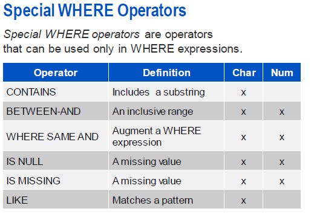
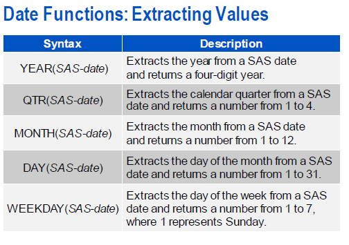
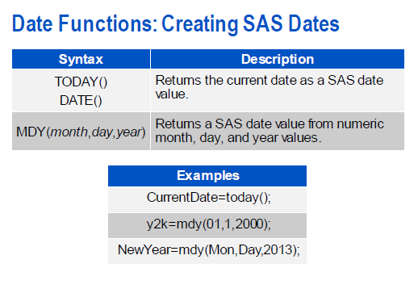
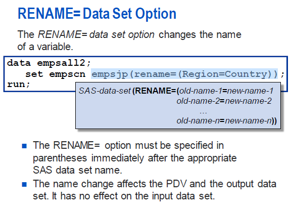
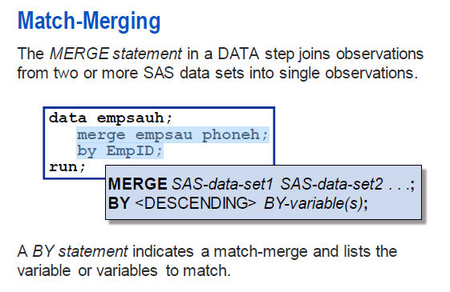

提交code的三种方式:

sasstudio/EG/Windows Environment

```SAS
proc print data=sashelp.class;
quit;
proc print data=sashelp.class noobs;
quit;
/*差别在于有无观测值*/
```

sas代码是自由格式的

在每个语句的新行开始。

使用空白来分隔单词和步骤。

在一个步骤中缩进语句。

多行语句中的连续行缩进。

注释的方法:

```SAS
/*comment*/
* comment;
```

data set->Table

observation->Row

variable->Column

```
proc contents;
proc print;
```


变量类型:

- 可以是1到32个字符长。
- 必须以字母或下划线开头。后续字符可以是字母、下划线或数字
- 可以是大写、小写或混合大小写。
- 不区分大小写

```SAS
options validvarname=any;
/*变量名包含特殊字符;*/
```

数据类型:

- 字符变量

  可以包含任何值:字母、数字、特殊字符,空格

  范围 从 1 到 32767 个 字符 的 长度

  每个 character.1 字节

- 数值变量

   使用浮点或二进制存储数值表示

   默认 有 8 字节 的 存储

   可以 存储 16 或 17 digits. 意义 重大

日期类型

### Acecessing SAS Libraries																																																											

```sas
libname xxx "";
libname xxx clear;
proc contents data=orin._all_ nods;
run;
```

### reports

porc print/var/sum/where/define a data constant/identify observations with an ID statement

```SAS
*where语句
/*contains*/

```




sort and grouping

替代原始值和创建一个新的;可以sort在多个变量中;默认升序

```SAS
FILENAME REFFILE 'C:/sasworkspace/sas/sas pdf/base/SAS Programming 1：Essentials/pg1/sales.xls';   
PROC IMPORT DATAFILE=REFFILE
DBMS=XLS
OUT=WORK.IMPORT1;
GETNAMES=YES;
RUN;
```

变量中带有空格

```
proc sort data=work.sales out=work.sales2;
/* 	by Country descending Salary; */
	by 'Employee ID'n Salary;
quit;

```


title1/footnote1

title/Footnote:表示取消


label

一个标签最多可以包含256个字符,任何字符，包括空格。

Labels 由 许多 procedures. 自动 使用

The PRINT 过程 使用 标签指定LABEL或SPLIT=选项时。


Chapter 5 Formatting Data Values

Formats

User-Defined Formats


chapter read data

Drop/keep

reading Spreadsheet Data

```sas
options validvarname=V7;
/*
最多有32个混合大小写的字母数字字符允许的。
Names 必须 以 英文 字母 开始或下划线。
Invalid 字符 改为 underscores.
Any 列名 这 不是 独特 的 是 独特 的通过在名称后面附加一个计数器。
*/
```


Manipulating Data

```sas
variable=function-name(argument1, argument2, …);
Compensation=sum(Salary,Bonus);
BonusMonth=month(Hire_Date);
```





if-then

if else /do end


chapter 10

连接相同表结构的数据

```SAS
data work.class1;
set sashelp.class;
run;
data work.class2;
set sashelp.class;
run;

data work.class3;
set work.class2 work.class1;
run;

```

rename 




合并



one to one

one to many


FREQ Procedure