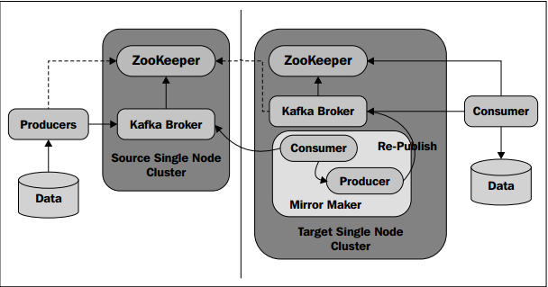
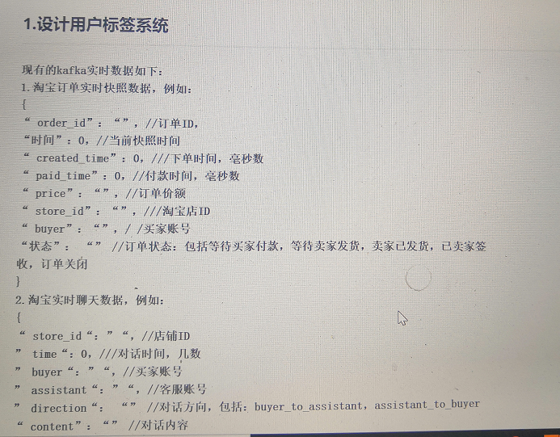
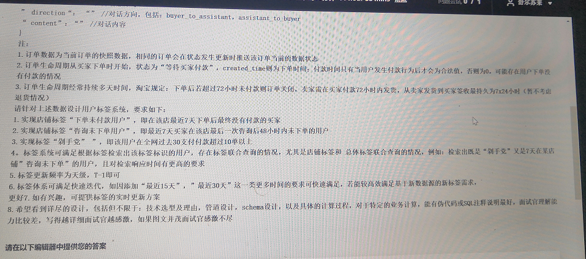
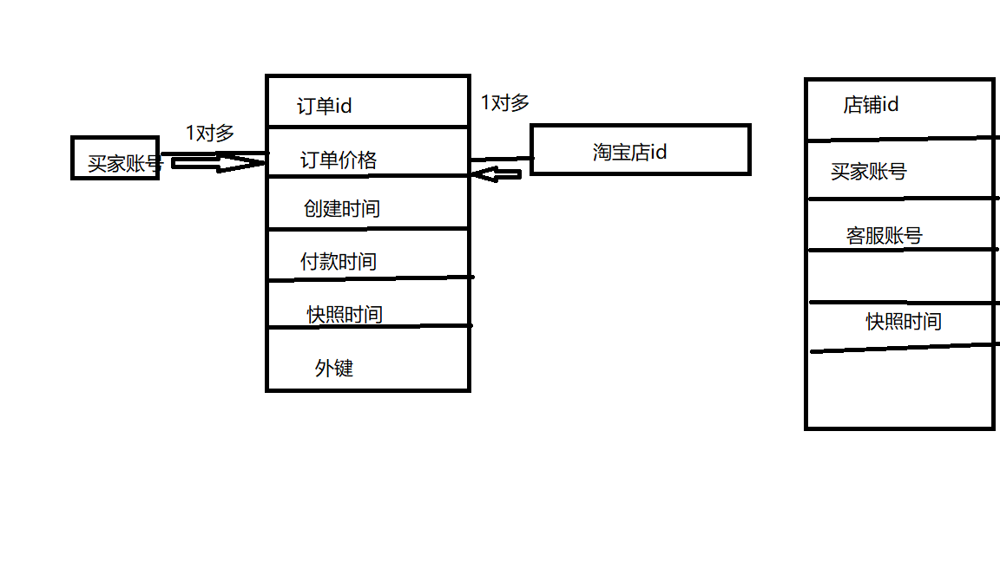
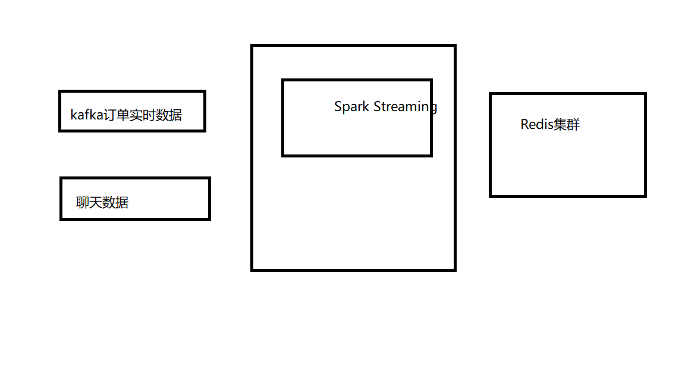

kafka:分布式流式处理平台，消息引擎


## kafka消息保留策略:

按照时间:比如天

按照数据存储量:比如字节数

按主题特点进行保存


## kafka性能影响因素

生产者性能:磁盘的吞吐量

消费者性能:内存的(系统页面缓存)


## broker如何计算


kafka的消息设计格式:

XML/JSON/二进制    结构化数据

Kafka传输设计协议

二进制的传输协议

消息引擎范型:

消息队列模型

发布订阅模型

消费组同时支持这两种模型

JMS:消息及服务，实现分布式环境中

Kafka的架构设计的重要点

| 吞吐量/延时        | 处理数据的能力/s，处理字节数的能力/s |
| ------------------ | ------------------------------------ |
| 消息持久化         |                                      |
| 负载均衡和故障转移 | zookeeper                            |
| 伸缩性             |                                      |

吞吐量：

生产者:

数据存储在页缓存上,最后在存储在磁盘上。磁盘的顺序存储的性能要比随机存储的性能要好。

采用追加写入消息的方式，在日志文件末尾追加写入的新的消息。

消费者:首先尝试从页缓存中读取，直接发送到网络的socket,也就是零拷贝


页缓存的优点:

kafka使用页缓存，数据读取要好，而且不易丢失。比JAVA的内存模型的栈内存和堆内存的管理模式更好，即使进程崩溃，数据如果存储在页缓存则比存储在堆内存中更好。

栈内存和堆内存


topic-partition-messgae

分区的概念没有实际的业务意义,

消息位移与消费者位移的概念

partition的位移表示消息的位移，消费者的位移可以进度条可以用户自己控制，但是终究不能超过分区的最后一条。

定位消息:

```
<topic-partition-offset>:即可定位消息
```

副本replica:

领导者和追随者的区别:

leader挂了以后，这个数据是如何同步的

ISR：  kafka自动维护一个replica集合

新版本的客户端

新版producer:

新版consumer:


集群生产环境规划

操作系统选型:linux,

原因

磁盘规划:

机械盘和SSD的选择,kafka选择机器盘也可以，因为kafka是顺序消息到磁盘中。所以在性能的方便，机器磁盘采用顺序的性能方面是不比SSD的性能差的。

使用RAID磁阵队列

内存规划：多核

网络带宽规划

多集群多节点安装

安装省

参数调优:

broker参数

broker>topic(特定参数，局部参数调优)

GC参数调优

java7

java8

JVM参数调优:

kafka在页缓存的使用，对JVM的堆内存的依赖不是很强。

OS参数调优

进程支持最大文件打开数;

Socket缓存调大;

```shell
sudo sysctl -w net.core.rmem_max=524288000
```

文件系统Ext4;swap空间关闭;flush的时间增大，增强页缓存的性能。


# producer

ProducerRecode对象

ProducerMetaData对象

语言选择;

二进制通信协议

同步发送和异步发送

Exception

消息分区策略


消息序列化;分区机制


### JMS:java message service

### kafka的两种模式

​	消息队列(p2p)

​	发布/订阅模式(topic主题)【publish-subscribe】

### kafka是消息系统

zk //协同

broker //代理,kafka server ,并不维护哪个消费者消费了消息

producer //生产者

consumer group //消费者组，每个组中只有一个消息者可以消费消息。

cousumer //消费者，维护了消息的消息状态

topic //主题


### kafka的核心部分

1、消息缓存与FileSystem的存储，数据被即可写入os内核页，并缓存以及清理磁盘(可以配置)

2、消息被消费后，kafka长时间驻留消息，如有必要，可以实现重复消息

3、对分组消息使用消息set，放置网络过载

4、使用消费者保持着消息元素据

5、消费状态默认存在zk中，也可以存在OTLP中(传统结构数据)

6、kafka的生产和消费是pull-push模式

7、kafka没有主从模式、所有broker地位相同。brokers的元数据均在zk中维护，并在producer和consumer共享。

8、kafka的LB(load  balance)策略运行producer动态发现broker.

9、producer维护了broker的连接池，并能够通过zk的watcher call机制实现进行更新

10、producer可以选择同步或者异步的方式向broker发送消息。


### 消费压缩

1、producer压缩(GZIP和snappy),cousumer解压缩

2、压缩的消息没有深度限制

3、在message的header中有一个compress type。

​	字节是8位

kafka镜像

​	将源集群的数据副本到target kafka集群



右边的kafka集群中的consumer拉取左边集群消息，同步到右边。

### kafka在zk的znode

生产者在zk中不注册，消费者在zk中注册

```
1、get /controller  //{"version":1,"brokerid":0,"timestamp":"1560900395223"}
2、get /controller_epoch //data=1
3、ls /brokers  [ids, topics, seqid]
	/brokers/ids            //实时维护的
get /brokers/topics/test-topic/partitions/0/state
{"controller_epoch":2,"leader":1,"version":1,"leader_epoch":6,"isr":[2,1,0]}

get /brokers/topics/test-topic/partitions/1/state
{"controller_epoch":2,"leader":2,"version":1,"leader_epoch":3,"isr":[2,1,0]}

get /brokers/topics/test-topic/partitions/2/state
{"controller_epoch":2,"leader":0,"version":1,"leader_epoch":4,"isr":[2,1,0]}

4、ls /admin/delete_topics
5、ls /isr_change_notification
6、/consumers
7、/config
changes, clients, brokers, topics, users]
```

### kafka的副本机制

```
修改主题:
副本数无法修改，只能在创建topic时进行指定。
多个分区的时候，可以给副本指定到不通的broker上去。
/app/kafka_2.11-2.4.0/bin/kafka-topics.sh --zookeeper datanode1:2181,namenode:2181,datanode2:2181 --topic test-topic

replication factor x partition / brokers
每个分区有n个副本，可以承受n-1个节点故障，每个副本都有自己的leader,其余的都是follower。
zk中存放分区的leader和all replica的消息。(get /brokers/topics/test-topic/partitions/0/stat)

每个副本存储消息的部分数据在本地的log和offset中，周期性同步到disk,确保消息日写入全部副本或者其中一个。
leader故障时，消息或者写入本地log，或者在producer在收到ack消息后，resent partition给new  leader.


kafka支持的副本模型
1、同步复制
	producer从zk中找到leader,并发送message，消息立即写入本地log,而且follow开始pull消息，每个foller将消息写各自的本地log后，向leader发送确认回执。leader在收到所有的follow确认回执和本地副本的写入工作均完成后，再向producer中完成。
2、异步复制
	leader的本地log写入即可向producer发送
```


### 安装

1、java环境配置

2、zookeeper集群搭建(省略)【3台】

3、kafka集群搭建


```shell
mkdir -p /app/kafka_2.11-2.4.0/logs
```


```shell
broker.id=0
delete.topic.enable=true
listeners=PLAINTEXT://namenode:9092
log.dirs=/app/kafka_2.11-2.4.0/logs
zookeeper.connect=namenode:2181,datanode1:2181,datanode2:2181
unclean.leader.election.enable=false
zookeeper.connection.timeout.ms=6000

broker.id=1
delete.topic.enable=true
listeners=PLAINTEXT://datanode1:9092
log.dirs=/app/kafka_2.11-2.4.0/logs
zookeeper.connect=namenode:2181,datanode1:2181,datanode2:2181
unclean.leader.election.enable=false
zookeeper.connection.timeout.ms=6000


broker.id=2
delete.topic.enable=true
listeners=PLAINTEXT://datanode2:9092
log.dirs=/app/kafka_2.11-2.4.0/logs
zookeeper.connect=namenode:2181,datanode1:2181,datanode2:2181
unclean.leader.election.enable=false
zookeeper.connection.timeout.ms=6000

启动
/app/kafka_2.11-2.4.0/bin/kafka-server-start.sh -daemon /app/kafka_2.11-2.4.0/config/server.properties

```

### 验证测试

```shell
创建topic
/app/kafka_2.11-2.4.0/bin/kafka-topics.sh --zookeeper namenode:2181,datanode1:2181,datanode2:2181 --create --topic test-topic --partitions 3 --replication-factor 3

/app/kafka_2.11-2.4.0/bin/kafka-topics.sh --zookeeper namenode:2181,datanode1:2181,datanode2:2181 -list test-topic

/app/kafka_2.11-2.4.0/bin/kafka-topics.sh --zookeeper namenode:2181,datanode1:2181,datanode2:2181 --describe --topic test-topic

/app/kafka_2.11-2.4.0/bin/kafka-topics.sh --zookeeper datanode1:2181,namenode:2181,datanode2:2181 --describe --topic test-topic

./zkCli.sh -server namenode:2181,datanode1:2181,datanode2:2181
ls /brokers/topics/test-topic
get /brokers/topics/test-topic

/app/kafka_2.11-2.4.0/bin/kafka-console-producer.sh --broker-list  datanode1:9092,namenode:9092,datanode2:9092 --topic test-topic

/app/kafka_2.11-2.4.0/bin/kafka-console-consumer.sh --bootstrap-server  datanode1:9092,namenode:9092,datanode2:9092 --topic test-topic --from-beginning
```


# kafka的设计题






最初的设计：




