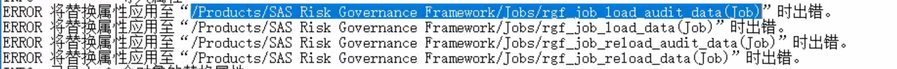
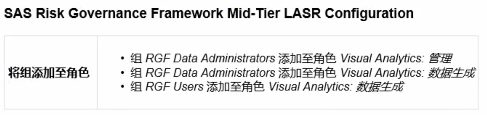

制作plan(省略)

70264138

建立用户、确认环境

密码sas@2020

安装

配置

sassrv sas risk 外部用户

sas risk config 报警

**HTTP 404 error when accessing SASRiskGovernanceFramework web application**

SAS infrastructure for Risk Management :Administrator's Guide

SAS Risk Governanve Framework Mid-Tier LASR Configuration

db,wip的密码sas@2020

postgresql的编码格式改为: -E UNICODE option to -E EUC-KR

