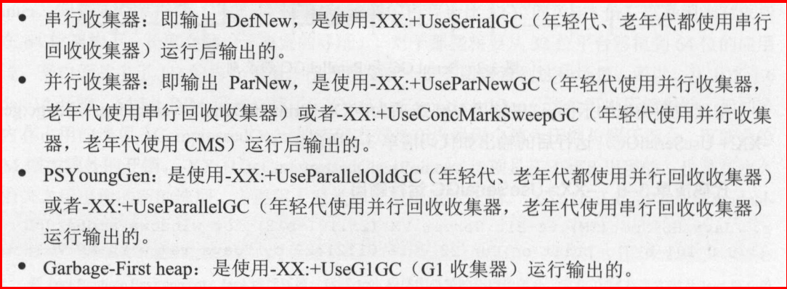

Spring

概念:

注解和配置

IOC容器:初始化对象,解决对象间的依赖管理和对象的使用。

IOC和AOP的区别

依赖注入/代理/控制反转

IOC容器:解析配置元数据信息进行Bean初始化、配置、依赖管理

## spring-ldap

必须组件

spring-ldap-core (the Spring LDAP library)
spring-core (miscellaneous utility classes used internally by the framework)
spring-beans (contains interfaces and classes for manipulating Java beans)
spring-data-commons (base infrastructure for repository suppport, etc.)
slf4j (a simple logging facade, used internally)

附加组件

- *spring-context* (If your application is wired up using the Spring Application Context - adds the ability for application objects to obtain resources using a consistent API. Definitely needed if you are planning on using the BaseLdapPathBeanPostProcessor.)
- *spring-tx* (If you are planning to use the client side compensating transaction support)
- *spring-jdbc* (If you are planning to use the client side compensating transaction support)
- *commons-pool* (If you are planning to use the pooling functionality)
- *spring-batch* (If you are planning to use the LDIF parsing functionality together with Spring Batch)


## Spring-batch


## Spring-Kafka

版本兼容

| Spring for Apache Kafka Version | Spring Integration for Apache Kafka Version | `kafka-clients`     | Spring Boot |
| ------------------------------- | ------------------------------------------- | ------------------- | ----------- |
| 2.5.x                           | 3.3.x                                       | 2.5.0               | 2.3.x       |
| 2.4.x                           | 3.2.x                                       | 2.4.1               | 2.2.x       |
| 2.3.x                           | 3.2.x                                       | 2.3.1               | 2.2.x       |
| 2.2.x                           | 3.1.x                                       | 2.0.1, 2.1.x, 2.2.x | 2.1.x       |
| 1.3.x                           | 2.3.x                                       | 0.11.0.x, 1.0.x     | 1.5.x (EOL) |


## JVM调优


使用jdk的jre的jar包的调优方式

### jps

jps主要用来输出JVM中运行的进程状态信息。

> jps [options] [hostid]

```shell
/sas/sas94/SASHome/SASPrivateJavaRuntimeEnvironment/9.4/jre/bin/java -classpath /sas/sas94/SASHome/SASPrivateJavaRuntimeEnvironment/9.4/lib/tools.jar sun.tools.jps.Jps -m -l
```

###  jstack

jstack主要用来查看某个Java进程内的线程堆栈信息。语法格式如下：

> jstack [option] pid
> jstack [option] executable core
> jstack [option] [server-id@]remote-hostname-or-ip

-l long listings，会打印出额外的锁信息，在发生死锁时可以用jstack -l pid来观察锁持有情况
-m mixed mode，不仅会输出Java堆栈信息，还会输出C/C++堆栈信息（比如Native方法）


```shell
ps -Lfp pid
ps -mp pid -o THREAD, tid, time
top -Hp pid
ps -o nlwp xx #查看指定process的id
```

TIME列就是各个Java线程耗费的CPU时间，CPU时间最长的是线程ID为21742的线程，用

```shell
printf "%x\n" 21742
```


得到21742的十六进制值为54ee，下面会用到。

OK，下一步终于轮到jstack上场了，它用来输出进程21711的堆栈信息，然后根据线程ID的十六进制值grep，如下：

```shell
root@ubuntu:/# jstack 21711 | grep 54ee
"PollIntervalRetrySchedulerThread" prio=10 tid=0x00007f950043e000 nid=0x54ee in Object.wait()
```


```shell
/sas/sas94/SASHome/SASPrivateJavaRuntimeEnvironment/9.4/jre/bin/java -classpath /sas/sas94/SASHome/SASPrivateJavaRuntimeEnvironment/9.4/lib/tools.jar sun.tools.jstack.JStack -l 
```


C、 jmap（Memory Map）和jhat（Java Heap Analysis Tool）

jmap用来查看堆内存使用状况，一般结合jhat使用。

jmap语法格式如下：

> jmap [option] pid
> jmap [option] executable core
> jmap [option] [server-id@]remote-hostname-or-ip

如果运行在64位JVM上，可能需要指定-J-d64命令选项参数。

```
jmap -permstat pid
```


## JVM GC调优

### JVM的三种执行模式

编译执行和解释执行

```shell
#混合执行模型
java -version
#java version "1.8.0_60"
#Java(TM) SE Runtime Environment (build 1.8.0_60-b27)
#Java HotSpot(TM) 64-Bit Server VM (build 25.60-b23, mixed mode)
#编译执行模式
java -Xcomp -version
#java version "1.8.0_60"
#Java(TM) SE Runtime Environment (build 1.8.0_60-b27)
#Java HotSpot(TM) 64-Bit Server VM (build 25.60-b23, compiled mode)
#解释执行模式
java -Xint -version
#java version "1.8.0_60"
#Java(TM) SE Runtime Environment (build 1.8.0_60-b27)
#Java HotSpot(TM) 64-Bit Server VM (build 25.60-b23, interpreted mode)
```


-Xms64m -Xmx256m

##### -XX:+PrintGCDetails

作用:显示基础信息并输出

```verilog
Heap
 PSYoungGen      total 152576K, used 13107K [0x0000000716780000, 0x0000000721180000, 0x00000007c0000000)
  eden space 131072K, 10% used [0x0000000716780000,0x000000071744cf28,0x000000071e780000)
  from space 21504K, 0% used [0x000000071fc80000,0x000000071fc80000,0x0000000721180000)
  to   space 21504K, 0% used [0x000000071e780000,0x000000071e780000,0x000000071fc80000)
 ParOldGen       total 348160K, used 0K [0x00000005c3600000, 0x00000005d8a00000, 0x0000000716780000)
  object space 348160K, 0% used [0x00000005c3600000,0x00000005c3600000,0x00000005d8a00000)
 Metaspace       used 3231K, capacity 4496K, committed 4864K, reserved 1056768K
  class space    used 350K, capacity 388K, committed 512K, reserved 1048576K
```

##### -Xloggc

作用:打印详细信息到Log中

```shell
-XX:+PrintGCDetails -verbose:gc -Xloggc:gc.log
```

```verilog
Java HotSpot(TM) 64-Bit Server VM (25.60-b23) for windows-amd64 JRE (1.8.0_60-b27), built on Aug  4 2015 11:06:27 by "java_re" with MS VC++ 10.0 (VS2010)
Memory: 4k page, physical 33331348k(17920976k free), swap 38312084k(12863084k free)
CommandLine flags: -XX:InitialHeapSize=533301568 -XX:MaxHeapSize=8532825088 -XX:+PrintGC -XX:+PrintGCDetails -XX:+PrintGCTimeStamps -XX:+UseCompressedClassPointers -XX:+UseCompressedOops -XX:-UseLargePagesIndividualAllocation -XX:+UseParallelGC 
Heap
 PSYoungGen      total 152576K, used 13107K [0x0000000716780000, 0x0000000721180000, 0x00000007c0000000)
  eden space 131072K, 10% used [0x0000000716780000,0x000000071744cf28,0x000000071e780000)
  from space 21504K, 0% used [0x000000071fc80000,0x000000071fc80000,0x0000000721180000)
  to   space 21504K, 0% used [0x000000071e780000,0x000000071e780000,0x000000071fc80000)
 ParOldGen       total 348160K, used 0K [0x00000005c3600000, 0x00000005d8a00000, 0x0000000716780000)
  object space 348160K, 0% used [0x00000005c3600000,0x00000005c3600000,0x00000005d8a00000)
 Metaspace       used 3238K, capacity 4496K, committed 4864K, reserved 1056768K
  class space    used 352K, capacity 388K, committed 512K, reserved 1048576K

```


##### -XX:+UseSerialGC

作用:单线程的垃圾收集器

运行过程中会导致应用程序停顿,单线程的处理方式；适用于cpu核数较少的场景。而Parallel GC是一个多线程的处理方式。

```shell
-XX:+PrintGCDetails -verbose:gc -Xloggc:gc.log -XX:+UseSerialGC
```


```verilog
Java HotSpot(TM) 64-Bit Server VM (25.60-b23) for windows-amd64 JRE (1.8.0_60-b27), built on Aug  4 2015 11:06:27 by "java_re" with MS VC++ 10.0 (VS2010)
Memory: 4k page, physical 33331348k(17874968k free), swap 38312084k(12822564k free)
CommandLine flags: -XX:InitialHeapSize=533301568 -XX:MaxHeapSize=8532825088 -XX:+PrintGC -XX:+PrintGCDetails -XX:+PrintGCTimeStamps -XX:+UseCompressedClassPointers -XX:+UseCompressedOops -XX:-UseLargePagesIndividualAllocation -XX:+UseSerialGC 
Heap
 def new generation   total 156672K, used 13926K [0x00000005c3600000, 0x00000005ce000000, 0x000000066cea0000)
  eden space 139264K,  10% used [0x00000005c3600000, 0x00000005c4399be0, 0x00000005cbe00000)
  from space 17408K,   0% used [0x00000005cbe00000, 0x00000005cbe00000, 0x00000005ccf00000)
  to   space 17408K,   0% used [0x00000005ccf00000, 0x00000005ccf00000, 0x00000005ce000000)
 tenured generation   total 348160K, used 0K [0x000000066cea0000, 0x00000006822a0000, 0x00000007c0000000)
   the space 348160K,   0% used [0x000000066cea0000, 0x000000066cea0000, 0x000000066cea0200, 0x00000006822a0000)
 Metaspace       used 3264K, capacity 4496K, committed 4864K, reserved 1056768K
  class space    used 355K, capacity 388K, committed 512K, reserved 1048576K
```

差别在 def new generation 



##### -XX:+UseParNewGC

作用:独占式;多线程的方式

UseParNewGC这个垃圾收集器将已经是过时的

```
Java HotSpot(TM) 64-Bit Server VM warning: Using the ParNew young collector with the Serial old collector is deprecated and will likely be removed in a future release
```

##### -XX:+UseParallelGC

jdk7的GC，多线程处理，高吞吐GC

##### -XX:+UseParallelOldGC

专门为老年代设计

##### -XX:+UseG1GC

##### -XSS

-XX:+UseParallelGC:


JVM诊断工具

```shell
java -classpath sa-jdi.jar sun.jvm.hotspot.HSDB
```


# org.omg.CORBA.COMM_FAILURE: vmcid: SUN minor code: 203 completed: No