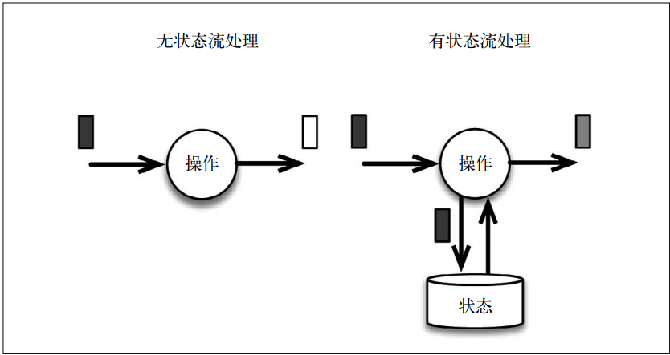
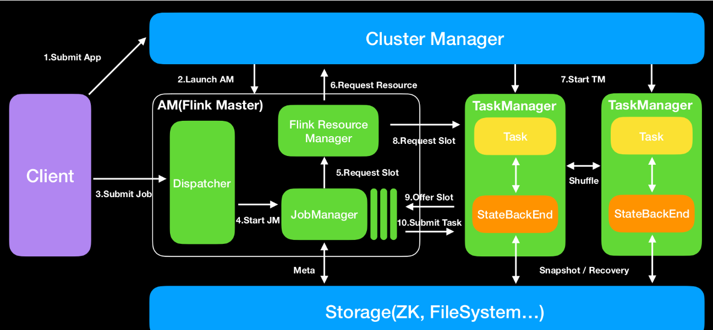
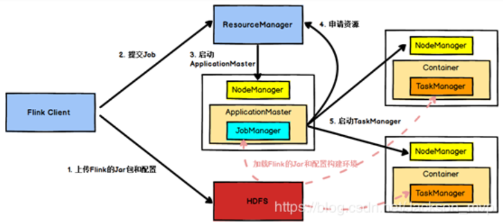

flink的概念

流处理架构:

消息传输层以及流处理层

Flink的状态管理

lambda架构


Flink的三个时间定义的区别和联系

时间概念:事件时间,处理时间,摄取时间

窗口：时间窗口/计数窗口/会话窗口/触发器

有状态的计算和无状态的计算



流处理的一致性

exactly-once

检查点和保存点的流程以及区别


### 本地集群


```shell
#启动
/opt/flink-1.8.0/bin/start-cluster.sh
/opt/flink-1.8.0/bin/flink run /opt/flink-1.8.0/examples/streaming/SocketWindowWordCount.jar -port 9000

/opt/flink-1.8.0/bin/flink run /opt/flink-1.8.0/examples/batch/WordCount.jar --input /opt/flink-1.8.0/README.txt --output /opt/flink-1.8.0/test/
```


### Flink运行架构

作业管理器/任务管理器/资源管理器/分发器

JobManager/TaskManager/ResouceManager/Dispacher

资源管理器主要负责任务管理器的插槽(slot),插槽是Flink中定义的处理资源单元。插槽的数量限制了TaskManager能够执行的任务数量。

Dispacher分发器提供了一个REST接口，将应用转发给JobManager。




提交流程到YARN

