# 联机开户

## 功能:

用netty做了一个web服务化的工作，为甲方提供了增删改查的接口。

## 需求以及接口说明

联机开户的功能需要对外提供给了web接口，对openldap和sas侧同时进行开户的工作,主要分以下的几种情况。

| 需求       | 接口                  | 说明           | 参数     |
| ---------- | --------------------- | -------------- | -------- |
| 境内删除   | synchronizaDeleteUser | 单用户组的删除 | 详情附录 |
| 境内新增   | synchronizaCreateUser | 单用户组的新增 |          |
| 境外删除   | synchronizaDeleteUser | 单用户组的删除 |          |
| 境外新增   | synchronizaCreateUser | 单用户组的新增 |          |
| 境内外删除 | homeAbroadDeleteUser  | 多用户组的删除 |          |
| 境内外新增 | homeAbroadCreateUser  | 多用户组的新增 |          |

甲方调用的流程：先调用删除接口后调用增加的接口

境内(外)和境内外接口的区别：

境内(外):该接口创建的用户在openldap和sas侧只能属于境内或者境外，所以该接口执行出来的用户只属于一个用户组。

境内外接口：该接口创建的用户在openldap和sas侧同时属于境内和境外两个组。

### 流程架构图:

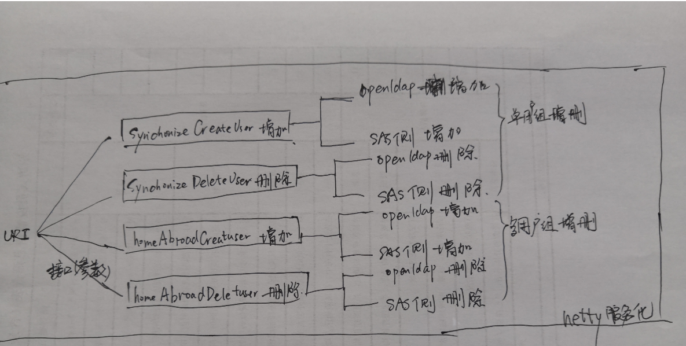

### openldap和sas侧的开户不同点

​	openldap使用的是开源的jldap.jar包对openldap做的CRUD的操作。

​        sas侧使用java调用sas代码的方式，传参给sas代码，具体的业务逻辑是使用sas代码操作元数据的。

接口使用的类和函数

| 类         | 函数                 | 说明                       |
| ---------- | -------------------- | -------------------------- |
| LdapHelper | addUsers             | openldap用户增加(单用户组) |
|            | deleteUsers          | openldap用户删除(单用户组) |
|            | homeAbroadaddUsers   | openldap用户增加(多用户组) |
|            | homeAbroadeleteUsers | openldap用户删除(多用户组) |
| SASPerson  | createUser           | SAS侧用户增加(单用户组)    |
|            | deleteUser           | SAS侧用户删除单用户组)     |
|            | homeAbroadCreateUser | SAS侧用户增加(多用户组)    |
|            | homeAbroadeletUser   | SAS侧用户删除(多用户组)    |

#### 代码图片

##### SASPerson.createUser

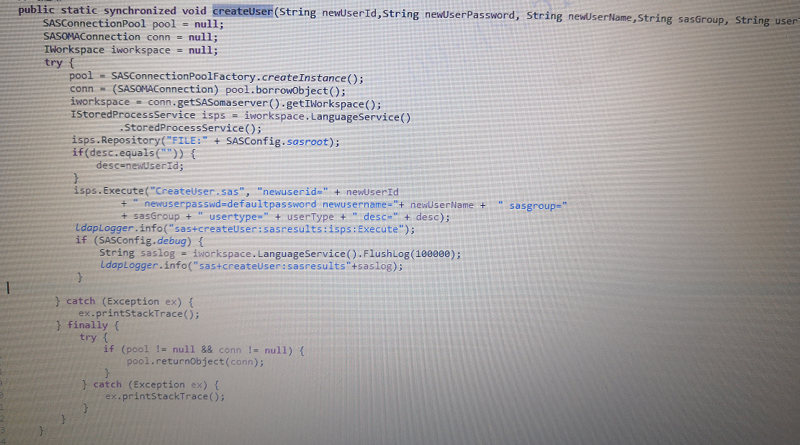

##### SASPerson.deleteUser

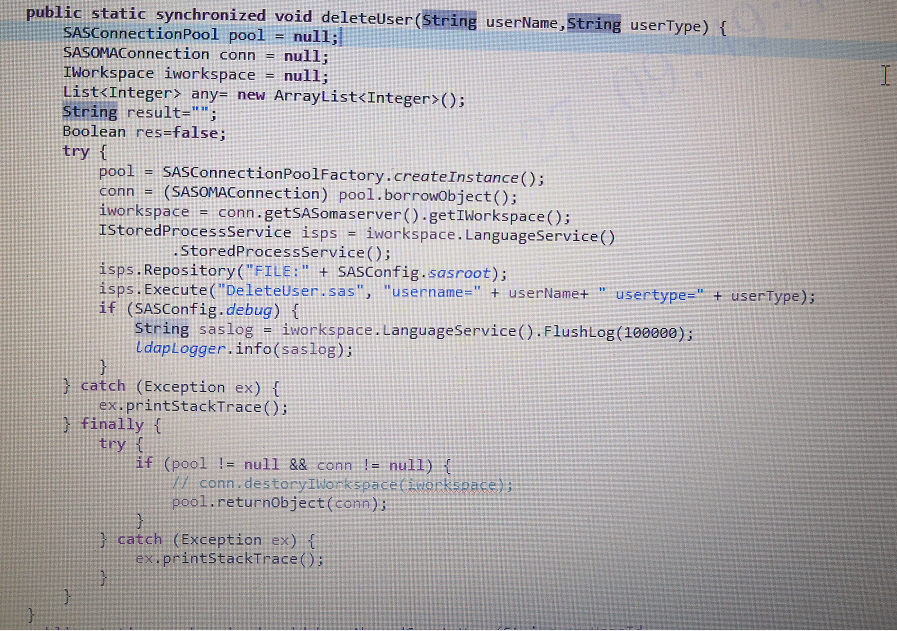

##### SASPerson.homeAbroadCreateUser

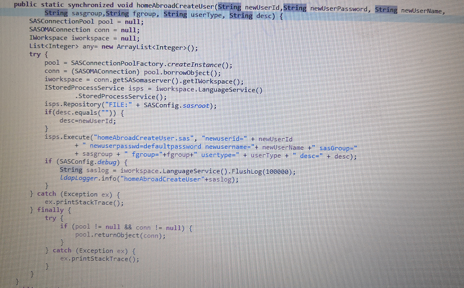

##### SASPerson.homeAbroadeletUser

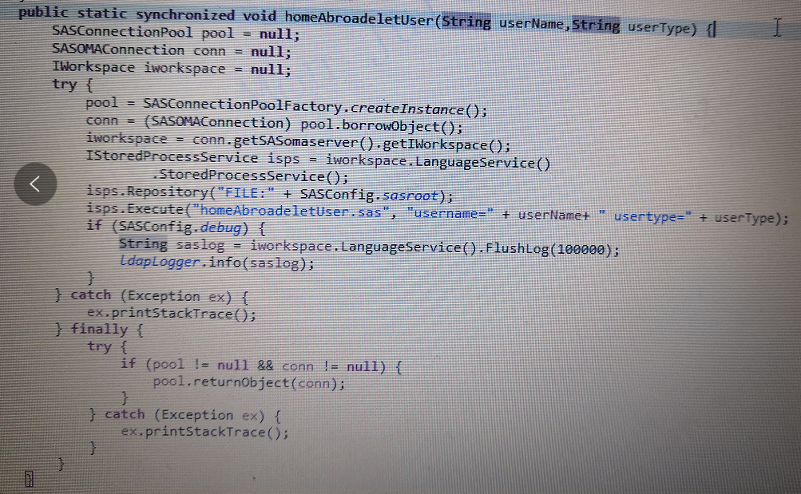

#### 函数伪代码

addUsers

1. 根据最新的uidNuDn,给该用户赋予一个uid,并将uidNuDn++
2. 根据group查询gidnumber,根据传进来的参数创建用户dn；组dn中添加member和memberUid

deleteUsers

1. 根据uid,查询用户dn，删除该用户;
2. 根据uid，查询出gidnumber，删除该组的member和memberUid

homeAbroadaddUsers

1. 根据最新的uidNuDn,给该用户赋予一个uid,并将uidNuDn++
2. 根据group查询gidnumber,根据传进来的参数创建用户dn；
3. 根据组名查询组dn,将多个组中添加member和memberUid。

homeAbroadeleteUsers

1. 根据uid查询所属的所有组dn
2. 删除查询出来的组dn中的member和memberUid

createUser

1. java调用sas94提供的iwokspace接口和istoredProcess接口，传入参数，执行sas代码。
2. sas代码:使用sas接口操作元数据，增加用户，增加logins,增加组和用户的关联

deleteUser

1. java调用sas94提供的iwokspace接口和istoredProcess接口，传入参数，执行sas代码。
2. sas代码:使用sas接口操作元数据，删除用户，删除logIns

homeAbroadCreateUser

1. java调用sas94提供的iwokspace接口和istoredProcess接口，传入参数，执行sas代码
2. sas代码:使用sas接口操作元数据，增加用户，增加多个logins,增加多个组和用户的关联

homeAbroadeletUser

1. java调用sas94提供的iwokspace接口和istoredProcess接口，传入参数，执行sas代码。
2. sas代码:使用sas接口操作元数据，删除用户，删除logIns

### 代码的流程

#### 类流程

HttpLdapServer->HttpLdapServerHandler->{LdapHelper/SASPerson}

#### example:

以homeAbroadCreateUser的uri为例做一个流程

先进行openldap的用户创建，然后调用shell修改home目录权限，最后对sas侧创建用户

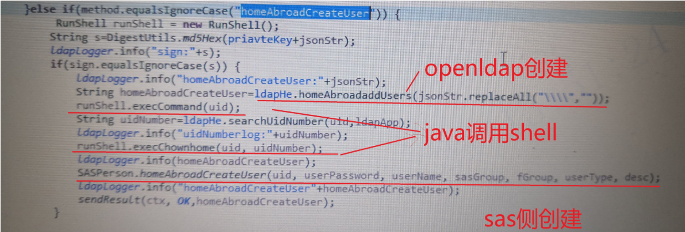

### 后期任务和之前解决的问题

#### 已经解决的问题

| 解决的问题                                                   | 解决办法                                                  |
| ------------------------------------------------------------ | --------------------------------------------------------- |
| ldap同步到home中不及时的问题                                 | 通过java获取最新的uid，然后调用shell方式修改home的权限    |
| java调用shell出现buffer已满，进程卡死                        | java释放buffer                                            |
| 删除用户目录;需要将之前的用户目录备份，再创建                | java调用shell的方式，将之前的用户目录按照时间戳的格式备份 |
| 用户更换之后，uid改变，hadoop的keytab生产的临时tmp文件需要删除 | java调用shell的方式删除指定的                             |
| JVM调优                                                      | -Xms512m -Xmx4g -Xss2m                                    |
| 功能稳定解决                                                 | 增加每天凌晨重启服务的机制                                |

#### 待优化的点

| 问题描述                                        | 建议解决办法                                                 |
| ----------------------------------------------- | ------------------------------------------------------------ |
| java响应时间比较长，现在是正常一个开户时间是20s | java操作sas，调起Workspace的时间比较长;java调用shell，等待shell返回结果 |

# 附录

## 接口文档以及参数

### 境内(外)删除

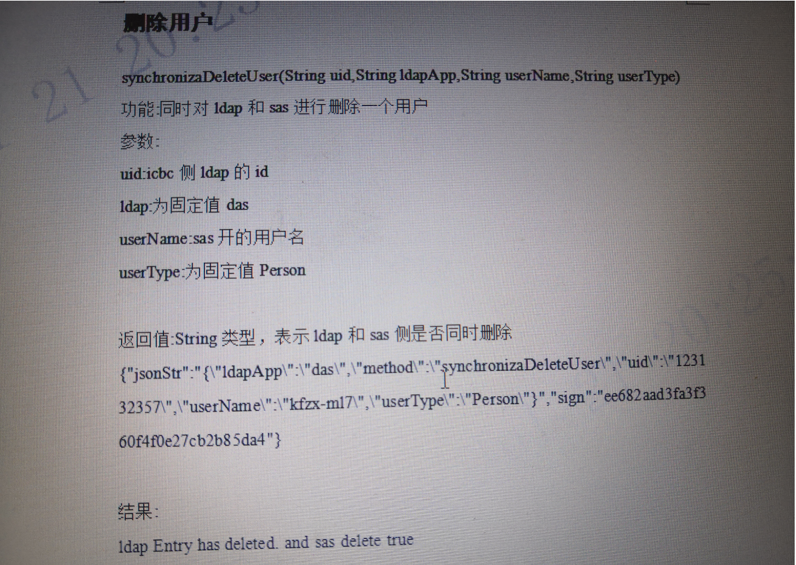

### 境内(外)增加

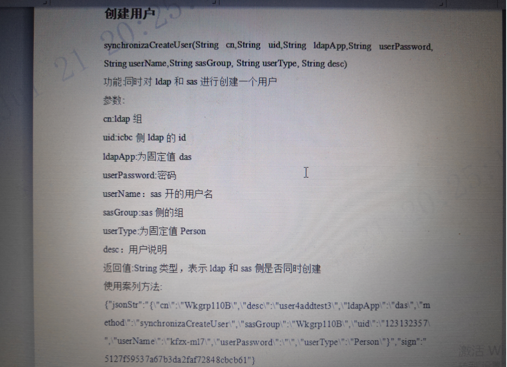

### 境内外共同删除

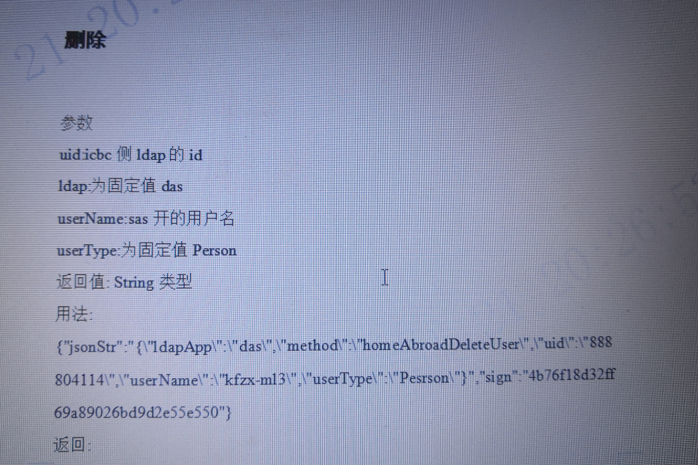

### 境内外共同增加

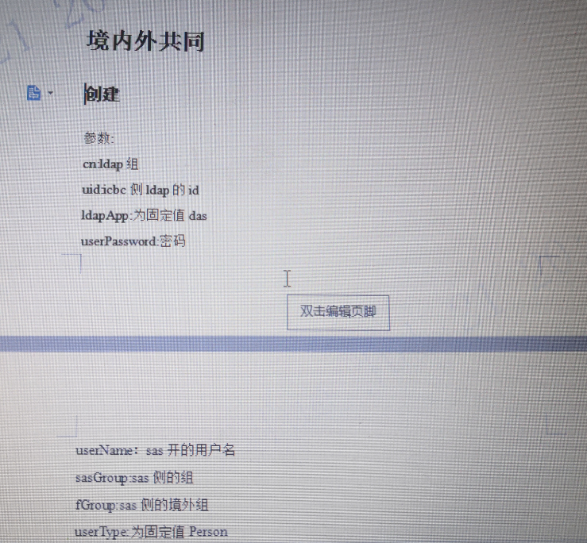

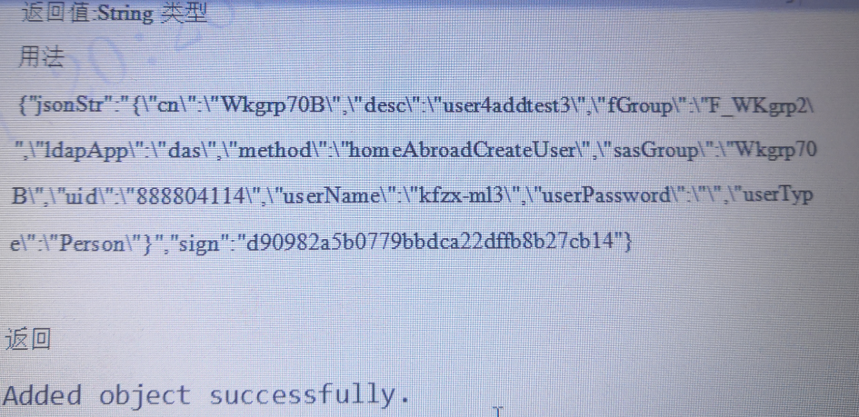

## SAS代码（主要的）

### 获取组和用户的关系

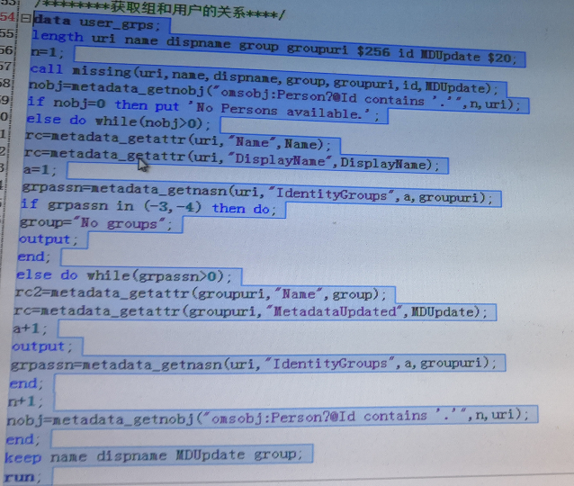

### 通过组名获取特殊组

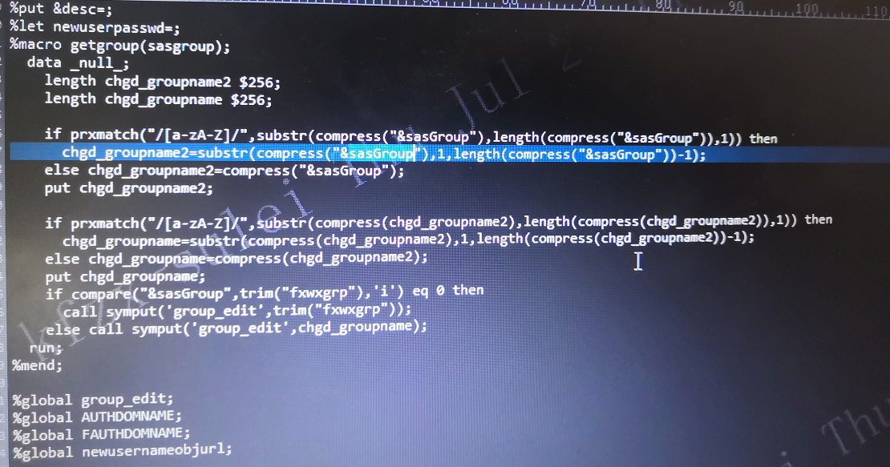

###      删除用户

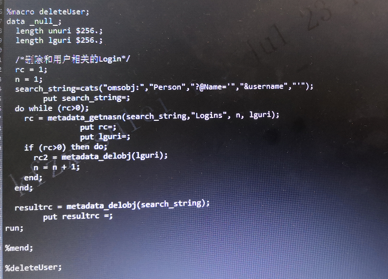

### 增加用户

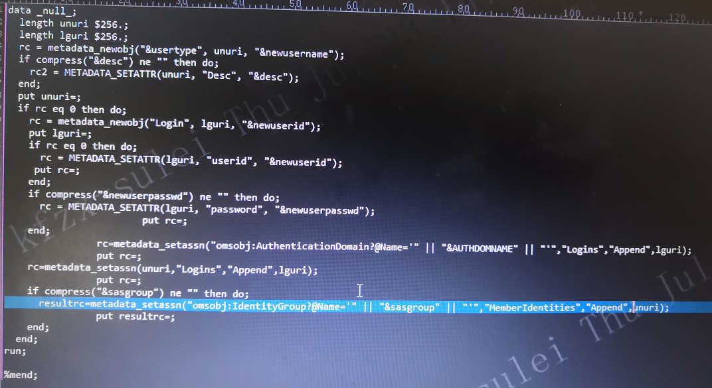