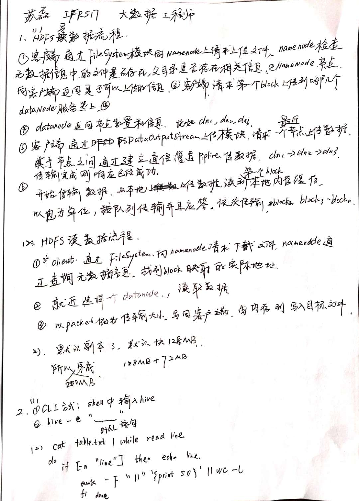
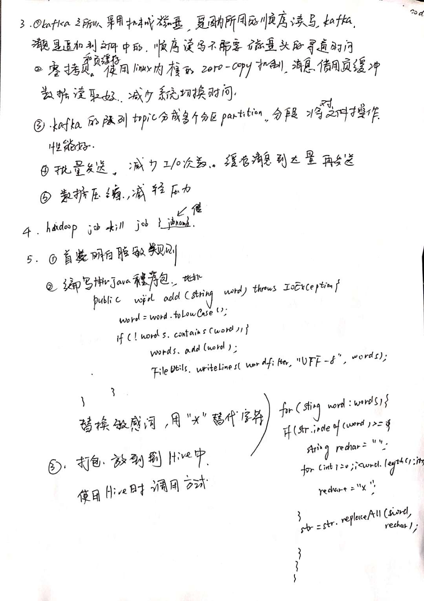
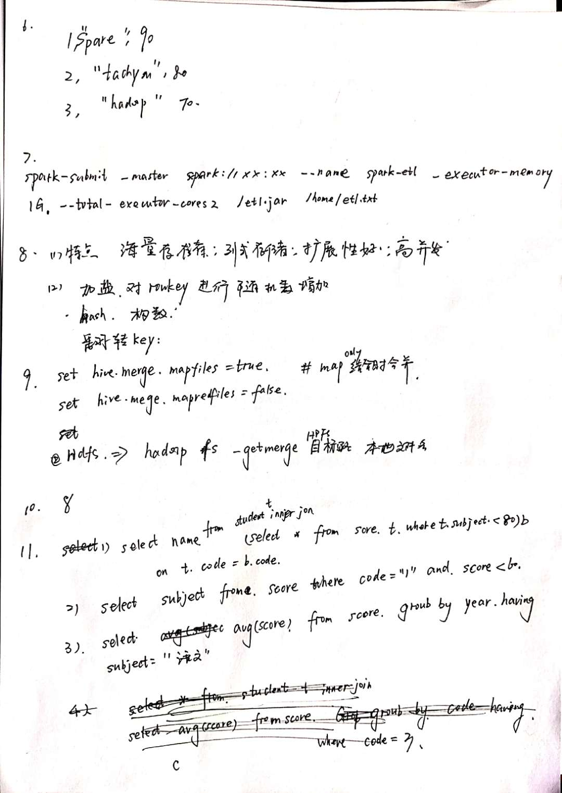
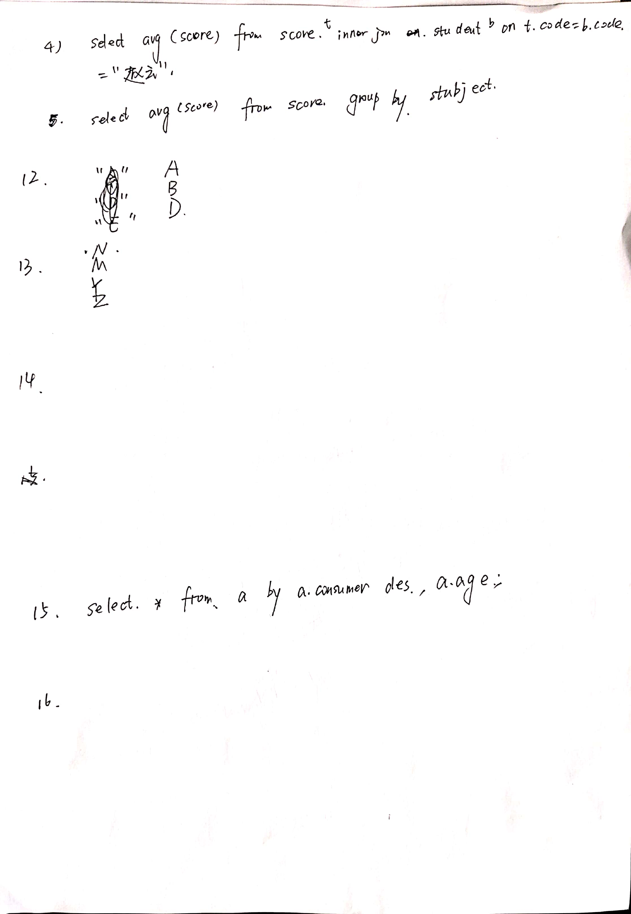
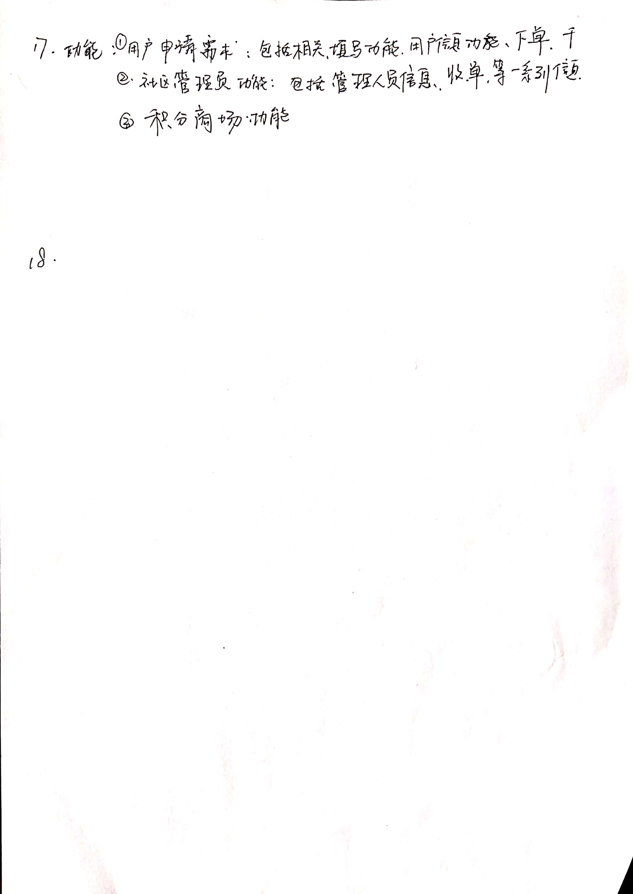

# JAVA

Runnable 比Thread的线程方式比较好，除了接口更容易继承之外，资源共享

### String和StringBuffer的区别

String不是最基本的数据类型,java.lang.String类是final类型的，因此不可以继承这个类、不能修改这个类。

JAVA平台提供了两个类：String和StringBuffer，它们可以储存和操作字符串，即包含多个字符的字符数据。这个String类提供了数值不可改变的字符串。而这个StringBuffer类提供的字符串进行修改。当你知道字符数据要改变的时候你就可以使用StringBuffer。典型地，你可以使用StringBuffers来动态构造字符数据。

### 说出ArrayList,Vector, LinkedList的存储性能和特性

名单主要有数组列表，链表与矢量几种实现。

这三者都实现了List接口，使用方式也很相似，主要区别在于因为实现方式的不同，所以对不同的操作具有不同的效率。 

ArrayList是一个可改变大小的数组。当更多的元素加入到ArrayList中时，其大小将会动态地增长。内部的元素可以直接通过get与set方法进行访问，因为ArrayList本质上就是一个数组。

LinkedList是一个双链表，在添加和删除元素时具有比ArrayList更好的性能。但在get与set方面弱于ArrayList。

当然，这些对比都是指数据量很大或者操作很频繁的情况下的对比，如果数据和运算量很小，那么对比将失去意义。Vector和ArrayList类似，但属于强同步类。如果你的程序本身是线程安全的（thread-safe，没有在多个线程之间共享同一个集合/对象），那么使用ArrayList是更好的选择。矢量和的ArrayList在更多元素添加进来时会请求更大的空间.Vector每次请求其大小的双倍空间，而ArrayList的每次对大小增长50％。而LinkedList还实现了Queue接口，该接口比List提供了更多的方法，包括offer（），peek（），poll（）等。注意：默认情况下ArrayList的初始容量非常小，所以如果可以预估数据量的话，分配一个较大的初始值属于最佳实践，这样可以减少调整大小的开销。

### **Collection 和 Collections的区别。**

 Collection是集合类的上级接口，继承与他的接口主要有Set 和List.

Collections是针对集合类的一个帮助类，他提供一系列静态方法实现对各种集合的搜索、排序、线程安全化等操作。


8大基本数据类型的变量和对象的引用变量，其内存都分配在栈上。变量出了 作用域就会自动释放掉了

引用类型的变量，其内存都分配在堆上或者常量池里，需要通过new来创建。

8大基本数据类型的变量和对象的引用变量，其内存都分配在栈上哈
堆可以用来回收那些没有使用的变量空间，但是是指8大基本类型变量和对象的引用变量
栈也可以用来回收那些没有使用的变量空间，但是是指引用类型的变量和常量池里的变量。


final这里的考点更大了。如final修改变量怎么怎么样、final修改方法怎么怎么样、final修饰方法怎么怎么样、final修饰类怎么怎么样。

以及还有final、finally和finalize的区别，以及这里的回收机制

string这里考点也很大，string、stringbuffer、stringbuilder、stringtokenizer的区别


jdbc提供公共方法、二进制数据、事务

assert、enum、const


HashMap/HashTable


HashMap的


### JDK虚拟机

java的接口中的default方法

# Shell

行的开头和结尾: ^ $

# Spring

Spring是一个轻量级的IoC和AOP容器框架.

Ioc：控制反转


常见的配置方式有三种：基于XML的配置、基于注解的配置、基于Java的配置


# 大数据

## Hadoop

### HDFS中Block size的默认大小

```markdown
http://hadoop.apache.org/docs/
根据版本，2.7.3之前是64MB，之后的是128MB
```


### hadoop增加datanode节点

加入新的存储节点和删除旧的存储节点

```shell
hadoop-daemon.sh start datanode
hdfs dfsadmin -refreshNodes
hdfs dfsadmin -report

```

Shuffle阶段

shuffle阶段主要包括map阶段的combine、group、sort、partition以及reducer阶段的合并排序。

### Hadoop的杀死提交的进程

```shell
hadoop job -kill job_201212111628_11166
```


## Hive


Top N

### 和row_number() over（）函数结合起来使用

```sql
select * from
(
select cate1,cate2,title,count(uid),row_number() over(partition by cate1,cate2 order by count(uid) desc) as n 
from t_ods_video_user_behavior
where idfa is not null and dt >= 20180621 and dt<= 20180628
group by cate1,cate2,title) a
where a.n <= 100

/**rank() 排序相同时会重复，总数不会变  
dense_rank()排序相同时会重复，总数会减少
row_number() 会根据顺序计算**/


select id,
name,
sal,
rank()over(partition by name order by sal desc ) rp,
dense_rank() over(partition by name order by sal desc ) drp,
row_number() over(partition by name order by sal desc) rmp
from f_test
```

### order by和sort by的区别

```SQL
#order by 全局排序
hive>select * from hive.test order by id;
#sort by 局部排序(reduce)
hive>set mapreduce.job.reduces=3;
hive>select * from hive.test sort by id;
```

distribute by是控制在map端如何拆分数据给reduce端的。hive会根据distribute by后面列，对应reduce的个数进行分发，默认是采用hash算法。sort by为每个reduce产生一个排序文件。在有些情况下，你需要控制某个特定行应该到哪个reducer，这通常是为了进行后续的聚集操作。distribute by刚好可以做这件事。因此，distribute by经常和sort by配合使用。

**注：Distribute by和sort by的使用场景**

**1.**Map输出的文件大小不均。

**2.**Reduce输出文件大小不均。

**3.**小文件过多。

**4.**文件超大。

### 动态分区和静态分区的差别

### 合并小文件

1、hadoop fs -getmerge hdfs文件夹路径 合并本地的文件名

2、hive的参数化配置

```sql
set hive.merge.mapfiles = true ##在 map only 的任务结束时合并小文件
set hive.merge.mapredfiles = false ## true 时在 MapReduce 的任务结束时合并小文件
set hive.merge.size.per.task = 256*1000*1000 ##合并文件的大小
set mapred.max.split.size=256000000; ##每个 Map 最大分割大小
set mapred.min.split.size.per.node=1; ##一个节点上 split 的最少值
set hive.input.format=org.apache.hadoop.hive.ql.io.CombineHiveInputFormat; ##执行 Map 前进行小文件合并
```


## sqoop

### 解决Sqoop CLOB 字段从Oracle导入Hive错行

需要添加--map-column-java col4=String

```
sqoop import --connect jdbc:oracle:thin:@ORA_IP:ORA_PORT:ORA_SID \
--username user123 --password passwd123 -table SCHEMA.TBL_2 \ 
--hcatalog-table tbl2 --hcatalog-database testdb --num-mappers 1 \ 
--split-by SOME_ID --columns col1,col2,col3,col4 --hive-drop-import-delims \
--outdir /tmp/temp_table_loc --class-name "SqoopWithHCAT" \
--null-string "" --map-column-java col4=String
```

### sqoop如何增量导入数据

Storm


Flume

补知识点


## Spark

### 1.Spark master使用zookeeper进行HA的，有哪些元数据保存在Zookeeper？

spark通过这个参数spark.deploy.zookeeper.dir指定master元数据在zookeeper中保存的位置，包括Worker，Driver和Application以及Executors


Spark的HA做切换

standby节点要从zk中，获得元数据信息，恢复集群运行状态，才能对外继续提供服务，作业提交资源申请等，在恢复前是不能接受请求的。


1）在Master切换的过程中，所有的已经在运行的程序皆正常运行！因为Spark Application在运行前就已经通过Cluster Manager获得了计算资源，所以在运行时Job本身的调度和处理和Master是没有任何关系的！
2） 在Master的切换过程中唯一的影响是不能提交新的Job：一方面不能够提交新的应用程序给集群，因为只有Active Master才能接受新的程序的提交请求；另外一方面，已经运行的程序中也不能够因为Action操作触发新的Job的提交请求；


### **2.Spark master HA 主从切换过程不会影响集群已有的作业运行，为什么？**

答：因为程序在运行之前，已经申请过资源了，driver和Executors通讯，不需要和master进行通讯的

**3.Spark on Mesos中，什么是的粗粒度分配，什么是细粒度分配，各自的优点和缺点是什么？**

1）粗粒度：启动时就分配好资源， 程序启动，后续具体使用就使用分配好的资源，不需要再分配资源；好处：作业特别多时，资源复用率高，适合粗粒度；不好：容易资源浪费，假如一个job有1000个task，完成了999个，还有一个没完成，那么使用粗粒度，999个资源就会闲置在那里，资源浪费。

2）细粒度分配：用资源的时候分配，用完了就立即回收资源，启动会麻烦一点，启动一次分配一次，会比较麻烦。


### 3、driver的功能是什么？

1）一个Spark作业运行时包括一个Driver进程，也是作业的主进程，具有main函数，并且有SparkContext的实例，是程序的人口点；

2）功能：负责向集群申请资源，向master注册信息，负责了作业的调度，负责作业的解析、生成Stage并调度Task到Executor上。包括DAGScheduler，TaskScheduler。


### 4、Spark为什么比mapreduce快？

1）基于内存计算，减少低效的磁盘交互；

2）高效的调度算法，基于DAG；

3)容错机制Linage，精华部分就是DAG和Lingae


### 5、RDD宽依赖和窄依赖？

RDD和它依赖的parent RDD(s)的关系有两种不同的类型，即窄依赖（narrow dependency）和宽依赖（wide dependency）。

1）窄依赖指的是每一个parent RDD的Partition最多被子RDD的一个Partition使用

2）宽依赖指的是多个子RDD的Partition会依赖同一个parent RDD的Partition

### 6、Spark Streaming


### 7、钨丝计划


## Kafka

Kafka-Streaming

### spark-Streaming direct和receiver方式读取的区别

#### 基于Receiver的方式

Receiver是使用Kafka的高层次Consumer API来实现的。

receiver从Kafka中获取的数据都是存储在Spark Executor的内存中的，然后Spark Streaming启动的job会去处理那些数据。

然而，在默认的配置下，这种方式可能会因为底层的失败而丢失数据。如果要启用高可靠机制，让数据零丢失，就必须启用Spark Streaming的预写日志机制（Write Ahead Log，WAL）。该机制会同步地将接收到的Kafka数据写入分布式文件系统（比如HDFS）上的预写日志中。所以，即使底层节点出现了失败，也可以使用预写日志中的数据进行恢复。 
需要注意的要点

1、Kafka中的topic的partition，与Spark中的RDD的partition是没有关系的。所以，在KafkaUtils.createStream()中，提高partition的数量，只会增加一个Receiver中，读取partition的线程的数量。不会增加Spark处理数据的并行度。

2、可以创建多个Kafka输入DStream，使用不同的consumer group和topic，来通过多个receiver并行接收数据。

3、如果基于容错的文件系统，比如HDFS，启用了预写日志机制，接收到的数据都会被复制一份到预写日志中。因此，在KafkaUtils.createStream()中，设置的持久化级别是StorageLevel.MEMORY_AND_DISK_SER。

#### 基于Direct的方式

周期性地查询Kafka，来获得每个topic+partition的最新的offset，从而定义每个batch的offset的范围。当处理数据的job启动时，就会使用Kafka的简单consumer api来获取Kafka指定offset范围的数据。

1、简化并行读取：如果要读取多个partition，不需要创建多个输入DStream然后对它们进行union操作。Spark会创建跟Kafka partition一样多的RDD partition，并且会并行从Kafka中读取数据。所以在Kafka partition和RDD partition之间，有一个一对一的映射关系。

2、高性能：如果要保证零数据丢失，在基于receiver的方式中，需要开启WAL机制。这种方式其实效率低下，因为数据实际上被复制了两份，Kafka自己本身就有高可靠的机制，会对数据复制一份，而这里又会复制一份到WAL中。而基于direct的方式，不依赖Receiver，不需要开启WAL机制，只要Kafka中作了数据的复制，那么就可以通过Kafka的副本进行恢复。

3、一次且仅一次的事务机制：

基于receiver的方式，是使用Kafka的高阶API来在ZooKeeper中保存消费过的offset的。这是消费Kafka数据的传统方式。这种方式配合着WAL机制可以保证数据零丢失的高可靠性，但是却无法保证数据被处理一次且仅一次，可能会处理两次。因为Spark和ZooKeeper之间可能是不同步的。

4、降低资源。 
Direct不需要Receivers，其申请的Executors全部参与到计算任务中；而Receiver-based则需要专门的Receivers来读取Kafka数据且不参与计算。因此相同的资源申请，Direct 能够支持更大的业务。

5、降低内存。 
Receiver-based的Receiver与其他Exectuor是异步的，并持续不断接收数据，对于小业务量的场景还好，如果遇到大业务量时，需要提高Receiver的内存，但是参与计算的Executor并无需那么多的内存。而Direct 因为没有Receiver，而是在计算时读取数据，然后直接计算，所以对内存的要求很低。实际应用中我们可以把原先的10G降至现在的2-4G左右。

6、鲁棒性更好。 
Receiver-based方法需要Receivers来异步持续不断的读取数据，因此遇到网络、存储负载等因素，导致实时任务出现堆积，但Receivers却还在持续读取数据，此种情况很容易导致计算崩溃。Direct 则没有这种顾虑，其Driver在触发batch 计算任务时，才会读取数据并计算。队列出现堆积并不会引起程序的失败。

基于direct的方式，使用kafka的简单api，Spark Streaming自己就负责追踪消费的offset，并保存在checkpoint中。Spark自己一定是同步的，因此可以保证数据是消费一次且仅消费一次。

 

在Receiver的方式中，ssc中的partition和kafka中的partition并不是相关的，所以如果我们加大每个topic的partition数量，仅仅是增加线程来处理由单一Receiver消费的主题。但是这并没有增加Spark在处理数据上的并行度。

对于不同的Group和topic我们可以使用**多个Receiver**创建不同的Dstream来并行接收数据，之后可以利用**union来统一**成一个Dstream。

而在Direct方式中，**Kafka中的partition与RDD中的partition是一一对应**的并行读取Kafka数据，会创建和kafka分区一样的rdd个数。


spark1.4.0

<https://spark.apache.org/docs/1.4.0/streaming-programming-guide.html#receiver-reliability>


#### 预写日志是什么？其工作机制是什么？如何配置预写日志机制？


预写日志，简称WAL,从spark1.2版本开始，引入基于容错机制的文件系统的WAL机制，若启用该机制，receiver接收到的所有数据都会被写入配置的checkpoint目录中的预写日志这种机制可以让driver在恢复的时候，避免数据丢失，并且可以确保整个实时计算过程中，零数据丢失。
要配置该机制：
首先，调用StreamingContext的checkpoint()方法设置一个checkpoint目录；
然后，将spark.streaming.receiver.writeAheadLog.enable参数设置为true。
WAL机制的缺点：
会导致Receiver的吞吐量大幅度下降，因为单位时间内有相当一部分时间需要将数据写入预写日志；
解决办法：
如果又希望开启预写日志机制，确保数据零损失，又不希望影响系统的吞吐量，那么可以创建多个输入DStream启动多个Reciver，然后将这些receiver接收到的数据使用ssc.union()方法将这些dstream中的数据进行合并 。此外在启用了预写日志机制之后，推荐将复制持久化机制禁用掉，因为所有数据已经保存在容错的文件系统中了，不需要再用复制机制进行持久化，保存一份副本了，只要将输入的DStream的持久化机制设置一下即可。


### Kafka的高吞吐性的优点

顺序读写

1、kafka的消息是不断追加到文件中的，这个特性使kafka可以充分利用磁盘的顺序读写性能;顺序读写不需要硬盘磁头的寻道时间，只需很少的扇区旋转时间，所以速度远快于随机读写.

Kafka官方给出了测试数据(Raid-5，7200rpm)：

顺序 I/O: 600MB/s;随机 I/O: 100KB/s

2、零拷贝

先简单了解下文件系统的操作流程，例如一个程序要把文件内容发送到网络

这个程序是工作在用户空间，文件和网络socket属于硬件资源，两者之间有一个内核空间

在操作系统内部，整个过程为：

[](http://attach.dataguru.cn/attachments/portal/201609/02/173206xip766ntnpziapk2.png)

在Linux kernel2.2 之后出现了一种叫做"零拷贝(zero-copy)"系统调用机制，就是跳过“用户缓冲区”的拷贝，建立一个磁盘空间和内存的直接映射，数据不再复制到“用户态缓冲区”

系统上下文切换减少为2次，可以提升一倍的性能

[](http://attach.dataguru.cn/attachments/portal/201609/02/173206tzmk9mxg2q6qry9s.png)

文件分段

kafka的队列topic被分为了多个区partition，每个partition又分为多个段segment，所以一个队列中的消息实际上是保存在N多个片段文件中

[](http://attach.dataguru.cn/attachments/portal/201609/02/173207d74s8a3paa144st4.png)

通过分段的方式，每次文件操作都是对一个小文件的操作，非常轻便，同时也增加了并行处理能力

 

批量发送

Kafka允许进行批量发送消息，先将消息缓存在内存中，然后一次请求批量发送出去

 

比如可以指定缓存的消息达到某个量的时候就发出去，或者缓存了固定的时间后就发送出去

 

如100条消息就发送，或者每5秒发送一次

 

这种策略将大大减少服务端的I/O次数

 

数据压缩

Kafka还支持对消息集合进行压缩，Producer可以通过GZIP或Snappy格式对消息集合进行压缩

 

压缩的好处就是减少传输的数据量，减轻对网络传输的压力

 

Producer压缩之后，在Consumer需进行解压，虽然增加了CPU的工作，但在对大数据处理上，瓶颈在网络上而不是CPU，所以这个成本很值得


# SQL

## Sql开窗函数，开窗函数中row_number与rank的区别

row_number和rank都是排序，但是rank相同数据会重复，但是总数不会变

row_number相同数据不会重复，但是总数不变

## Union和Union All到底有什么区别

Union：对两个结果集进行并集操作，不包括重复行，同时进行默认规则的排序；

Union All：对两个结果集进行并集操作，包括重复行，不进行排序；

## count（\*）、count（1）和count（列名）的区别

1、执行效果上：  
l  count(*)包括了所有的列，相当于行数，在统计结果的时候，不会忽略列值为NULL  

l  count(1)包括了忽略所有列，用1代表代码行，在统计结果的时候，不会忽略列值为NULL  

l  count(列名)只包括列名那一列，在统计结果的时候，会忽略列值为空（这里的空不是只空字符串或者0，而是表示null）的计数，即某个字段值为NULL时，不统计。


2、执行效率上：  
l  列名为主键，count(列名)会比count(1)快  

l  列名不为主键，count(1)会比count(列名)快  

l  如果表多个列并且没有主键，则 count（1） 的执行效率优于 count（*）  

l  如果有主键，则 select count（主键）的执行效率是最优的  

l  如果表只有一个字段，则 select count（*）最优。

## SQL的差集

Except可以对两个或多个结果集进行连接，形成“差集”。返回左边结果集合中已经有的记录，而右边结果集中没有的记录。

```sql
　　SELECT Name FROM Person_1
　　EXCEPT
　　SELECT Name FROM Person_2
```

## INSTR()函数的使用方法

INSTR(C1,C2,I,J) 在一个字符串中搜索指定的字符,返回发现指定的字符的位置;
C1    被搜索的字符串
C2    希望搜索的字符串
I     搜索的开始位置,默认为1
J     出现的位置,默认为1
SQL> select instr("abcde",'b');


1、英语介绍一下介绍自己，用英语介绍一下最后的一个工作经验

2、介绍一下最近的工作项目

3、union和union all的区别

4、sql去重的几种方法

5、sql开窗函数row_number和rank、dense by的区别

6、shell如何替换文件中的字符

7、shell的crontab的原理

8、spark sql的性能调优，如何

9、两个字段，一个字段是有序数字如，1-无限大，另一个字段的数值aa,bb,cc....。再a到b到c中有无数个重复的，而且有空格。如何更新空格的值

自己的技能

SQL如何行转列

自己擅长的语言或者技能


left join/inner join


HBase的性能优化

HDFS的机架,DataNode的副本的分布机制

sqoop的增量数据导入

hadoop的数据分布设计，数据如何分布


太保面试题












# Flink

## flink的三种时间和watermark

## flink的窗口计算

flink 

时间窗口:滚动窗口/滑动窗口

时间乱序进入/

水印

水印的规律的业务模型.或者构建水印生成模型。flink监控事件流

触发器

滑动窗口是滚动窗口的一种


计数窗口:


会话窗口:


开窗机制与检查点机制完全分离


