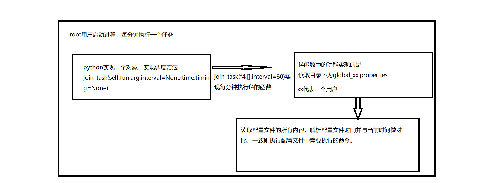

# 名称:python_crontab

# 功能:python实现定时任务的功能

# 项目出发点:

因项目需求,不能使用linux系统的crontab的,准备自己开发一个多用户定时任务框架。

# 设计思路:

基本的原理是采用crontab的原理是一样的,每一分钟去读取用户的时间配置文件，针对不同用户对应的自己的配置文件。

# 第一版本:

## 技术栈:

python2.7+shell+properties文件

## 思路：

使用root用户作为该框架的启动进程,每一分钟读取配置文件，并且和当前时间进行比较，如果成功则使用该用户执行命令。

## 功能图:




## 代码实现:


## 缺陷:

1、多机器、多用户，不同机器的不同用户拥有不同的定时调度任务，不同的机器有自己的进程，维护比较繁琐。

2、用户的配置文件中的时间显示必须是唯一的。

global_xx.properties该文件文件格式为:

```properties
2，32 * * * * = sh /tmp/1.sh
```

python代码中采用的是Map类型：key,value的方式进行核查比较的，所以存在这个如果时间是一样的格式，则执行的命令，只会执行一个结果。

3、实际投产中，采用了shell和python结合的方式，shell启动程序，并且注释修改配置文件;使用shell方式做了一个看门狗的功能，语言复杂，推荐使用统一语言实现。

4、log功能统一


# 版本二:

根据以上的

不再采用xx.properties的配置文件的形式，采用sqlite数据库的方式;

采用共享的方式，代码框架存在共享，每一台有自己的进程，控制log。


# 版本三:

使用flask微服务作为对外服务的接口，提供

