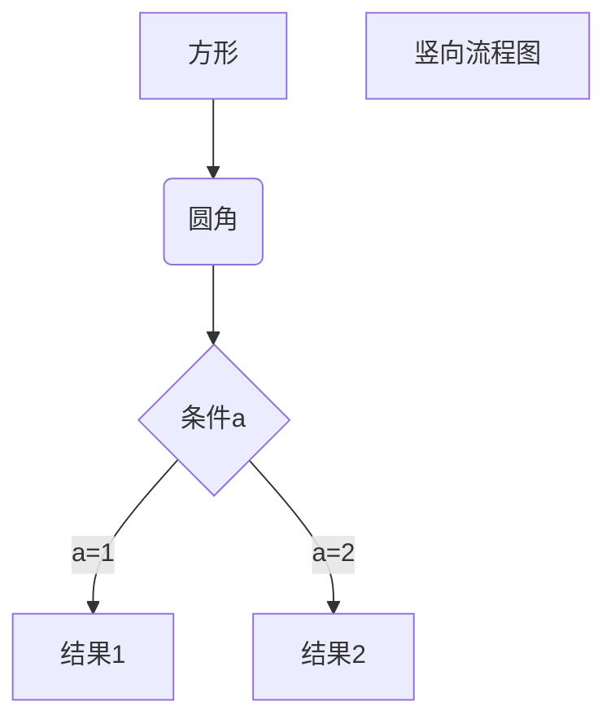

## oracelink宏

```sql
/*gcmsdboralink显式passthrough定义*/ 
%macro gcmsdboralink ; 
options nomprint;   

%let sas_path=/conpro/config/alluser/share/control; 
%let g_libname=control; 


LIBNAME &g_libname "&sas_path."; /*定义Control库*/ 


   %local lc_oracleuser; 
   %local lc_oraclepassword; 
    
   %let lc_oracleuser=; 
   %let lc_oraclepassword=; 
    
    
   proc sql noprint; 
      select oracleuser ,oraclepassword into :lc_oracleuser , :lc_oraclepassword 
      from &g_libname..userconfig 
      where trim(sasuser) = "&sysuserid"; 
    
  quit; 
    
  %let lc_oracleuser= &lc_oracleuser.;  /* 去掉&lc_oracleuser 后多余的空格 */ 
  %let lc_oraclepassword= &lc_oraclepassword.; 

    
   libname &g_libname; 
   /*获取oracle用户名密码结束，为global的*/ 
  
  %local clntid; 
   %let clntid=%sysfunc(compress("&_CLIENTUSERID","'")); 
    
   proc sql ; 
    connect to oracle  (PATH="GCMSDB" USER="&lc_oracleuser" PASSWORD="&lc_oraclepassword"); 


%mend gcmsdboralink; 

```


## viya

```SAS
cas mySession sessopts=(caslib=casuser timeout=1800 locale="en_US");
/*列出已经定义过但是没有assign的库*/
caslib _all_ list;

/*只assign一个*/
libname casuser cas caslib=casuser;
/*所有的assign*/
caslib _all_ assign;

/*列出表*/
proc casutil; 
list tables incaslib="casuser"; 
quit;

/*列出文件*/
proc casutil; 
list files incaslib="casuser"; 
quit;
/*保存到hdfs*/
proc casutil;
save casdata="a" incaslib="casuser" 
outcaslib="casuser" casout="a"; 
quit;

/*将已经保存在HDFS的表加载到cas库*/
proc casutil;
load casdata="a.sashdat" incaslib="casuser"
     outcaslib="casuser" casout="a";
quit;
/*将base库的表加载到内存，同时promote还作2份备份*/
proc casutil; 
load data=sashelp.class
outcaslib="casuser" casout="class" promote copies=2; 
list tables incaslib="casuser";
quit;
/*加载已经进入hdfs的文件，或是表到内存，同时promote*/
proc casutil; 
load casdata="class.sashdat" incaslib="casuser"
outcaslib="casuser" casout="class" promote; 
list tables incaslib="casuser";
quit;

/*从内存中删除表*/
proc casutil;
droptable casdata="a" incaslib="casuser"  quiet;
quit;
/*从HDFS中删除sashdat文件*/
proc casutil;
   deletesource casdata="class.sashdat" incaslib="casuser" quiet;
list files incaslib="casuser"; 
quit;

/*用FEBSQL处理CAS表*/
proc fedsql sessref=mySession;
create table casuser.a as
select * from casuser.mycustomers
where postal_code='6437';
quit;

/*将数据存放到SPRE下的SAS94库，同时突破数据量的限制*/
data a;
set casuser.mycustomers(datalimit=all);
run;

获得当前的cas session名字。
cas _all_ list;


/*获取当前活动CAS库的方法*/
%put Active caslib=%sysfunc(GETSESSOPT(mySession, caslib));

/*Data step, 多线程*/
data _null_; 
put "Processed on " _threadid_= _nthreads_=; 
run;

data _null_/sessref="Mysession" single=yes; 
put "Processed on " _threadid_= _nthreads_=; 
run;

data casuser.Departments;
set casuser.mycustomers end=eof;
select(Continent);
when ('Africa', 'Asia')
Department="General Shoes";
when ("Oceania")
Department="Men's Shoes";
when ("North America", "Europe")
Department="Women's Shoes";
otherwise Department='Unknown';
end;
keep City Continent Department;
if eof then put _threadid_= _N_=;
run;

data casuser.Departments; 
set casuser.mycustomers end=eof; 
select(Continent); 
when ('Africa', 'Asia') 
Department="General Shoes"; 
when ("Oceania") 
Department="Men's Shoes"; 
when ("North America", "Europe") 
Department="Women's Shoes"; 
otherwise Department='Unknown'; 
end; 
keep City Continent Department; 
if eof then put _threadid_= _N_=; 
run;

Summary in CAS
data casuser.NAcustomers;
set casuser.mycustomers end=eof;
if Continent="North America" then NAcustomers+1;
if eof then output;
keep NAcustomers;
run;

data casuser.CityTotals; 
set casuser.mycustomers; 
by Continent; 
if first.Continent then TotalCost=0; 
TotalCost+Cost; 
if last.Continent then output; 
keep Continent TotalCost; 
format TotalCost dollar15.2; 
run;


/*使用Formats*/
proc format casfmtlib="formats";
 value retailfmt 0-100='Cheap Retail Price'
 100<-500="Moderate Retail Price"
 500<-1500='Expensive Retail Price'
 1500<-2500='Extreme Retail Price'
 2500<-high='Outrageous Retail Price';
run;

cas mysession listfmtranges fmtname=retailfmt;

proc casutil; 
format returns retailfmt.; 
load data=sashelp.shoes casout="shoes" replace;
contents casdata="shoes"; 
quit;
cas mysession savefmtlib fmtlibname=formats caslib="formats" table=retailpfmt replace;

```

## format

```
1、default format folder: /opt/sas/viya/config/data/cas/default/formats/
2、under  /opt/sas/viya/config/etc/cas/default, casstartup_usermods.lua
增加：
s:sessionProp_addFmtLib{casLib="Formats",fmtLibName="retailpfmt",name="retailpfmt.sashdat",promote=true}
customFmtSearch = "retailpfmt"
s:configuration_setServOpt{fmtSearch="retailpfmt SASSuppliedFormats"}
需要重新启动cas服务：
/etc/init.d/sas-viya-cascontroller-default restart
systemctl restart sas-viya-cascontroller-default
3、建立两个format，并保存在一个HDFS文件中。
cas mySession sessopts=(caslib=casuser timeout=1800 locale="en_US");
caslib _all_ assign;


proc format casfmtlib="retailpfmt";
 value retailfmt 0-100='Cheap Retail Price'
 100<-500="Moderate Retail Price"
 500<-1500='Expensive Retail Price'
 1500<-2500='Extreme Retail Price'
 2500<-high='Outrageous Retail Price';
run;

proc format casfmtlib="retailpfmt";
 value ret 0-100='Cheap Retail Price'
 100<-500="Moderate Retail Price"
 500<-1500='Expensive Retail Price'
 1500<-2500='Extreme Retail Price'
 2500<-high='Outrageous Retail Price';
run;

cas mysession savefmtlib fmtlibname=retailpfmt caslib="formats" table=retailpfmt replace;

cas mySession promotefmtlib fmtlibname=retailpfmt replace;

data a;
i=1;
j=2600;
format i retailfmt. j ret.;
run;

proc casutil;
load data=a
outcaslib="casuser" casout="atest" promote; 
list tables incaslib="casuser";
quit;

proc casutil;
save casdata="atest" incaslib="casuser" 
outcaslib="casuser" casout="atest"; 
quit;

此时，在任何新开的浏览器中用VA等可以看到这个表，而且可以看到format。
4、重新进入的SESSION，可以调用原来的format。
cas mySession sessopts=(caslib=casuser timeout=1800 locale="en_US");
caslib _all_ assign;

cas mySession promotefmtlib fmtlibname=formats replace;

data a;
i=1;
j=2600;
format i retailfmt. j ret.;
run;

需要把加载format的方式改为：
data casuser.a;
i=2000;
run;

proc cas;
  table.altertable /
  caslib='casuser'
  name='a'
  columns={{name='i',format='retailfmt'}};
quit;

proc casutil;
promote casdata='a' incaslib='casuser' outcaslib='casuser';
quit;
 
上述语句在SAS StudioV中还是不能看到format，但是在其他交互界面都可以看到format。
5、在Environment Manager中可以看到format
```


```
data casuser.new1;
i=302;
run;

proc cas;
  table.altertable /
  caslib='casuser'
  name='new1'
  columns={{name='i',format='icbcfmt'}};
quit;
```


## sas的task任务

```SAS
option sascmd="!sascmd" autosignon;
signon task1;
rsubmit process=task1 wait=yes;
/*
中间为需要调用的代码
options set=
filename t pipe 
data _null_;
run;
filename hdp1 hadoop ...;
run;
endrsubmit;*/

signon task2;
rsubmit process=task2 wait=yes;
/*
中间需要调用的代码
options set=
filename t pipe ' 
data _null_;
run;
filename hdp2 hadoop ...;
run;
endrsubmit;
*/
waitfor _all_ task1 task2;
```

## sas修改数据表

```SAS
%macro chmod(libname,dataset,permis=777);
  proc sql;
     /* get the absolute path of the libname */
     select path into: extpath from dictionary.members
       where libname="%UPCASE(&LIBNAME)";
     /* find out if there are any datasets in the library */
     select count(path) into: cnt from dictionary.members
       where libname="%UPCASE(&LIBNAME)";
     /* if there are datasets...then issue the below command to change the
        permissions of the dataset called in this macro  to 777 */
     %if &cnt > 0 %then %do;
        filename chmod pipe "chmod &PERMIS %trim(&extpath)/&dataset..sas7bdat";
        data _null_;
          file chmod;
        run;
     %end;
%mend;
/*assign a libref to test the macro */
libname slibref '/pcb/dmt/';
/* test the macro on the 'houses' dataset in the 'link' library */
%chmod(slibref,test4);
```


## 加密解密

```SAS
proc delete data=work.enc;
run;

data work.enc (ENCRYPT=aes encryptkey=sugus);
  set sashelp.class;
run;

proc sql noprint;
  create table work.members as
  select * from dictionary.members
  where libname = "WORK"
  ;
quit;
```

## 获取JREOPTIONS

```SAS
%put OS: &SYSSCP &SYSSCPL ;
%put SAS Mode: &SYSPROCESSNAME ;
%put Host: &SYSTCPIPHOSTNAME ;
%put SAS Version: &sysvlong ;
%put User: &SYSUSERID ;
%put SASROOT: %sysget(SASROOT) ;
%put JAVA_HOME is: %sysget(JAVA_HOME) ;
%put CLASSPATH is: %sysget(CLASSPATH) ;
proc javainfo ; run ;
proc options option=jreoptions ; run ;
options set=TKJNI_OPT_TRACE="y" ;
```

## SAS/ACCESS - hadoop  Hive和SAS之间的数据类型转换

```SAS
ERROR:Data conversion error on column ..
ERROR:列""fin_bal_dk"、类型""DECIAML(11,2)"的值超出范围，不允许为1266529472.68

设置DECIAML(13,2)
```

SAS的DECIAML


## hadoop UTF-8 Error

问题描述:

```SAS
ERROR: Data from column 'content' in row 297906 of the result set is not in Hadoop UTF-8 format. The length of this data is 94 
        bytes, and the first 12 characters are 'inteligentne'. The data should be corrected to UTF-8 format.
 NOTE: The DATA step has been abnormally terminated.
 NOTE: The SAS System stopped processing this step because of errors.
```

解决办法:

```SAS
data work.test;
	set myhive.table1 (transcode_fail=silent);
run;
DBMAX_TEXT = 255 TRANSCODE_FAIL = SILENT LOGIN_TIMEOUT = 0;
```


## sysparm

**方法1：通过命令行选项 -sysparm**

**示例：**sas.exe -sysin “/home/temp/test.sas" -sysparm 'PROJECTID STUDYID 2018-01-01 2018-06-30'

**调用：**在SAS程序中通过%scan函数分别提取相应参数值并传递给相应宏变量:

％let PROJECTID =％scan（＆sysparm，1）;

％let STUDYID=％scan（＆sysparm，2）;

％let STDTC=％scan（＆sysparm，3）;

％let ENDTC=％scan（＆sysparm，4）;

**注：**当只传递一个不含空格参数值时，引号可省略；常用空格作为分隔符；如果参数本身含空格或有多个参数，则需要添加引号，必要时使用用其它分隔符，比如|或#等，注意此时需要在相应的%scan语句中作相应的修改。

本方法使用较多，借助系统宏变量&sysparm来传递参数，适用于参数名比较固定且数量较少的情况。

**方法2：通过命令行选项 -set 设置环境变量**

**示例：**sas.exe -sysin “/home/temp/test.sas" -set PROJECTID "ABC001" -set STUDYID "ABC001A001" -set STDTC "2018-01-01" -set ENDTC "2018-06-30"

**调用：**

%let PROJECTID = %sysget(PROJECTID );

%let STUDYID = %sysget(STUDYID );

%let STDTC= %sysget(STDTC );

%let ENDTC = %sysget(ENDTC );

**注：**此种方法借助环境变量来传递参数，需要使用%sysget函数来取，需要环境变量名与值配对使用。

**方法3：通过EXPORT语句设置环境变量，适应于UNIX SAS**

**示例：**

export PROJECTID=ABC001;

export STUDYID=ABC001A001;

export STDTC=2018-01-01;

export ENDTC=2018-06-30ABC001A001;

**调用：**

data _env;

infile 'env' pipe;

input ENV $255.;

run;

**注：**不同UNIX环境可能具体设置稍有不同。另外，上述调用默认会将所有当前系统环境变量提取，用户需要对所读取环境变量进行筛选和转换，必要时可以结合使用call symputx语句来实现（在以后的具体实例应用介绍中会有详细说明）。

**方法4：通过自动配置程序文件来传递参数**（autoexec.sas，可用任意名称，但需在命令行通过选项-autoexec指定， 此处不同于所需运行的主程序），必要时可通过宏程序或脚本文件动态修改此文件与命令行，来实现不同参数传递目的。

本文简要总结了几种在命令行或批处理运行SAS程序时如何传递参数的几种常用方法，希望对大家在日常编程工作当中有所帮助或启发，另外用户也可结合UNIX下的CRONTAB JOB、WINDOWS下的任务管理器或Putty远程桌面命令来实现条件报表自动化应用。我们也会在以后的文章中更具体的分享上述方法的实际应用案例。


## 联机开户java

境内外逻辑的判断

1、删除用户

删除新用户、删除旧用户

2、创建用户

查询是否有这个用户

- 没有这个用户，则创建该用户

​                前提条件已经存在该组

​               ldap创建用户、SAS侧创建用户

- 有这个用户，考虑是否是增加组

  ​         ldap增加组的对应关系、sas侧增加组的对应关系，增加Domain

删除用户:

- 是否有这个用户

- 判断是否是整个用户的删除，还是只删除这个用户的某一个组

  ​     删除整个用户

  ​     删除这个用户的某一个组

增加一个新用户

ldap增加用户，增加组对应关系;sas侧增加用户，增加组对应关系，增加Domain

境外这种同一个用户两个组

ldap侧增加组对应关系;SAS侧增加组对应关系，增加Domain;


境内

先删后增

境外


### 用户删除组/组中删除用户

```SAS
/* replace some things below accordingly */
%let metaserver=localhost;
%let metaport=8561;
%let metauser=sasadm;
%let metapass=xxxxxx;
%let metarepository=Foundation;
%let authdomain=DefaultAuth;

%let username=SAS Demo User;
%let groupname=group1;

options metaserver="&metaserver" metaport=&metaport  metauser="&metauser" metapass="&metapass"
  metarepository="&metarepository";


/*remove user from group*/
data _null_;
    length user_uri $256 group_uri $256;
    n=1;
    rc=1;

    rc=metadata_resolve("omsobj:Person?@Name='&username'",n,user_uri);  
    if rc>0 then do;
        rc=metadata_getnobj("omsobj:IdentityGroup?@Name='&groupname'",n,group_uri);
        if rc>0 then do;
            put group_uri;
/*    remove it */
            rc=metadata_setassn(user_uri,"IdentityGroups","Remove",group_uri);
            put rc;
            if rc>0 then do;
                put "remove complete";
            end;
            else do;
                put "remove failed";
            end;
        end;
        else do;
            put "no such group";
        end;
    end;
    else do;
        put "no such user";
    end;
run;


/*add user to a group*/
data _null_;
    length user_uri $256 group_uri $256;
    n=1;
    rc=1;

    rc=metadata_getnobj("omsobj:Person?@Name='&username'",n,user_uri);
     if rc>0 then do;
/*    find out the gourp's id */
        rc=metadata_getnobj("omsobj:IdentityGroup?@Name='&groupname'",n,group_uri);
        if rc>0 then do;
            put "group id:" group_uri;
            rc=metadata_setassn(user_uri,"IdentityGroups","Append",group_uri);
            if rc>0 then do;
                put "add complete";
            end;
            else do;
                put "add failed";
            end;
        end;
        else do;
            put "no such group";
        end;
    end;
    else do;
        put "no such user!";
    end;
run;
```





```SAS
%mdseccon();
options symbolgen mprint;
```


SAS操作元数据

```SAS
data _null_;

    search_string = cats("omsobj:", "Tree", "?@Name='Steven1'");

   length NewURI $255;

    nobj = 0;

   n = 1;

    DO WHILE (nobj >= 0);

                           /*Get the next Existing Object URI*/

                              nobj = metadata_getnobj("omsobj:Tree?@Name='Steven1'",n,NewURI);

                             put nobj= NewURI=;

                              IF nobj >= 0 THEN

                              DO;

                                      PUT "Delete the Existing Object, " NewURI=;

                                      d_rc = METADATA_DELOBJ(NewURI);

                                      IF d_rc = -1 THEN PUT "Unable to connect to the metadata server";

                                      ELSE IF d_rc = -2 THEN PUT "The deletion was unsuccessful; see the SAS log for details";

                                      ELSE IF d_rc = -3 THEN PUT "No objects match the URI";

                                      ELSE IF d_rc = 0 THEN PUT "Successful completion the deletion..";

                                      ELSE if d_rc ne 0 THEN PUT "Unknown Error Code";

                              END;

                             n=n+1;

    END;

run;
```


## sas不显示任何信息

```SAS
options syntaxcheck nosymbolgen nomprint nonotes nosource;
```


```SAS
Option NOSYNTAXCHECK NODMSSYNCHK;
```


## 不打印结果集

```SAS
proc sql noprint;
quit;
```


## tkjava报错

```xml
-DPFS_TEMPLATE=!SASROOT\tkjava\sasmisc\qrpfstpt.xml
-Djava.class.path=C:\Program Files\SASHome\SASVER~1\eclipse\plugins\SASLAU~1.JAR
-Djava.security.auth.login.config=!SASROOT\tkjava\sasmisc\sas.login.config
-Djava.security.policy=!SASROOT\tkjava\sasmisc\sas.policy
-Djava.system.class.loader=com.sas.app.AppClassLoader
-Dlog4j.configuration=file:/C:/Program%20Files/SASHome/SASFoundation/9.4/tkjava/sasmisc/sas.log4j.properties
-Dsas.app.class.path=C:\Program Files\SASHome\SASVER~1\eclipse\plugins\tkjava.jar
-Dsas.ext.config=!SASROOT\tkjava\sasmisc\sas.java.ext.config
-Dsas.jre.libjvm=C:\Program Files\SASHome\SASPRI~1\9.4\jre\bin\server\jvm.dll
-Dtkj.app.launch.config=C:\Program Files\SASHome\SASVER~1\picklist
-Xms128m
-Xms128m
)
```

# 转码

```SAS
libname aa cvp "/opt/aa";
libname outlib "/opt/mppdb.sasdat" outencoding='utf-8';
proc copy noclone in=work out=outlib;
run;
```

# mppdb的bulkload

```SAS
option sastrace='d,d,d' sastraceloc=saslog nostsuffix;
%macro bulkload(filename);
%let lc_psqlpath=/opt/mppdb_client/psql/psql;
%let lc_workpath=%sysfunc(pathname(work));
%let lc_filename=&filename.;
bulkload=yes;
bl_psql_path="&lc_psqlpath.";
bl_default_dir="&lc_workpath./"
bl_datafile="&lc_workpath./&lc_filename..txt"
bl_delete_datafile=no
bl_format=CSV
bl_delimiter="%sysfunc(byte(124))"
bl_quote="%sysfunc(byte(27))"
%mend;
```


# sas显示详细的错误信息

```SAS
option sastrace='d,d,d' sastraceloc=saslog nostsuffix;
```


# sas操作元数据

1、连接元数据信息

```SAS
%macrO getdomainbygroup;
options metaserver="xxx";
metaport=8561;
metaprotocol=bridge;
metauser="";
metapass="";
metarepository="Foundation";
%mduextr(libref=work);
%mend;
```


# pipe

```SAS
%macro show(command);
filename x pipe &command lrecl=32767;
data _null_;infile x;input;put _infile_;run;
%mend;
```

sas的data改变数据类型

```SAS
proc print data=x.mldatetest(dbsastype=(bb='date'));
run;


data work.test2;
set x.aa(dbsastype=(aa='date'));
run;
%macro test;
%if %sysfunc(exist(&ora_lib..DAS_xx)) %then
%do;
xxx
%end;
%else %put xxx;
%mend test;
```

data步

```SAS
data B;
set xx.aa(firstobs=1 obs=4 keep=oracleuser);
where oracleuser is not null;
run;
```

自增

```SAS
proc sort data=sashelp.class out=class;
by age;
data a;
set class;
retain new 0;
by age;
if first.age then do;
	if age=11 then start=50;
	if age=12 then start=60;
	if age=13 then start=70;
	new=start;
end;
else new+1;
run;
```


# 生成随机队列

```SAS
%macro hadoopqueue(s);
%put &s;
%let delietestring=%nrstr(/)*show sql*%nrstr(/);
data _null_;
flag=find("&s","&delietestring");
call symput('hadoopQue10;',flag);
run;
%put &hadoopQue10;
data _null_;
if &hadoopQue10=0 then do;
	call symput('ranvariable',catt("QueueZ",rand('integer',1,8)));
end;
else do;
	call symput('ranvariable',catt("QueueZ",10));
end;
run;
%mend;
```

```SAS
%macro sqlcut();
data test;
%let sqlcodetest=%nrstr(/)*how sql*%nrstr(/)%nrstr(select * from tables);
%put "&sqlcodetest";
  del_num = count("&sqlcodetest",'/');
  array sub(*) $20 sub1-sub10;
  do i = 1 to del_num+1;
    sub(i) = scan(&sqlcodetest,i,'/');
  end;
run;
%mend;
%sqlcut();

data test;
  string = "www.cnblogs.com/jstwt/admin/EditPosts.aspx?opt=1";
  del_num = count(string,'/');
  array sub(*) $20 sub1-sub10;
  do i = 1 to del_num+1;
    sub(i) = scan(string,i,'/');
  end;
run;


/* COMPLEV Function */
/* COMPARE Function */
/* COMPGED Function */
 data WORK.ONE;
     %let sqlcodetest=%nrstr(/)*how sql*%nrstr(/)%nrstr(select * from tables);
%put "&sqlcodetest";
Pos=find(Text,'US','i',5); 
	Pos=find(&sqlcodetest,'/',2);
  run;
 
%let sqlcodetest=%nrstr(/)*show sql*%nrstr(/)%nrstr(select * from tables);
%let delietestring=%nrstr(/)*show sql*%nrstr(/);
data _null_;
flag122=find("&sqlcodetest","&delietestring");
%put &flag122;
%put &sqlcodetest;
%put &delietestring;
%put &test;
run;

 data a;
 arg='ABC.DEF(X=Y)';
 word=scan(arg,3);
 put word;
 run;


data a;
flag1=find("acfghjkl","cf");
flag2=index("acfghjkl","fe");
run;

%let sqlcodetest=%nrstr(/)*show sql*%nrstr(/)%nrstr(select * from tables);
%let delietestring=%nrstr(/)*show sql*%nrstr(/);
data _null_;
flag=find("&sqlcodetest","&delietestring");
call symput("isexists",flag);
run;
%put &isexists;


%macro hadoopqueue(s);
%let delietestring=%nrstr(/)*show sql*%nrstr(/);
%put &delietestring;
%mend;
%hadoopqueue(s);
```


# SAS元数据操作

```SAS
proc options group=meta value;run;
/*proc metaoperate*/
/*action=status;*/
/*run;*/

options metapass="hcb@1234"
metaport=8561
metarepository="Foundation"
metaserver="192.168.93.41"
metauser="sasadm";

```

## metadata_libraries

```SAS
/*Connect to the metadata server. */
options metapass="hcb@1234"
metaport=8561
metarepository="Foundation"
metaserver="192.168.93.41"
metauser="sasadm";

data metadata_libraries;

length liburi upasnuri $256 name $128 type id $17 libref engine $8 path
mdschemaname schema $256;

keep name libref engine path mdschemaname schema;
call missing(liburi,upasnuri,name,engine,libref);

nlibobj=1;
librc=metadata_getnobj("omsobj:SASLibrary?@Id contains '.'",nlibobj,liburi);
do while (librc>0);
rc=metadata_getattr(liburi,'Name',name);
rc=metadata_getattr(liburi,'Engine',engine);
rc=metadata_getattr(liburi,'Libref',libref);
n=1;
uprc=metadata_getnasn(liburi,'UsingPackages',n,upasnuri);

if uprc > 0 then do;
call missing(type,id,path,mdschemaname,schema);
rc=metadata_resolve(upasnuri,type,id);

if type='Directory' then do;
rc=metadata_getattr(upasnuri,'DirectoryName',path);
output;
end;

else if type='DatabaseSchema' then do;
rc=metadata_getattr(upasnuri,'Name',mdschemaname);
rc=metadata_getattr(upasnuri,'SchemaName',schema);
output;
end;

n+1;
uprc=metadata_getnasn(liburi,'UsingPackages',n,upasnuri);
end;
nlibobj+1;
librc=metadata_getnobj("omsobj:SASLibrary?@Id contains '.'",nlibobj,liburi);
end; 
run;

proc print data=metadata_libraries; run;
```

## metadata_newobj/metadata_delobj

```SAS
options metapass="hcb@1234"
metaport=8561
metarepository="Foundation"
metaserver="192.168.93.41"
metauser="sasadm";
data _null_;
length uri $256
curi $256
curi1 $256
curi2 $256;
rc=0;
rc=metadata_newobj("PhysicalTable",uri,"My Table");
put rc=;
put uri=;
rc=metadata_newobj("Column",curi,"Column1","myrepos",uri,"Columns");
put rc=;
put curi=;
rc=metadata_newobj("Column",curi1,"Column2","myrepos",uri,"Columns");
put rc=;
put curi1=;
rc=metadata_newobj("Column",curi2,"Column3","myrepos",uri,"Columns");
put rc=;
put curi2=;
rc=metadata_delassn(uri,"Columns");
put rc=;
rc=metadata_delobj(uri);
put rc=;
run;
```

## Identities

```SAS
options metapass="hcb@1234"
	metaport=8561
	metarepository="Foundation"
	metaserver="192.168.93.41"
	metauser="sasadm";

data work.Identities;
	length IdentId IdentName DispName ExtLogin IntLogin DomainName $32
		uri uri2 uri3 uri4 $256;
	label
		IdentId = "Identity Id"
		IdentName = "Identity Name"
		DispName = "Display Name"
		ExtLogin = "External Login"
		IntLogin = "Is Account Internal?"
		DomainName = "Authentication Domain";
	call missing(IdentId, IdentName, DispName, ExtLogin, IntLogin, DomainName,
		uri, uri2, uri3, uri4);
	n=1;
	n2=1;
	rc=metadata_getnobj("omsobj:Person?@Id contains '.'",n,uri);

	if rc<=0 then
		put "NOTE: rc=" rc
		"There are no identities defined in this repository"
		" or there was an error reading the repository.";

	do while(rc>0);
		objrc=metadata_getattr(uri,"Id",IdentId);
		objrc=metadata_getattr(uri,"Name",IdentName);
		objrc=metadata_getattr(uri,"DisplayName",DispName);
		objrc=metadata_getnasn(uri,"InternalLoginInfo",n2,uri2);
		IntLogin="Yes";
		DomainName="**None**";

		if objrc<=0 then
			do;
				put "NOTE: There are no internal Logins defined for " IdentName +(-1)".";
				IntLogin="No";
			end;

			objrc=metadata_getnasn(uri,"Logins",n2,uri3);

			if objrc<=0 then
do;
put "NOTE: There are no external Logins defined for " IdentName +(-1)".";
ExtLogin="**None**";
output;
end;
do while(objrc>0);
objrc=metadata_getattr(uri3,"UserID",ExtLogin);

DomainName="**None**";
objrc2=metadata_getnasn(uri3,"Domain",1,uri4);
if objrc2 >0 then
do;
objrc2=metadata_getattr(uri4,"Name",DomainName);
end;

output;
n2+1;
objrc=metadata_getnasn(uri,"Logins",n2,uri3);
end; /*do while objrc*/
n+1;
n2=1;
rc=metadata_getnobj("omsobj:Person?@Id contains '.'",n,uri);
end; /*do while rc*/
keep IdentId IdentName DispName ExtLogin IntLogin DomainName;
run;

proc print data=work.Identities label;
run;


proc export data=work.Identities
dbms=EXCEL2000
outfile="C:\temp\Identities.xls"
replace;
run;
```

## domians

```SAS
/*Connect to the metadata server using the metadata system options
shown in the first example.*/
data logins;

length LoginObjId UserId IdentId AuthDomId $ 17
IdentType $ 32
Name DispName Desc uri uri2 uri3 AuthDomName $ 256;
call missing
(LoginObjId, UserId, IdentType, IdentId, Name, DispName, Desc, AuthDomId, AuthDomName);
call missing(uri, uri2, uri3);
n=1;
objrc=metadata_getnobj("omsobj:Login?@Id contains '.'",n,uri);
if objrc<=0 then put "NOTE: rc=" objrc
"There are no Logins defined in this repository"
" or there was an error reading the repository.";
do while(objrc>0);
arc=metadata_getattr(uri,"Id",LoginObjId);
arc=metadata_getattr(uri,"UserId",UserId);
n2=1;
asnrc=metadata_getnasn(uri,"AssociatedIdentity",n2,uri2);
if asnrc<=0 then put "NOTE: rc=" asnrc
"There is no Person or Group associated with the " UserId "user ID.";
else do;
arc=metadata_resolve(uri2,IdentType,IdentId);
arc=metadata_getattr(uri2,"Name",Name);
arc=metadata_getattr(uri2,"DisplayName",DispName);
arc=metadata_getattr(uri2,"Desc",Desc);
end;
n3=1;
autrc=metadata_getnasn(uri,"Domain",n3,uri3);
if autrc<=0 then put "NOTE: rc=" autrc
"There is no Authentication Domain associated with the " UserId "user ID.";
else do;
arc=metadata_getattr(uri3,"Id",AuthDomId);
arc=metadata_getattr(uri3,"Name",AuthDomName);
end;
output;
call missing(LoginObjId, UserId, IdentType, IdentId, Name, DispName, Desc, AuthDomId,
AuthDomName);
n+1;
objrc=metadata_getnobj("omsobj:Login?@Id contains '.'",n,uri);
end;
keep LoginObjId UserId IdentType Name DispName Desc AuthDomId AuthDomName;
run;
proc print data=logins;
var LoginObjId UserId IdentType Name DispName Desc AuthDomId AuthDomName;
run;
```

## logins

```SAS
/*Connect to the metadata server using the metadata system options
shown in the first example.*/
data logins;

length LoginObjId UserId IdentId AuthDomId $ 17
IdentType $ 32
Name DispName Desc uri uri2 uri3 AuthDomName $ 256;
call missing
(LoginObjId, UserId, IdentType, IdentId, Name, DispName, Desc, AuthDomId, AuthDomName);
call missing(uri, uri2, uri3);
n=1;
objrc=metadata_getnobj("omsobj:Login?@Id contains '.'",n,uri);
if objrc<=0 then put "NOTE: rc=" objrc
"There are no Logins defined in this repository"
" or there was an error reading the repository.";
do while(objrc>0);
arc=metadata_getattr(uri,"Id",LoginObjId);
arc=metadata_getattr(uri,"UserId",UserId);
n2=1;
asnrc=metadata_getnasn(uri,"AssociatedIdentity",n2,uri2);
if asnrc<=0 then put "NOTE: rc=" asnrc
"There is no Person or Group associated with the " UserId "user ID.";
else do;
arc=metadata_resolve(uri2,IdentType,IdentId);
arc=metadata_getattr(uri2,"Name",Name);
arc=metadata_getattr(uri2,"DisplayName",DispName);
arc=metadata_getattr(uri2,"Desc",Desc);
end;
n3=1;
autrc=metadata_getnasn(uri,"Domain",n3,uri3);
if autrc<=0 then put "NOTE: rc=" autrc
"There is no Authentication Domain associated with the " UserId "user ID.";
else do;
arc=metadata_getattr(uri3,"Id",AuthDomId);
arc=metadata_getattr(uri3,"Name",AuthDomName);
end;
output;
call missing(LoginObjId, UserId, IdentType, IdentId, Name, DispName, Desc, AuthDomId,
AuthDomName);
n+1;
objrc=metadata_getnobj("omsobj:Login?@Id contains '.'",n,uri);
end;
keep LoginObjId UserId IdentType Name DispName Desc AuthDomId AuthDomName;
run;
proc print data=logins;
var LoginObjId UserId IdentType Name DispName Desc AuthDomId AuthDomName;
run;
```

## CreateUser.sas

```SAS
%global newuserid newuserpasswd newusername userdomain sasgroup usertype desc;

*ProcessBody;

%let newuserid=user1;
%let newuserpasswd=password1;
%let newusername=SASUser1;
%let userdomain=DefaultAuth;
%let sasgroup=SASGROUP1;
%let usertype=Person;
%let desc=SAS User1 Test;

/*
 *	在元数据库中创建新的用户或组
 *	adminUser必须为SAS Administrator组成员和Metadata Server: Unrestricted成员
 *	参数：
 *		newuserid : 新创建用户或组的登录ID
 *		newuserpasswd ：新创建用户或组的密码
 *		newusername ：新创建用户或组的名称
 *		userdomain ：新创建用户或组的域
 *		sasgroup ：新创建用户或组的所属组，空格使用下划线代替
 *		usertype ：用户或组
 *		desc ：用户或组的描述，空格使用下划线代替
 */
 
%let server=sasmeta1;
%let adminUser=sasdemo;
%let adminPass=SASpw1;
options metaserver="&server"
	metaport=8561
	metaprotocol=bridge
	metauser="&adminUser"
	metapass="&adminPass"
	metarepository="Foundation";
	
option mprint mlogic;

%macro createUser;

%let newuserpasswd=;/*newuserpasswd置为空*/

/*从下划线还原到空格*/
data _null_;
	length mystr $256.;
	length n 8.;
	
	mystr = "&sasgroup";
	n = index(mystr, '_');
	do while (n > 0);
		substr(mystr, n, 1) = " ";
		n = index(mystr, '_');
		if ( n < 1) then call symput('sasgroup', mystr);
	end;
run;
/*从下划线还原到空格*/
data _null_;
	length mystr $256.;
	length n 8.;
	
	mystr = "&desc";
	n = index(mystr, '_');
	do while (n > 0);
		substr(mystr, n, 1) = " ";
		n = index(mystr, '_');
		if ( n < 1) then call symput('desc', mystr);
	end;
run;


data _null_;
	length unuri $256.;
	length lguri $256.;

	rc = metadata_newobj("&usertype", unuri, "&newusername");
	if compress("&desc") ne "" then do;
		rc2 = METADATA_SETATTR(unuri, "Desc", "&desc");
	end;	
	put unuri=;

	if rc eq 0 then do;
		rc = metadata_newobj("Login", lguri, "&newuserid");
		
		put lguri=;
		if rc eq 0 then do;
			rc = METADATA_SETATTR(lguri, "userid", "&newuserid");
            put rc=;	
		end;
		if compress("&newuserpasswd") ne "" then do;
			rc = METADATA_SETATTR(lguri, "password", "&newuserpasswd");
            put rc=;	
		end;
		rc=metadata_setassn(unuri,
                        "Logins",
                        "Append",
                        lguri);
        put rc=;
    	rc=metadata_setassn("omsobj:AuthenticationDomain?@Name='" || "&userdomain" || "'",
                        "Logins",
                        "Append",
                        lguri);
        put rc=;
		if compress("&sasgroup") ne "" then do;
			rc=metadata_setassn("omsobj:IdentityGroup?@Name='" || "&sasgroup" || "'",
							"MemberIdentities",
							"Append",
							unuri);
		end;
	end;
run;

%mend;

%createUser;

/*
data _null_;
length uri $256;
nobj=0;
n=1;
nobj=metadata_getnobj("omsobj:Login?@Name contains 'user1'",n,uri);
put nobj=; 
put uri=; 
run;
data _null_;
rc=metadata_delobj("OMSOBJ:Login\A5JCCOIG.AS000005");
put rc=;
run;
*/
```

## UserMemberGroupMGR.sas

```SAS
%global personId groupId operator;

*ProcessBody;

/*
 * 参数：
 * personId :  
 * groupId :
 * operator :
 */
%let server=vm126181;
%let adminUser=sasadm;
%let adminPass=sasadm000;
options metaserver="&server"
	metaport=8561
	metaprotocol=bridge
	metauser="&adminUser"
	metapass="&adminPass"
	metarepository="Foundation";
	
option mprint mlogic;

data _null_;
	length puri $256. guri $256. rc 8.;
	
	puri = compress("omsobj:Person?@Name='" || "&personId" || "'");
	guri = compress("omsobj:IdentityGroup\&groupId");
	put puri=;
	put guri=;
	rc = metadata_setassn(puri, "IdentityGroups", "&operator", guri);
run;


```

## UserGroupMGR.sas

```SAS
%global personId groupId operator;

*ProcessBody;

/*
 * 参数：
 * personId :  
 * groupId :
 * operator :
 */
%let server=vm126181;
%let adminUser=sasadm;
%let adminPass=sasadm000;
options metaserver="&server"
	metaport=8561
	metaprotocol=bridge
	metauser="&adminUser"
	metapass="&adminPass"
	metarepository="Foundation";
	
option mprint mlogic;

data _null_;
	length puri $256. guri $256. rc 8.;
	
	puri = compress("omsobj:Person\&personId");
	guri = compress("omsobj:IdentityGroup\&groupId");
	put puri=;
	put guri=;
	rc = metadata_setassn(puri, "IdentityGroups", "&operator", guri);
run;


```

## EnableUser.sas

```SAS
%global userid enabled;

*ProcessBody;
%let userid=user1;
%let enabled=1;

/*
 * 参数
 * userid    Login对象的用户Id（UserID）
 * enabled    0|1，0表示停用，其它值表示启用
 */

%let server=sasmeta1;
%let adminUser=sasadm@saspw;
%let adminPass=SASpw1;
options metaserver="&server"
    metaport=8561
    metaprotocol=bridge
    metauser="&adminUser"
    metapass="&adminPass"
    metarepository="Foundation";
    
option mprint mlogic;

%put "&userid===&enabled";

%macro enableuser;
data _null_;
    length unuri $256.;
    length lguri $256.;
     rc = metadata_setattr("omsobj:Login?@UserID='"||"&userid"||"'", "Desc", "&enabled");
    put rc=;
run;
%mend;

%enableuser;

```

## DeleteUser.sas

```SAS
%global username usertype;

*ProcessBody;

%let username=SASUser1;
%let usertype=Person;

/*
 * 从元数据库中删除用户和组
 * 参数：
 *    username : 身份名称
 *     usertype : 身份类型
 */

%let server=sasmeta1;
%let adminUser=sasadm@saspw;
%let adminPass=SASpw1;
options metaserver="&server"
    metaport=8561
    metaprotocol=bridge
    metauser="&adminUser"
    metapass="&adminPass"
    metarepository="Foundation";
    
option mprint mlogic;

%macro deleteUser;
data _null_;
    length unuri $256.;
    length lguri $256.;
    
    /*删除和用户相关的Login*/
    rc = 1;
    n = 1;
    
    do while (rc>0);
        rc = metadata_getnasn("omsobj:&usertype?@Name='" || "&username" || "'", "Logins", n, lguri);
        if (rc>0) then do;
            rc2 = metadata_delobj(lguri);
            n = n + 1;
        end;
    end;
    
    rc = metadata_delobj("omsobj:&usertype?@Name='" || "&username" || "'");
run;

%mend;

%deleteUser;

```


# SAS宏加密

```
libname pgm 'd:\pgm';
options sasmstore=pgm mstored mautosource;
 %macro test /store; 
proc print data=sashelp.class; 
where sex="F"; 
run; 
%mend test;

%test
```


# python实现DS2的code

```python
# -*- coding: utf-8 -*-
''' 在 Output: docString 中将所有输出参数列为逗点分隔值。若没有输出参数，则不指定“无”。 '''
import requests
import sys
#import re

def execute (app_no,phone,address):

   'Output:r,addr_stnd,addr_stnd_MatchCode'
   reload(sys)
   sys.setdefaultencoding('utf8')
   url="http://dfwbs-sid.fraud-fna-sid-china.sashq-d.openstack.sas.com:21036"
   headers = {'content-type': 'text/xml'}
   body = '''<soapenv:Envelope xmlns:soapenv="http://schemas.xmlsoap.org/soap/envelope/" xmlns:arc="archserver.xsd.dataflux.com">
            <soapenv:Header/>
            <soapenv:Body>
            <arc:datasvc_test008.ddf_in>
            <!--Optional:-->
            <table_>
            <!--1 or more repetitions:-->
            <row>
            <app_no>'''+app_no+'''</app_no>
            <phone>'''+phone+'''</phone>
            <address>'''+address+'''</address>
            </row>
            </table_>
            </arc:datasvc_test008.ddf_in>
            </soapenv:Body>
            </soapenv:Envelope>'''
   response = requests.post(url,data=body.encode(),headers=headers)
   r = response.content
   #addr_stnd = re.compile(r'(?<=<addr_stnd>)(.*?)(?=</addr_stnd>)').findall(r)[0]
   #addr_stnd_MatchCode = re.compile(r'(?<=<addr_stnd_MatchCode>)(.*?)(?=</addr_stnd_MatchCode>)').findall(r)[0]
   addr_stnd = r.decode('utf-8')[r.decode('utf-8').find('<addr_stnd>')+len('<addr_stnd>'):r.decode('utf-8').find('</addr_stnd>')]
   addr_stnd_MatchCode = r.decode('utf-8')[r.decode('utf-8').find('<addr_stnd_MatchCode>')+len('<addr_stnd_MatchCode>'):r.decode('utf-8').find('</addr_stnd_MatchCode>')]
   return r,addr_stnd,addr_stnd_MatchCode
```

# DS2调用dataflux

```SAS
package "${PACKAGE_NAME}" /inline;
    method execute(varchar appno, varchar(11) phone, in_out varchar(1000) address, in_out varchar(1000) address_Stnd, in_out varchar(2000) address_Stnd_MatchCode);
        /* instantiate the package */
	    declare package http h();
	    declare varchar(1024) character set utf8 body;
	    declare varchar(32767) character set utf8 reqbody;
	    declare varchar(20) addstr;
	    declare varchar(20) addend;
	    declare varchar(20) mcstr;
	    declare varchar(20) mcend;
	    declare int rc;
	 
	    /* create a POST */
	    h.CREATEPOSTMETHOD('http://dfwbs-sid.fraud-fna-sid-china.sashq-d.openstack.sas.com:21036');
	    reqbody = '<soapenv:Envelope xmlns:soapenv="http://schemas.xmlsoap.org/soap/envelope/" xmlns:arc="archserver.xsd.dataflux.com"><soapenv:Header/><soapenv:Body><arc:datasvc_test008.ddf_in><!--Optional:--><table_><!--1 or more repetitions:--><row><app_no>' || appno || '</app_no><phone>' || phone || '</phone><address>' || address || '</address></row></table_></arc:datasvc_test008.ddf_in></soapenv:Body></soapenv:Envelope>';
	    /*reqbody = '<soapenv:Envelope xmlns:soapenv="http://schemas.xmlsoap.org/soap/envelope/" xmlns:arc="archserver.xsd.dataflux.com"><soapenv:Header/><soapenv:Body><arc:datasvc_test008.ddf_in><!--Optional:--><table_><!--1 or more repetitions:--><row><app_no>2</app_no><phone>13810001234</phone><address>北京市朝阳区东三环北路53号</address></row></table_></arc:datasvc_test008.ddf_in></soapenv:Body></soapenv:Envelope>';*/
	    h.SETREQUESTBODYASSTRING(reqbody);
	    h.SETREQUESTCONTENTTYPE('text/xml;charset=UTF-8');
	    /* execute the POST */
	    h.executeMethod();
	    /* retrieve the response body as a string */
	    h.getResponseBodyAsString(body, rc);
	    addstr = '<addr_stnd>';
	    addend = '</addr_stnd>';
	    mcstr = '<addr_stnd_MatchCode>';
	    mcend = '</addr_stnd_MatchCode>';
	    address_Stnd = substr(body,index(body,addstr)+length(addstr)+1);
	    address_Stnd = substr(address_Stnd,1,index(address_Stnd,addend)-1);
	    address_Stnd_MatchCode = substr(body,index(body,mcstr)+length(mcstr)+1);
	    address_Stnd_MatchCode = substr(address_Stnd_MatchCode,1,index(address_Stnd_MatchCode,mcend)-1);
   end;
endpackage;
```


# sas的ETL表转换

```SAS
libname SASMacro '/sas92/config/Lev1/SASApp/SASEnvironment/SASMacro';
options sasmstore=SASMacro mstored mautosource;

/*创建表
srcsys:源系统libname
dessys：目标系统libname
srctable：源系统表名
destable：目标表名
*/
%macro macro_create_table(srcsys=,dessys=,srctable=,destable=) /store;
%local src_sys des_sys src_table des_table column condition;
%let src_sys=%upcase(&srcsys);
%let des_sys=%upcase(&dessys);
%let src_table=%upcase(&srctable);
%let des_table=%upcase(&destable);
%let column=%upcase(&cols);
%let condition=%upcase(condition);
%let tot_num=0;

/*根据输入条件获取COLS和CONDITION*/
data _NULL_;
	set bas_base.DM_ETL_JOBS(obs=1) end=eof;
	where upcase(compress(SRC_SYSTEM_ID))="&src_sys" and upcase(compress(DES_SYSTEM_ID))="&des_sys"
	and upcase(compress(SRC_TABLE_CODE))="&src_table" and upcase(compress(DES_TABLE_CODE))="&des_table"
	and upcase(compress(VALID_TAG)) in ('Y' '1');
	if compress(COLS)='' then COLS='*';
	else COLS=upcase(COLS);
	if compress(CONDITION)='' then CONDITION='1=1';
	else CONDITION=upcase(CONDITION);
	call symput('column',COLS);
	call symput('condition',CONDITION);
	index=_N_;
	if eof then call symput('tot_num',trim(put(_N_,8.)));
run;
%if &tot_num=1 %then %do;
proc sql;
	create table &des_sys..&des_table. as
	select &column.,
	%sysfunc(datetime()) as _LOADTIME length=8 format=datetime20. informat=datetime20.
	from &src_sys..&src_table.
	where &condition.
	;
	/*更新上次更新时间*/
	update bas_base.DM_ETL_JOBS set LAST_UPDATE=%sysfunc(datetime())
	where %upcase(compress(SRC_SYSTEM_ID))="&src_sys"
	and %upcase(compress(SRC_TABLE_CODE))="&src_table"
	and %upcase(compress(VALID_TAG)) in ('Y' '1');
quit;

%end;
%else %do;
%put ERROR: There is Something WRONG with the configuration DATASET bas_base.DM_ETL_JOBS;
%goto done;
%end;

/*etl log*/
%macro_etl_log(lib=&des_sys,tb=&des_table);

%done:
%mend;
/*ETL log
lib：逻辑库代码
tb:表名
*/
%macro macro_etl_log(lib=,tb=) /store;
%local dset nobs nvars rs_log; 
%let dset=&lib..&tb.;
%let dsid=%sysfunc(open(&dset));

%if &dsid %then %do; 
   %let nobs=%sysfunc(attrn(&dsid,NOBS)); 
   %let nvars=%sysfunc(attrn(&dsid,NVARS)); 
   %let rc=%sysfunc(close(&dsid));
   %let rs_log=OK;
   %put INFORMATION:dataset &dset is created successfully;
   %end; 
%else %do;
	%let nobs=0;
	%let nvars=0;
	%put ERROR: Create for dataset &dset failed;
	%let rs_log=%sysfunc(sysmsg());	
%end;
/*插入到DM_ETL_LOG*/
%local obsvars; 
%let obsvars=bas_base.DM_ETL_LOG; 
%if %sysfunc(exist(&obsvars))=1 %then %do;
	%put &rs_log;
	proc sql; 
		insert into &obsvars (RUN_DATE,SRC_SYSTEM_ID,DES_SYSTEM_ID,SRC_TABLE_CODE,DES_TABLE_CODE,REC_NUM,COL_NUM,RESULT_LOG)
			values (%sysfunc(datetime()),"&src_sys.","&des_sys.","&src_table.","&des_table.",&nobs,&nvars,"&rs_log"); 
	quit;		
%end; 
%else %put Cannot find data &obsvars;

%mend;

/*抽取一张数据表
srcsys:源系统libname
srctable：源系统表名
gettime:获取的时间值
*/
%macro macro_etl_table(srcsys=,srctable=) /store;
%local src_sys src_table des_sys des_table date_col date_value column condition;
%let src_sys=%upcase(&srcsys);
%let src_table=%upcase(&srctable);
%let tot_num=0;
%let date_col='';
%let date_value='';
/*获取相关数据*/
data _NULL_;
	set bas_base.DM_ETL_JOBS(obs=1) end=eof;
	where upcase(compress(SRC_SYSTEM_ID))="&src_sys"
	and upcase(compress(SRC_TABLE_CODE))="&src_table"
	and upcase(compress(VALID_TAG)) in ('Y' '1');
	if compress(COLS)='' then COLS='*';
	else COLS=upcase(COLS);
	if compress(CONDITION)='' then CONDITION='1=1';
	else CONDITION=upcase(CONDITION);	
	call symput('des_sys',compress(DES_SYSTEM_ID));	/*目标系统*/
	call symput('des_table',compress(DES_TABLE_CODE));	/*目标表*/
	call symput('date_col',compress(REAL_DATE));	/*时间字段*/
	call symput('date_value',compress(MAX_TIME));	/*最大时间值*/
	call symput('column',COLS);	/*列*/
	call symput('condition',CONDITION);	/*条件*/
	index=_N_;
	if eof then call symput('tot_num',trim(put(_N_,8.)));
run;

%if &tot_num=1 %then %do;
	%local dset; 
	%let dset=&des_sys..&des_table.;
	%if %sysfunc(exist(&dset))=1 %then %do; /*增量更新*/

		/*REAL_DATE和MAX_TIME都为空时创建表*/
		%if %length(&date_value) eq 0 and %length(&date_col) eq 0 %then %do;
			/*删除表*/
			proc delete data=&dset;run;
			/*创建新表*/
			%macro_create_table(srcsys=&src_sys,dessys=&des_sys,srctable=&src_table,destable=&des_table);
		%end;
		/*REAL_DATE和MAX_TIME都不为空时更新表*/
		%if %length(&date_value) gt 0 and %length(&date_col) gt 0 %then %do;
			%local input_time;
			%if %length(&date_value)=8 %then %do;
				data _NULL_;			
					call symput("input_time",put(intnx('day',input("&date_value",yymmdd10.),-7),yymmddn8.));
				run;
			%end;
			%else %do;
				data _NULL_;
					call symput("input_time",put(intnx('day',date(),-7),yymmddn8.));
				run;
			%end;
			
			proc sql;
				/*删除要更新时间的数据*/
				delete from &dset where &date_col ge "&input_time";
				/*获取要更新的数据*/
				create table tmpetl001 as
				select &column.,
				%sysfunc(datetime()) as _LOADTIME length=8 format=datetime20. informat=datetime20. 
				from &src_sys..&src_table.
				where &condition. and put(&date_col,yymmddn8.) ge "&input_time"
				;
			quit;
			/*proc append base=&dset data=tmpetl001 force;quit;*/
			data &dset;
			set &dset tmpetl001;
			run;
			%macro_etl_log(lib=work,tb=tmpetl001);
			proc delete data=tmpetl001;quit;
			/*更新最大时间值*/
			%if %length(&date_col) gt 0  %then %do;
				proc sql;
					update bas_base.DM_ETL_JOBS set MAX_TIME=
						(select max(&date_col) from &des_sys..&des_table.)				
					where %upcase(compress(SRC_SYSTEM_ID))="&src_sys"
					and %upcase(compress(SRC_TABLE_CODE))="&src_table"
					and %upcase(compress(VALID_TAG)) in ('Y' '1');	
				quit;
			%end;

			/*更新上次更新时间*/
			proc sql;
				update bas_base.DM_ETL_JOBS set LAST_UPDATE=%sysfunc(datetime())
				where %upcase(compress(SRC_SYSTEM_ID))="&src_sys"
				and %upcase(compress(SRC_TABLE_CODE))="&src_table"
				and %upcase(compress(VALID_TAG)) in ('Y' '1');	
			quit;
		%end;
		/*REAL_DATE和MAX_TIME不全为空时输出错误信息*/
		%if (%length(&date_value) eq 0 and %length(&date_col) gt 0) or (%length(&date_value) gt 0 and %length(&date_col) eq 0) %then %do;
			%put There is Something WRONG with the configuration DATASET bas_base.DM_ETL_JOBS;
			%goto done;
		%end;
	%end;
	%else %do;	/*创建新表*/
		%macro_create_table(srcsys=&src_sys,dessys=&des_sys,srctable=&src_table,destable=&des_table);
		%if %length(&date_value) gt 0 and %length(&date_col) gt 0 %then %do;
		proc sql;
			update bas_base.DM_ETL_JOBS set MAX_TIME=
				(select max(&date_col) from &des_sys..&des_table.)
			where %upcase(compress(SRC_SYSTEM_ID))="&src_sys"
			and %upcase(compress(SRC_TABLE_CODE))="&src_table"
			and %upcase(compress(VALID_TAG)) in ('Y' '1');				
		quit;
		%end;
	%end;

%end;
%else %do;
	%put There is Something WRONG with the configuration DATASET bas_base.DM_ETL_JOBS;
	%goto done;
%end;

%done:
%mend;

/*抽取所有符合条件的表*/
%macro macro_etl_all(freq=) /store;
%local freq_num;
%let freq_num=&freq;

data temp1;
	set bas_base.DM_ETL_JOBS(where=(FREQUENCY=&freq_num and %upcase(compress(VALID_TAG)) in ('Y' '1'))) end=eof;	
	index=_N_; 
	if eof then call symput('tot_num',trim(put(_N_,8.))); 	
run;
%put &tot_num;

%do i=1 %to &tot_num;
	data _NULL_; 
		set temp1(where=(index=&i)); 
		call symput('src_sys',compress(SRC_SYSTEM_ID));
		call symput('src_table',compress(SRC_TABLE_CODE));
	run;
	%macro_etl_table(srcsys=&src_sys,srctable=&src_table);
%end;

%mend;

%*macro_etl_all(freq=24);
```

# viya的python入门demo

```python
import swat
s=swat.CAS("122.71.253.108",5570,"testuser01","Pass1234")
print(s)
s.builtins.serverStatus()
r=s.builtins.serverStatus()
type(r)
from IPython.core.display import display
display(r['server'])
#include a trivial action to increment the action count
pingResult=s.builtins.ping()
r=s.builtins.serverStatus()
display(r['server'])
titanic3=s.CASTable("titanic3",replace=True)
s.upload_file('/jupyternotebook/sasviya/titanic3.csv',casout=titanic3)
type{titanic3}
titanic3.table.columnInfo()
s.table.columnInfo(table="titanic3")
summaryResults=titanic3.simple.summary()
dispaly(summaryResults.Summary[['Column','Min','Max','N','NMiss','Mean','Sum','Std','StdErr']])
type(summaryResults.Summary)
```

## viya的python读取数据

```python
import numpy as np
import pandas as pd
import matplotlib.pyplot as plt
from IPython.core.display import display, HTML
%matplotlib inline
import swat
s=swat.CAS("122.71.253.108",5570,"testuser01","Pass1234")
ulresult = s.upload('/jupyternotebook/sasviya/titanic3.csv')
titanic3 = ulresult.casTable
type(titanic3)
titanic3.table.columnInfo()

 Create a computed variable.

titanic3.computedVars = ['deck']                         # 1
titanic3.computedVarsProgram = \
   "if cabin ne '' then deck = ksubstr(cabin,1,1); else deck = '';"


numeric=['pclass', 'survived', 'age', 'sibsp', 'parch', 'fare']

# Remove boat and body because they are proxies for survived.
# Remove ticket and cabin. Use the computed column, deck, instead.
char = ['sex', 'deck', 'embarked', 'home.dest']

all = numeric + char

# The numeric variable was defined earlier.
results = titanic3[numeric].groupby("survived").simple.summary()

resultColumns = ['Column', 'Min', 'Max', 'N', 'NMiss', 'Mean', 'Sum', 'Std', 'StdErr'];

display(HTML('<h3>Perished</h3>'))
display(results['ByGroup1.Summary'][resultColumns])       # 1

display(HTML('<h3>Survived</h3>'))
display(results['ByGroup2.Summary'][resultColumns])

s.builtins.loadActionSet('sampling')

# The sampling.stratified action does not accept the vars parameter.
# Instead, copyVars is used to select the columns to copy to the output table.
if 'vars' in titanic3.params:
    del titanic3.vars

# Temporarily set a groupBy parameter.
with titanic3:
    titanic3.groupBy={'survived'}
    titanic3.sampling.stratified(
       partInd=True,                                     # 1
       samppct=40,                                       # 2
       seed=1234,
       output={
          'casout':{'name':'titanic3part', 'replace':True},
          'copyVars':all
       }
    )

titanic3.table.dropTable()                               # 3

titanic3part = s.CASTable('titanic3part')                # 4
ci = titanic3part.columnInfo()
display(ci)


survSummary = titanic3part['survived'].groupby('_partind_').simple.summary()
 
resultColumns = ['Column', 'N', 'NMiss', 'Mean', 'Sum', 'Std', 'StdErr']

display(survSummary['ByGroupInfo'])
display(survSummary['ByGroup1.Summary'][resultColumns])
display(survSummary['ByGroup2.Summary'][resultColumns])


s.builtins.loadActionSet('decisionTree')                 # 1

training = titanic3part.query('0 = _partind_')           # 2

trainingResults = training.forestTrain(
        target='survived',
        inputs=all,
        nominals=char + ['pclass', 'survived'],
        casOut={'name':'forestModel', 'replace':True},
        seed=1234,
        binOrder=True,
        varImp=True
    )

display(trainingResults)

forestModel = s.CASTable('forestModel')

titanic3part.forestScore(
    modelTable=forestModel, 
    copyVars=['survived', '_partind_'],
    casOut={'name':'forestScored', 'replace':True}, 
    vote='prob'
)


s.builtins.loadActionSet('percentile')

forestScored = s.CASTable('forestScored')                # 1
forestScored.groupBy='_PartInd_'                         # 2
forestScored.computedVars=['P1', 'P0']                   # 3
forestScored.computedVarsProgram='''                     
   if '1' eq strip(_RF_PredName_) then do;
     P1 = _RF_PredP_;
     P0 = 1 - _RF_PredP_;
   end;
   else do;
     P1 = 1 - _RF_PredP_;
     P0 = _RF_PredP_;
   end;
'''                                                      # 4

forestScored.percentile.assess(
    casOut={'name':'forestAssess', 'replace':True},
    nbins=10,
    cutStep = 0.01,
    inputs=['P1'],
    response='survived', 
    event='1', 
    pVar=['P0'], 
    pEvent='0'
)

forestAssess_ROC = \
    s.CASTable('forestAssess_ROC', where='1 = _partind_') # 1

out2 = forestAssess_ROC.to_frame()

plt.figure(figsize=(8,8))
plt.plot(out2._FPR_,out2._Sensitivity_,'bo-',linewidth=2)
plt.plot(pd.Series(range(0,11,1))/10,pd.Series(range(0,11,1))/10,'k--',linewidth=1)
plt.xlabel('False Positive Rate')
plt.ylabel('Correct Classification Rate')
plt.grid(True)
plt.title('ROC Curve')
plt.show()

forestAssess = \
     s.CASTable('forestAssess', where='1 = _partind_')  # 1
lift = forestAssess.to_frame()

plt.figure(figsize=(8,8))
plt.plot(lift._Depth_, lift._Lift_,'bo-',linewidth=2)
plt.xlabel('Percentile')
plt.ylabel('Lift')
plt.grid(True)
plt.title('Lift Chart')
plt.show()

s.close()
```


sas更新uplicense

```shell
#!/bin/bash
license=$1
export SASHOME=/sfm/SASHome


if [ ! -f $license ];then
echo "license file $license not exist"
exit 1
fi
echo "proc setinit;run;" > getexpday.sas
if [ -f getexpday.log ];then
rm -f getexpday.log
fi
$SASHOME/SASFoundation/9.4/sas getexpday.sas -log getexpday.log
echo "-----------------------------before renew license----------------------------------------"
egrep "Current version|Site name|Site number|Expiration|Grace Period|Warning Period|System birthday|Operating System|---" getexpday.log
echo ""
echo ""
echo "-----------------------------------------------------------------------------------------"
echo "start renew license"
echo "-----------------------------------------------------------------------------------------"
expect << END > renew.log
spawn $SASHOME/SASFoundation/9.4/sassetup
expect "Action*"
send "1\n"
expect "*>"
send "$license\r"
expect "Action*"
send "q\n"
expect "*>"
send "Y\n"
expect eof
END
echo ""
echo ""
echo "---------------------------after renew license-------------------------------------------"
$SASHOME/SASFoundation/9.4/sas getexpday.sas -log getexpday.log
egrep "Current version|Site name|Site number|Expiration|Grace Period|Warning Period|System birthday|Operating System|---" getexpday.log
rm getexpday.log
echo "---------------------------------end-----------------------------------------------------"

```


# icbc_macro

```SAS
%macro checkegversion;
if &_CLIENTVERSION. <'6.100.0' %then %do;
%put ERROR;
%put ERROR;
%mend;

%macro f_sas_queryband;
/***************/
%let id=%sysfunc(open(work.temp_sas));
%let varnum=%sysfunc(varnum(&id,libdefine));
%let nobs=%sysfunc(attrn(&id,nobs));
%let rc=%sysfunc(fetch(&id));
%do while(&rc=0);
	%let varname=%sysfunc(getvarc(&id,&varnum));
	&varname
	%let rc=%sysfunc(fetch(&id));	
%end;
/************/
%mend;
```


# SAS的链接

[document]: http://v8doc.sas.com/sashtml/

```html
https://communities.sas.com/
https://blogs.sas.com/content/
https://support.sas.com/en/search.html?q=*%3A*
https://v1-16.docs.kubernetes.io/
https://support.sas.com/rnd/javadoc/94/metadata/index.html
https://www.pearsonvue.com.cn/test-taker.aspx
https://github.com/sassoftware
```


```html
https://blog.csdn.net/sinat_28690417/article/details/83451127
https://docs.spring.io/spring-ldap/docs/current/reference/#packaging-overview
https://blog.csdn.net/qq_37192800/article/details/80016241
https://developer.aliyun.com/topic/ebook?utm_content=g_1000118657
rsync
https://www.cnblogs.com/noxy/p/8986164.html
https://www.zhihu.com/question/306127087
```

