# 前提条件

## 支持浏览器

Google Chrome 56.0+
Mozilla Firefox 52.0+
Microsoft Internet Explorer 11

## 配置 hosts 

编辑C:\Windows\System32\drivers\etc\hosts文件，加入以下内容

```
10.137.34.5  fxlh2-34-5
```


# EG/EM/MM详细登录

## SAS Manage Console

打开SAS Manage Console 9.4,选择创建新的配置文件

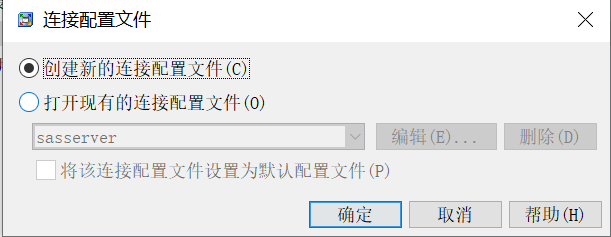

选择下一步

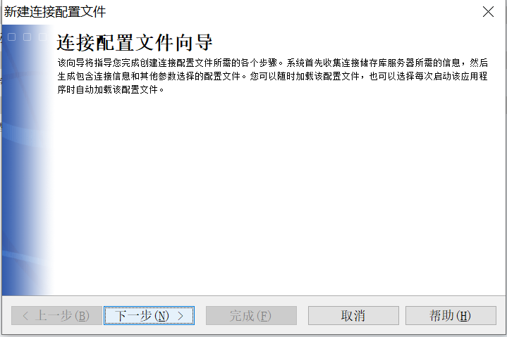

输入自己定义的名称

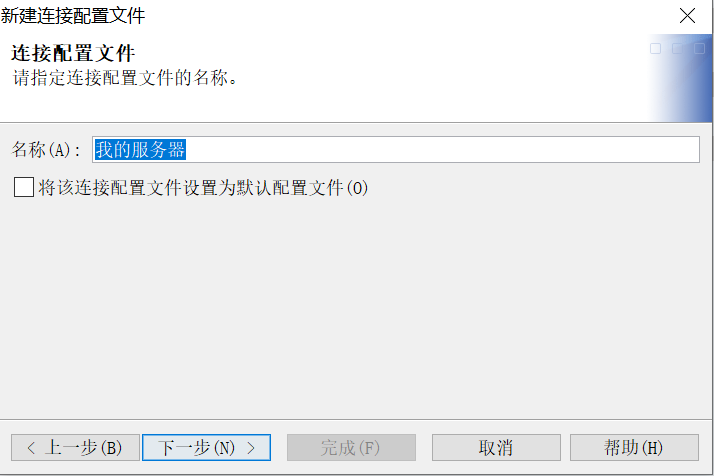

输入机器名:10.137.34.5；端口：8562；用户id和密码sasadm@saspw/sas@2020，成功选择下一步

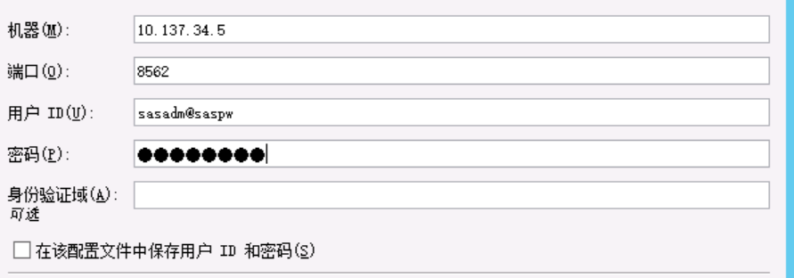

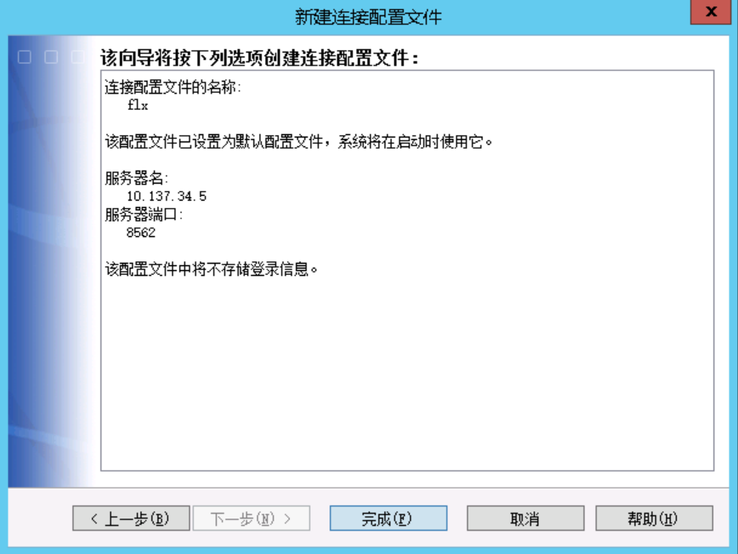

点击完成，将会出现如下的结果界面

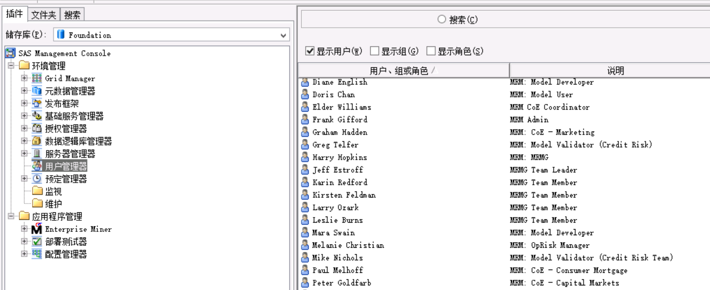

## EG

打开 SAS Enterprise Guide,单击未选择配置文件

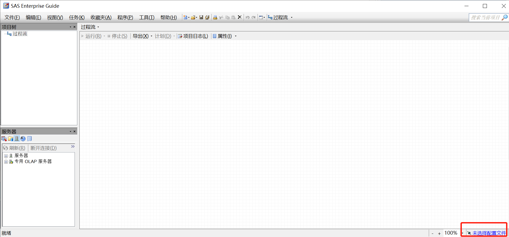

选择添加

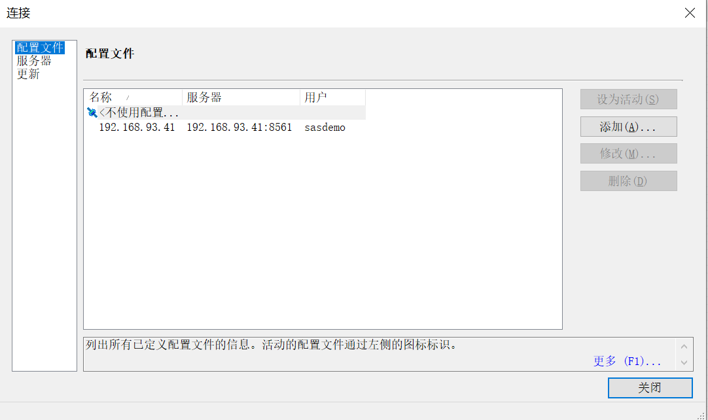

输入配置信息

机器:fxlh2-34-5;端口8562，sasdemo/sas@2020

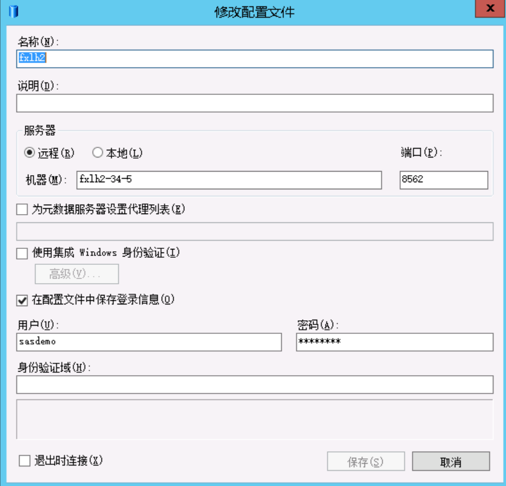

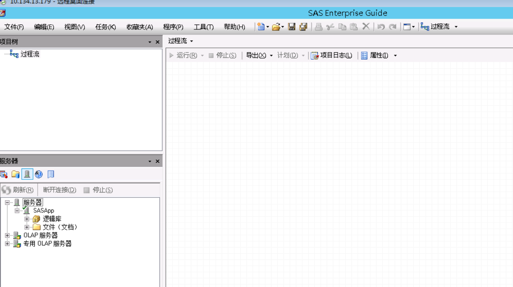

## SASStudio

http://10.137.34.5:81/SASStudio  输入账号密码:sasdemo/sas@2020

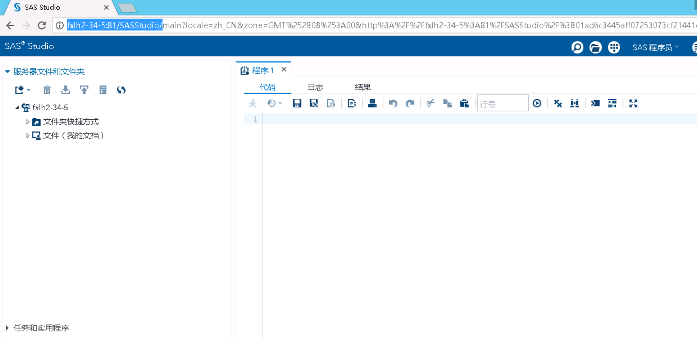

## EM

修改‪SASHome客户端的安装目录下的sassw.config文件

C:\Program Files\SASHome\sassw.config

```properties
[properties]
JREHOME=C:\Program Files\SASHome\SASPrivateJavaRuntimeEnvironment\9.4\jre\bin\java.exe
SASHOME=C:\Program Files\SASHome
PRIVATEJREHOME=C:\Program Files\SASHome\SASPrivateJavaRuntimeEnvironment\9.4\jre\bin\java.exe
DPLMTREGLOC=C:\Program Files\SASHome\deploymntreg
SASENVIRONMENTSURL=http://fxlh2-34-5:81/sas/sas-environment.xml
VJRHOME=C:\Program Files\SASHome\SASVersionedJarRepository

```

 打开SAS Enterprise Miner Workstation 14.2 输入账号和密码sasdemo/sas@2020

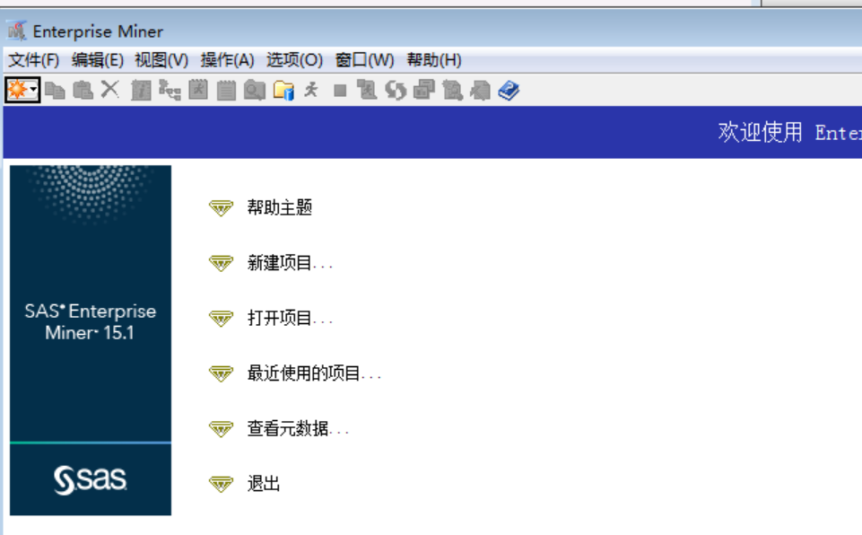

## MM 

环境:http://10.137.34.5:81/SASDecisionManager/   用户密码sasdemo/sas@2020

把sasdemo的权限都打开

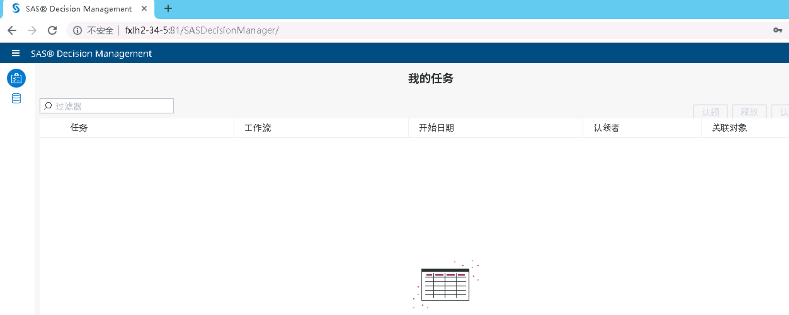

### visualAnalytic

http://10.137.34.5:81/SASVisualAnalyticsHub/index.jsp  用户密码sasdemo/sas@2020

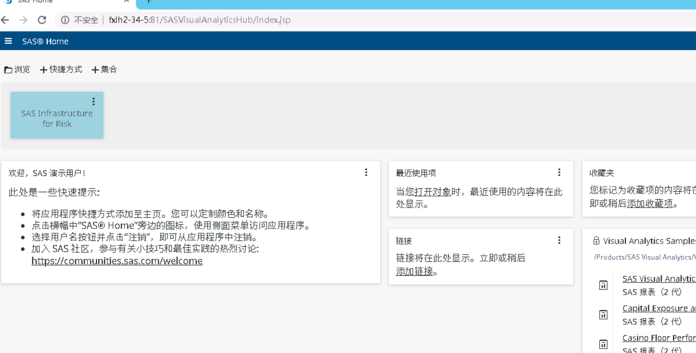

### SASIRM

http://10.137.34.5:81/SASIRM/index.jsp 用户密码sasdemo/sas@2020

!584951879638](MM.assets/1584951879638.png)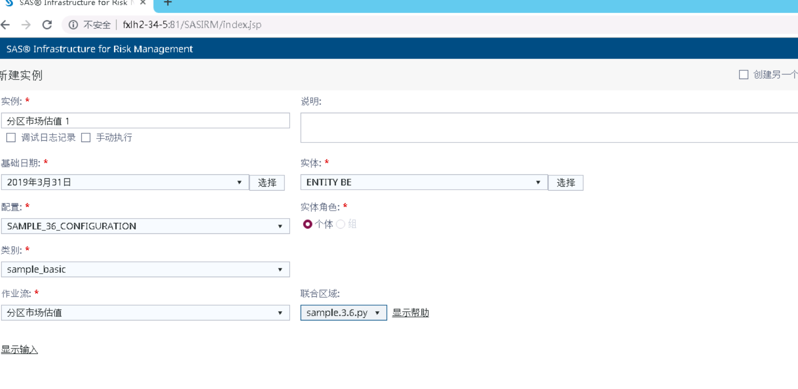

### SASAnalyticalDataSetBuilder

http://10.137.34.5:81/SASAnalyticalDataSetBuilder/index.jsp

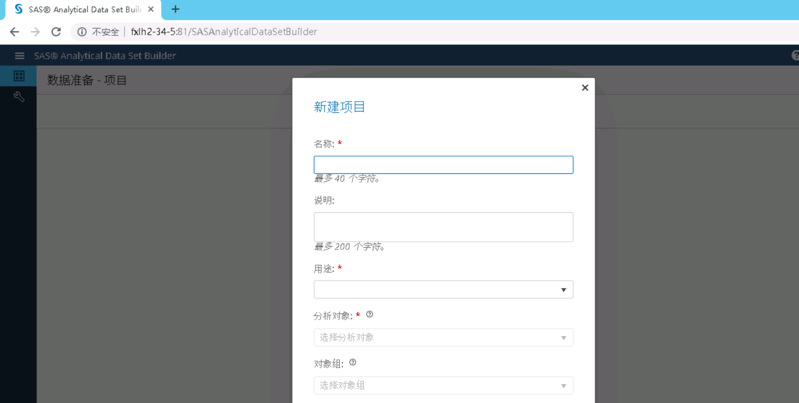

### Socring

http://10.137.34.5:81/SASCreditScoring

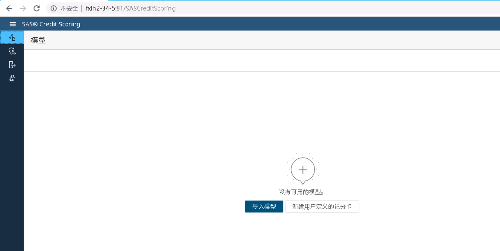


