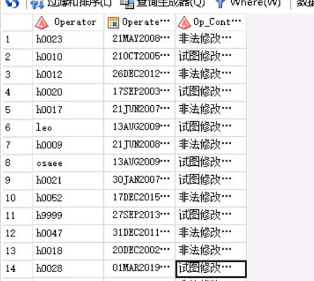

# 			视图转码SAS侧修改方案

## 服务器范围

元数据服务器:

   10.129.42.201   10.129.42.202   10.129.42.203

app:

  10.134.13.170  10.134.13.171 10.134.13.172 10.134.13.173

hpa:

 10.134.13.174   10.134.13.175 10.134.13.176 10.134.13.177

## sas配置修改

操作范围：app服务器

操作机器:10.134.13.170

操作用户:sas

```shell
cd /nfs/sasshare/sasapp/SASHome/SASFoundation/9.4/;
mv sas sasbak;
ln -s bin/sas_u8 sas;
```


## TD客户端修改

操作范围：app服务器

操作机器:110.134.13.170-177

操作用户：root

操作步骤：

1、使用root用户登录app服务器，110.134.13.170-177。

2、进入服务器的TD客户端的安装目录，找到clispb.dat文件，备份，修改添加，如下。

```shell
cd /opt/teradata/client/15.00/lib;
cp clispb.dat clispb.dat.bak;
echo "charset_type=N
charset_id=UTF8">>clispb.dat
```

3、注意。步骤2依次再每个机器上操作。


## 验证:

1、会话编码验证

EG登录

使用xx用户登录，验证会话编码

```SAS
proc options option=encoding;
run;
```

如果为UTF-8，则修改成功。

2、转码验证

```SAS
proc sql;
connect to teradata(TDPID='10.114.9.19' user='pu_check' password='check@uat2019ql' mode=TERADATA);
CREATE TABLE test as select * from connection to teradata(
select Operator,Operate_Dt,Op_Content from dw_mtaview.T05_illegal_Oper_Rec_Evt_UNICODE
);
quit;
```

结果数据正常显示




## 回退

### sas配置回退修改

操作范围：app服务器

操作机器:10.134.13.170

操作用户:sas

```shell
cd /nfs/sasshare/sasapp/SASHome/SASFoundation/9.4/;
mv sas sasu8;
mv sasbak sas;
```


### TD客户端回退修改

操作范围：app服务器

操作机器:110.134.13.170-177

操作用户：root

操作步骤：

1、使用root用户登录app服务器，110.134.13.170-177。

2、进入服务器的TD客户端的安装目录，找到clispb.dat.bak文件，将备份文件还原，如下。

```shell
cd /opt/teradata/client/15.00/lib;
mv clispb.dat.bak clispb.dat;
```

3、注意。步骤2依次再每个机器上操作。

